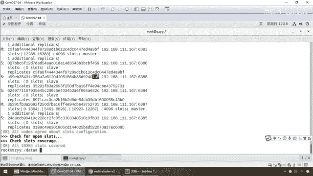
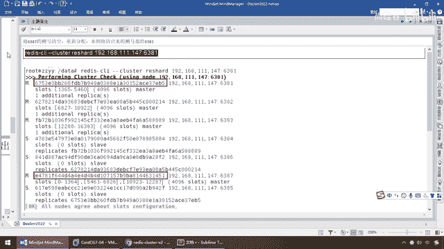

# 尚硅谷Docker实战教程（docker教程天花板） P55 - 55_主从缩容案例演示 - 尚硅谷 - BV1gr4y1U7CY

好，同学们，我们继续上一讲，我们完成了祖宗缩容案例的需求分析，那么接下来话不多讲，植入主题编码操纵，go，先清除从节点6388，然后槽位重新分配，再干掉6387，恢复成三主三层，那么接下来，走吧。

先看看我们的6387和6388，他们按照集群里面节点ID分别是多少，那么来，同学们，再次执行这个命令，这个命令，同学们，应该是见过很多次了，那么现在我们可以得到6388。

它的集群的Node节点是尾号A5。

这个这么说，能跟上？那么好，同学们，先拷贝，在这，将6388删除，从集群节点中将4号重节点6388删掉，那么这一步我们是获得了它的节点ID，那么搁到这，现在大家请看，我们完成一个什么，新的命令。

叫集群下面delete node，那么IP从集端口，从集6388的Node节点ID，OK，那么所以说在这，我们过来这，和刚才一样，那么来，过来这，是不是换成我们新的IP，当然我们现在先从集群当中。

先把我们的什么，6388给干掉。

好，那么同学们，获得了我们的命令以后，一回车，那么大家请看remove，不用我解释了吧，那么在这，我们可以看到，检查一下，6388就会被删除，只会剩下7台机器，那么得到了remove这个，代表删除成功。

那么好，再来执行一下我们这一行，由于我们前面有，我们直接复用，那么大家请看，现在我们可以清晰的看到，怎么着，4个Master还在吧，不用多废话，但是我们的S，一个，两个，三个，那么说明什么。

6388就已经被干掉了，完成了我们的第一步，到这，相信大家应该没什么问题吧，1234，4个Master，1233个Slaver，OK，好，这一步过，那么接下来，我们继续，要将6387的槽号清空。

重新分配本列，那么我们现在将清出来的槽号，统一分配给我们的6381，OK吧，那么所以说，我们在这儿，来吧，又变成以前的，这个是不是说过了，重新分配我们的槽号。

来吧。

到这儿，我们要完成一个什么工作呢，那么现在，把我们的6381要给它重新打散，就相当于是给这个集群，其实不是，就是以这个作为落脚点，其实是操作我整个集群，听懂了吧，那么相当于说，就是818283。

然后6387这四台机器，你们的这个槽号，16384个槽号，以6381作为突破点，对整个集群作为一个整体操作，兄弟们，他就问你，多少个槽位你需要去目误啊，那么和以前的差不多，那么兄弟们过来这儿。

我们现在呢，123加7是4个Master，我们来对以6381作为一个输入突破口，对整个集群进行哈希槽位的重新分配，那么现在跟刚才一样，怎么着，还是4096个，但是注意这儿有两个细节，分别是红色和蓝色啊。

红色他就问你，你要找哪一个Node，就是哪一个集群当中剩余的节点来接受这些东西，那么大家请看我这儿图层事啊，我就不想再AA了，那么也就说，我4096一次性就给我们的谁，6381节点，由他来干什么。

接受空出来的槽号，就是说6387现在有4096个节点，那么我要走了，我走了以后我是不是剩下了4096个槽位，那么这个Receiving是不是接受的意思，红色的笔记，谁来接受，1号机6381来接受。

这么说，能跟上，好，那么一次性就全部给他了，那么第二个，那么现在，他就问你，那么这个接下来，他是接受了，那么谁来出这个写呢，谁来发送这个呢，蓝色的笔记，谁，6387的节点，告知删除哪个，全部删掉。

那么这儿意思就是说，蓝色的笔记，6387这个节点，干嘛，把他4096个槽号，全部分配给唯一的一个接受者。

6381，就这么简单，OK，好，那么同学们，我们这儿现在呢多少，4096，当然你可以啊，不这么分配，你可以输入好多次，比如说1000，2000怎么怎么的，这儿我就图成事儿全部给，好，那么现在问你。

哪个来Receiving，来接受这个，那么6381，兄弟们，我们呢，过来接受，OK，那么现在，钱从哪儿出，谁来犯邪，那么这个时候按照我们的笔记，谁6387，蛋，听到，那么找到我们本列，6387。

那么他现在，身上是不是还有4096个槽位，那么现在，这个呢，谁来戳，蛋，搞定，那么，Yes，OK，那么等他慢慢的分配，那么相当于说，4096个槽位，就全部被刮出来了，统一的有6387，发送给了6381。

完成了节点之间的重新分配，好，那么同学们，我们来看一下，到这儿，全部完成，那么，OK，Yes，跟刚才的一样，那么现在我们来检查，集群的第二次情况，来，兄弟们，现在呢，我们来看看。

N10的IP是1670台机器，单前5，那么这个你看，是不是说过很多遍了，看看集群的情况，一回车，那么弟兄们，4个Master没问题，3个，这个Slaver没问题，但是注意这儿，请看，6387，还在不在。

在呢，但是他的槽位是不是，全部被刮空了，那么这个时候请看，6381，是不是，有两个4096，那么这，2和3是4096，相当于他们的比例，就是2比1比1，我根据我上次的，说明，是不是6387的。

要把它的节点，全部，发送给了，我们的6381，这么说，能跟上，那么请看，K1到K4的4个key，也依旧在4台Master主机上面，但是我的槽位，实行了内部的，流转和重新的分配，好，那么到这儿，相当于说。

4096个槽位，都分配给了6381，让它变成了，8192个槽位，那么相当于，从6387，刮晒的东东，全部给了我们的，6381，当然我刚才是，以前我那输入，是不是4096，否则的话你要输三次。

干脆我这次呢，就一锅端了，OK，就这么简单，好，那么接下来，6388从今死了，6387的槽号，重新分配了，那么第三步，才能是将，6387从机器中删除，好，那么兄弟们，请看，此时删除命令。

delete node，删，解，IP，从机，那个，应该是机器的端口，那么这个时候呢，IP加端口，6387的节点，完了。

因为我现在要删。

谁，6387，好，那么兄弟们，到这儿，那么现在呢，我们找到6387的，真实节点，是不是这个，粘贴，然后呢，6387，把我们本次案例的，真实节点，拷贝，那么IP地址，也换掉，那么，我们要把。

第四个master，6387，给他删除，那么，6387本次案例的，真实节点，是这个，一回车，那么大家请看，remove，如果出现这个，就证明什么，删除节点成功，好，那么最后一次，再来看看。

集群的检查情况，那么，我相信这个命令，兄弟们，应该是，很熟悉了吧，那么来吧，到这儿，那么现在是不是，我们的，167，来，集群再检查一下，我们以6381，作为一个切入点，检查我们的，三主三从的，这个集群。

那么来，兄弟们，master，master，master，三个，s，s，s，slaver，三个，那么大家可以看出，是不是又回复，缩容回去了，818283，作为了，三个master，又回复成了。

我们原来的，什么东西，三主三从的集群，哎，这个呢，就是我们的什么，相关的，缩容案例的演示，好，那么同学们，在这儿，通过这次，这个，docker下面，就给大家完成了，集群的三主三从，容错迁移，主从扩容。

主从缩容相关的案例，那么这个。

同学们，务必动手练习，多加掌握。