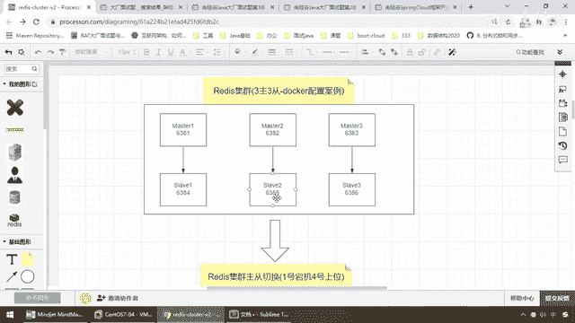
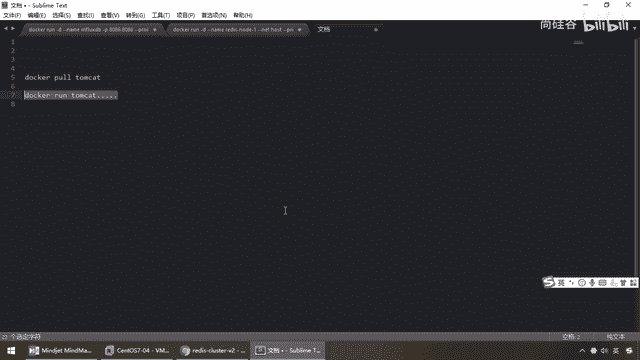
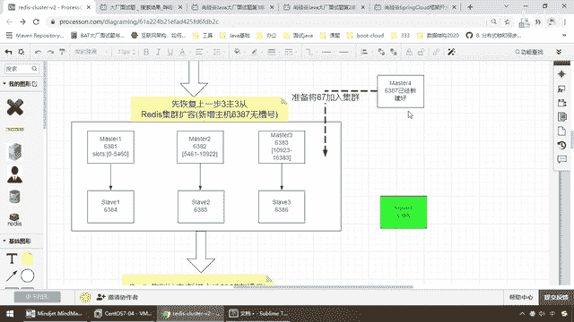
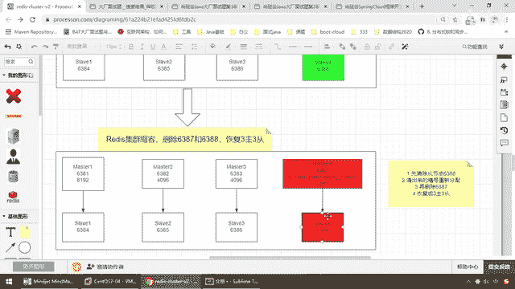
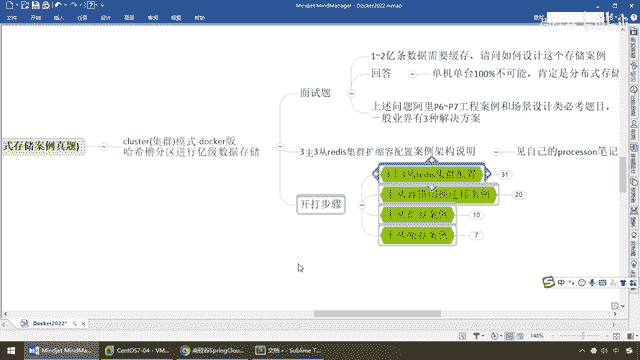
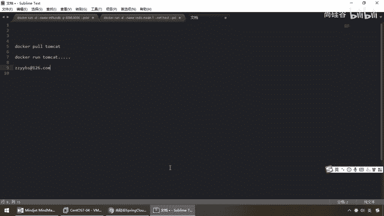
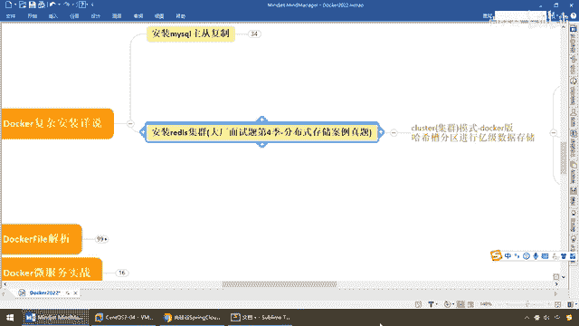

# 尚硅谷Docker实战教程（docker教程天花板） P56 - 56_分布式存储案例小总结 - 尚硅谷 - BV1gr4y1U7CY

好，各位同学，大家好，那么至此我们对于三主三从，Redis集群搭建分布式缓存，基于Docker容器的环境，达到了快速的扩容和缩容的案例，就给大家演示到这儿全部完成，那么由于这一章的东西比较多。

我们暂停一下，给大家做一下简单的小总结和回顾，顺便闲聊两句，好，那么同学们，首先这个工程案例请大家要掌握，那么对于我们的案例设计题，日常工作当中，哈希取余，一致性哈希分析算法和哈希槽的分派。

那么这种思想对于搭建分布式存储，那么大家务必在面试中和面试官，简单的聊一下，那么来回顾我们的案例，我们这一章学会了什么，解决了什么，第一个我们都晓得，现在可以明白Docker。

如果你对Docker的了解。

只是简简单单的拉个镜像，依据这个镜像转一个容器实列，那这个太简单了，根本就不叫什么技术。

可以这么说，你只是了解了两个命令和操纵，那么对于这样复杂案例，还是希望同学们能够坚持到底，把本案例全部刷一下，好，那么这儿大家请看，那么Redis集群三组三层，那么按照自己的实际情况，我们起了六个实例。

并且用我们集群搭建的方式，实现了谁和谁进行两两配对，完成了Master和Slaver，主从的搭建一比一，那么完成以后，我们搭建成功主要演示了两个，一个是集群下的注记读写存储，二个，注记的容错切换。

那么最经典的，如果说我们一号机，但机要求四号机能够上位，那么通过我们的案例和我们的设计架构，保证了我们的集群是可用的，某个机器但机了，那么不影响其他机器的使用和分配，完整了我们的建传性和扩展性，好。

那么第三一个，我们的扩容，那么将有我们的什么，一组一筹，三组三筹，一点点扩，扩到了我们的四组四筹，那么引入了我们的新的机器，6387和6388，第四一对主同复制，那么在加入的时候，我们要完成的东西。

第一个如何加，第二个只要有新人加入，由于我们是用哈奇槽，必然引起了以前的利益格局，槽位的重新分配，那么我们如何来进行，槽位的分配，给新的机器，然后才能把我们的slava，挂载到上面。

完成第四组。

一组一筹的搭建，那么到最后，我们解释了主同的什么，缩容，谈信云的思想就来自于这，需要用了我们就扩，不需要用了我们就缩，那么通过这样的话，来保证了我们系统的建传性，完成了我们系统的什么，分配和分布。

动态的扩容，那么对于缩容的案例，我们也详细的讲过，槽位的分配，那么强调过，那么大家如果是要做缩容的话，先删谁，应该什么样的操作，那么一定是，建议一定是先删从节点，然后把槽位再回退回去，那么你可以给一个。

或者给三台机器，或者给两台，随便你怎么分，然后再删除马奇塔。

OK那么好，这个就是我们目前所学到，和所掌握的，那么基于我们的哈奇槽分区，进行我们的一级数据的存储，OK好，那么非常感谢，能够看到这儿，学到这儿的玩友，同学和粉丝，我这儿也就闲聊两句，聊聊天，说两句。

首先还是希望各位同学，一不怕苦，二不怕死，认真学习，那么基本上，你技术多一分实力，生活就少一分恶意，那么这么说吧，罗道这儿，录到这儿，讲到这儿，说到这儿，我也比较惆怅，我真的想问问大家。

你们能看到这一集吗，可能我录出来以后，很多人就写一个，上硅谷外外DS，或者收藏不看，那么大家可以看一下，这是我以前录的这些视频，有时候我也很惆怅，到底我做这个事有没有意义，可能各位同学就是，图个热闹。

永远是什么，第一集嘛，人贼多，曾经第一集干到200多人，但是到后面，人就越来越少了，我也不知道我讲的这些知识，到底会不会扳到大家，那么在这儿呢，也算是，希望各位同学能够，把它学完，能够把它看完。

当然给大家买一个彩蛋，如果你能看到这儿，学到这儿的同学，应该来说你是热爱技术。

很专严的，那么假设啊，你学新玩可插本科，愿意和阳哥交个朋友，你觉得你去大产，头眼里无门，那么如果有需要的话。

我可以实弹的帮帮忙。

OK，好吧，那么也算是我们之间的缘分，因为我觉得能够看到这儿的同学，还是比较不错的，好吧，那么也希望大家，磨刀不务砍柴工，见过阳哥再打工，你把我讲的这些高级部分掌握了，一般去应聘个工作。

应该是没有他的问题，千万不要什么，收藏不看系列，没有任何意义，知识讲了这么多，你真的会看吗，我也只能说是，尽量的能扳到大家多少算多少吧，那么希望我们的这些技术和资料，能够真真真正的扳到大家。

希望你一定多看多练，好，那么这个就是我们的一个分布式存储案例，在这儿也接近下课了。

我闲聊了两句，那么同学们快去吃饭吧。