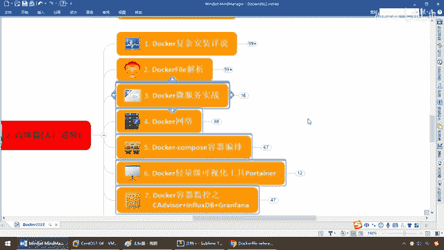
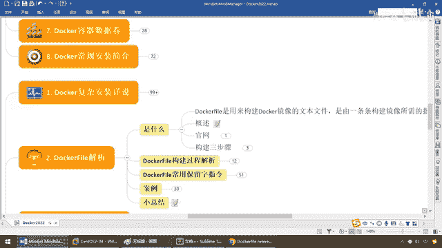
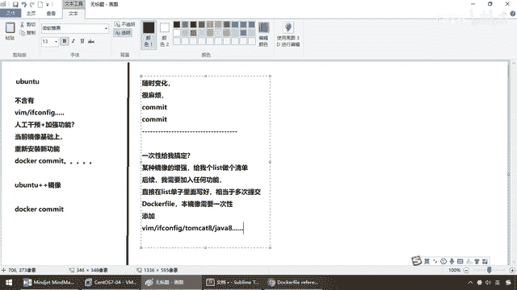
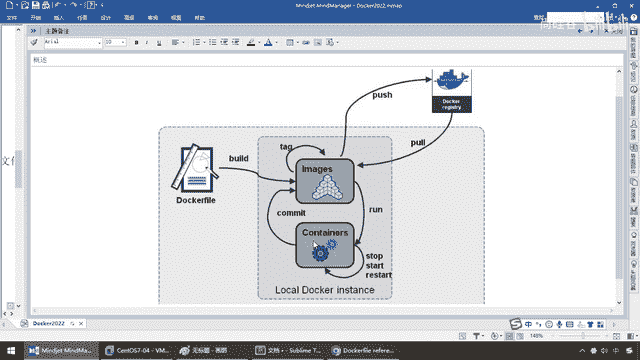
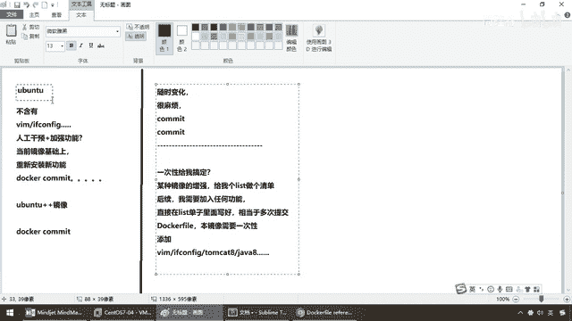
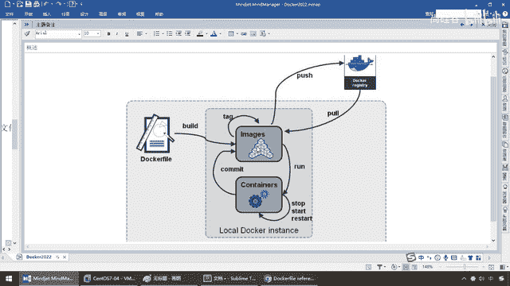
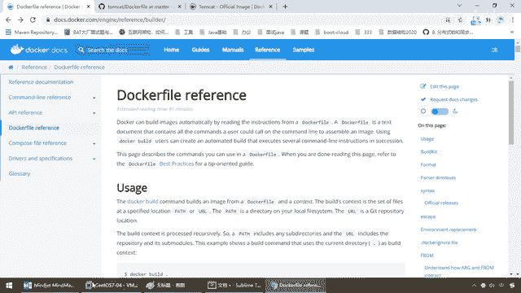
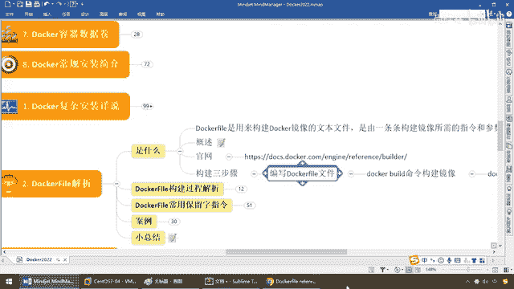

# 尚硅谷Docker实战教程（docker教程天花板） P57 - 57_Dockerfile简介 - 尚硅谷 - BV1gr4y1U7CY

各位同学大家好，我们继续接下来先给大家做一下一个新的知识点的介绍，Dockerfile这张非常的关键，几乎到后面大家用Docker的话，永远记着绝对不是操作几个命令，就OK的，不可以，那个太粗浅了。

那么要求大家对Dockerfile这张在没讲之前，我先说一下目标，几乎贯穿于我们后面微服务的全部，日常工作单中你用Spring Boot，Spring Cloud编写了一个微服务，假设需要跑到容器上。

这个Dockerfile的编盘你应该是跑不了的，那么我们对Dockerfile的了解，一能看懂，第二个。

当然倒不需要你像编写Java代码一样。

从头到尾能够从0编出来，但是起码我给你一个模板文件，你能够看懂并照着修改就行了，OK好，那么完成我们的教学目的的要求以后，我们先来看看老规矩，又接触到了一个新概念，还不是那套流程，对吧学习方法再扯一下。

它是什么，它能干什么，我为什么要学，解决了什么问题，给我解决了哪些痛点，那么完了以后是去哪下载呢，还是安装呢，还是怎么一个编写，那么用案例来说明，阳格三般符，理论，时操，小总结，走起来，来，第一个。

它是什么，首先，拍片名义说清楚，Dockerfile是用来构建Docker什么，镜像的文本文件，你可以把它理解为类似Linux的一种需要脚本，是由一条条构建镜像，所需的指令和参数，构成的脚本，有点懵逼。

别着急，我们先来看个图，首先得到一个问题，它是跟什么有关系，镜像，那么同学们，我们在哪讲过镜像，是不是说过这，怎么构建一个镜像，大家还有理解，还理解吗，那么在这块我们说过。

如果说我们有这样的一种需求。

假设我们现在有U版图操作系统，默认出产的话，那么它是什么，不含有，比如说我们的VIM命令，或者我们的EF，config命令等等，那么这个时候我们干嘛，是不是需要进行，人工干预，然后加强功能。

这个时候我们会干什么，是不是在单前，镜像基础上，那么我们来重新，安装新功能，还记得吧，所以说当时的时候，我们是不是学过一个命令叫，Docker，Comet等等等等，然后在这个镜像的基础上。

形成了一个功能，更加强大的U版图，加加这么一个镜像，影音相反，OK，那么好，这个是我们当年，当初自己带着大家构建镜像的一种方法，它的方法，那么就是用Docker，Comet，OK，这是一种方法，没错。

都OK，但是下面我们的问题是，这样的方法，有哪些问题，对于简单的来编辑，它完全可以做到，但是对于复杂的，比如说我这个U版图，或者后面我们的微服务，要配合连接着一大堆的中间键，还有各种功能参数的扩张。

那么它是什么，随时变化，那么你每一次Comet，就会显得什么，很麻烦，对吧，有点类似于我们的，有点类似于我们数据库里面，假设你操作完了以后，你Comet一次，假设你操作完了以后，你Comet一次。

对于MySQL而言，你提交一条记录，对于我们的Docker而言，是不是提交了一个境限，那么，如果这个操作是七八个，你要反复的跟MySQLComet，我们都晓得这样Io是不是会，频繁爆增，那么一样。

你反复的对DockerComet，那么这个时候是不是也很不爽，那么所以说，Docker，它的意思就是说，能不能，一次性，给我搞定，假如说现在我们要做，某种，镜像的增前，那么，给我个List，做个清单。

后续，我需要加入，任何功能，直接在，List里面，乱一次，那么，相当于，多次提交，OK，那么相当于说，在这个单子里面，你就给我什么，写好，OK，那么比如说，我这么一个文件里面，那么也就是说。

我们这种文件，就是我们这的Docker，File，它这个里面，就一次性告诉你，本镜像需要，一次性，添加，比如说我们的VIM，什么EF，Config命令，甚至我希望这个镜像，天生就带着TombKat8。

甚至天生就带着加瓦巴，等等等等等等，那么这样是不是把我们的，功能，相当于，做专修的时候，就画一个图纸，一次性按照这张图纸去施工，最后得到的那个镜像。

是不是一次成型。

那么这个，就是我们用，DockerFile的初衷和目的，那么再来看一下，它是由，一条条构建镜像，所需的指令和参数，构成了一个，脚本文件，好，那么大家请看一下，我们之前，给大家看过，类似的讲解。

这是它的意思，这是我们的电脑，上面装了我们的Docker实例，那么对Docker而言，请大家看DockerFile，是在Docker里面，还是外面，它是独立于外面的，它不像Docker引擎里面支撑着。

这个虚宽里内的全部命令，我们有两种方法，假设这个容器。

OK，我们现在又转了一个，U版图的容器实例，它不含有这些功能。

我们会干什么，是不是自己编写了以后，Commit，然后，有点类似于反射一样，重新形成一个新的镜像，并打高我们的标签，然后，我们以这个带有，更强大功能的镜像，来进行工作，那么这个是我们用Commit。

来形成镜像，前面讲过，那么现在我们用DockerFile，自己编写，你看一个两个三个，对吧，多种功能，那么写好这么个文件，注意看，第二个命令叫什么，Build，构建成一个什么动作，一个新的镜像。

它的作用和多次提交Commit，多个功能，多次提交，形成一个最终的。

一脉子，镜像是一样的道理，所以说，我们这。

得到的结论就可以知道，他所要干的活，就是构建一个什么，新的镜像，好，是构建我们镜像的第二种方法，那么大家来看，在官网上，我们来看一下，DockerFile这张，那么大家请看，那么OK，就它这个效果。

那么它是个什么，以及常见常用的，构建命令，脚本编写的语法，你看什么Front Run Command，等等等等，那么待会我们用案例，给大家进行一下讲解，那么也就是告诉大家，我们的DockerFile。

这个知识体的出处，在官网是哪一个地址，那么，更多的细节，就像查家瓦，API一样，欢迎同学们，自行来提升和学习。

但是你放心，我给你讲解的东西，足够你构建了，好，来接下来，做一个小口诀，构建三部曲，第一个，编写DockerFile，那么你现在这个，里面你要加哪些东西，哪些功能，形成一个新的镜像，你给我写好了，OK。

那么有点类似于我们这，你看一条，两条，三条，四条，五条，你要加多少功能，就加几条，一层层的叠加，好，最终形成一个脚本文件，一次性搞定，一次成型，所以说第一步，编写DockerFile文件，第二步。

Docker什么，Build，这个命令构建出，文件编写好的一个新的镜像，然后直接什么，Run，依照新编写好的这个镜像，运行我们的容器实例，好，那么同学们，这个就是我们DockerFile，它是什么。

能干什么，以及它的理论知识。

在官网上的出错。