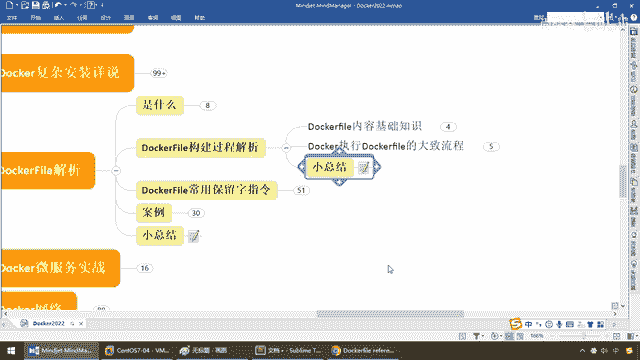

# 尚硅谷Docker实战教程（docker教程天花板） P58 - 58_DockerFile构建过程解析 - 尚硅谷 - BV1gr4y1U7CY

各位同学，我们继续，下面我们来看一下Dockerfile的构建过程，那么好，假设我现在编写好的这么一个文件，那么其内部原理和运行机制是什么一回事呢？，在这请大家看。

第一个Dockerfile有个基础知识，第一种要求大家完成的事情是，每条保留字指令，哇，还刚读到这就懵逼了，什么叫保留字指令啊？，说人话，就是官网上Dockerfile这边，大家请看。

是不是有什么Fro， Run， Command等等等等，这些就是它的关键字，也叫保留字，在这，主流常见常用的都给大家做了整理，不用慌，跟着来，那么所以说，也就是对于每条保留字指令，都必须什么？。

大写字母，兄弟们，官网上是不是都是大写？，好，那么且最好后面要跟随至少一个参数，比如说你都是没讲的，假设Copy，那么你Copy你是不是应该给人家源，从哪儿，考到哪儿，对吧，就是命令，然后是参数。

这个好理解，第二个指令，按照从上到下，顺序执行，我们编写了一个配置文件嘛，那自然然是从上到下，顺序执行，类似于我们在微博里面是不是有个Application点压模，你的各种配置也是从上到下，顺序执行。

好说，第三个警号表示注解，瞄懂，第四个，每条指令都会创建一个新的镜像层，并对镜像进行提交，说实人话，还记不记得以前，我们原来说过这个容器的时候，弟兄们，我们介绍过分层的镜像，杨哥是不是说过。

任何一个你最终和写操作的一个容器实力，一个镜像，那么它都是由多层次构成的，还记得这个花卷吧，都是基础一个基础之上一层层的发出来的，好，那么在这块我们继续，对于我们的这一块我们就会明白。

待会我们在编码上会给大家进一步的说明，你现在先了解，每条指令都会创建一个新的什么，镜像，镜像上面叠镜像，最终形成一个最终镜像，通过这个镜像得到一个容器实力，好，那么这个是它的基础知识。

那么下面Docker这个引擎本身来执行Dockerfile的大致流程，是这样的，第一个Docker从基础镜像运行一个容器，也就是说你这个镜像就是我的原代码，就是我的模板，一镜像启动容器，有对象，才能有。

你有一个类才能有一个对象，第二个执行一条指令，并对容器做出修改，那么我们在Dockerfile里面编排，其实就是把以前一个命令所做的操作，汇总成了一个文件，多个命令都汇聚进这个容器。

文件Dockerfile里面来完成我们的编码和编写，那么大家请看，多个命令是不是类似执行Docker commit的操作，提交一个新的镜像层，那么Docker再基于刚刚提交的镜像层。

又运行成一个新的容器，那么层层叠层层，那么这个时候执行Dockerfile中的下条指令，直到所有指令完成，最后发出我们那个花卷，形成一种多个分层，构成一个总的最终镜像提交版本，供你使用。

所以说呢。

大家捞眼，我们从应用软件的角度来看，也就是我们从干活程序编码工程来干活的角度，Dockerfile镜像和容器分别代表，这个软件的三个不同状态和阶段，它的生命周期如下。

第一个Dockerfile是软件的原材料，相当于我们的什么配置文件，我们相当于开中药，给你抓了一张方子，都写好了，哎呀，我们需要哪些药材，然后Docker镜像就是软件的交付品，那么按照你给我写的。

我去照翻拿药，最后Docker容器，它的这个实力，这可以是什么，软件用镜像的运行态，也即依照这个镜像熬出的中药，OK，运行好的容器实力，那么Dockerfile面向开发。

Docker镜像是交付的一个最终标准，Docker容器则涉及部署运为，三者缺一不可，合力充当了Docker体系的基石，所以说我们就是Dockerfile边写，Docker镜像，按照你边写的file。

形成一个最终交付的镜像，然后是Docker容器实力，那么相当于说按照这个镜像，软出来一个可以运行的容器实力，那说人话，那么大家请看，就算还没解，你应该明白什么叫关键字和保留字。

from、value、add、command，大致我们先混个眼书，那么意思就是说，按照Dockerfile的边写规则，用这些保留字，你看后面至少跟着一个参数，对吧，要干一件什么事。

那么from这儿了以后，巴拉巴拉一边写，build构建出了一个镜像，那么相当于是这个镜像，那么请看，将会运行并执行你的这些东西，好，最终run，一到这个镜像，run一个容器实力，那么把你这些功能写好。

打包成一个镜像，那么我这是不是一次成形，OK，那么最终我们就会明白，Dockerfile，它呢，定义的一个文件，它定义了，这个进程当中所需要的一切东西，比如说，这个哥们就是说，在Ubuntu。

14这个版本上，我呢，挂载了一个容器券，添加了一个运行的命令，等等等等，那么设计的内容，就包括执行的代码，或者又引入的一些文件，环境便利一袋包，这些就不再照着念了，那么Dockerfile。

就是定义了这个药方，然后，按照这个药方，我去配成成药，定义这个文件以后，我们构建，产生一个Docker镜像，然后呢，拿着这个成药去熬药，最终是不是倒进碗里面的，那碗中药，OK，那么所以说，文件，镜像。

容器，这就是它们三者的，关系和有机的整体。

好，那么这个就是我们Dockerfile，构建过程的一个说明。