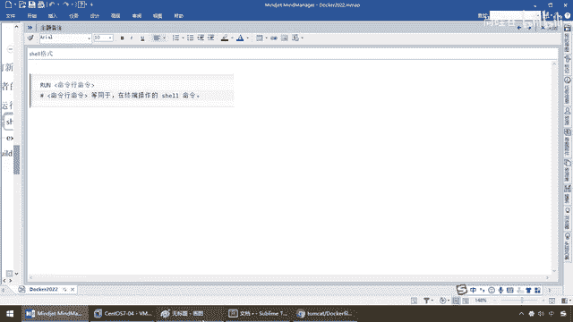
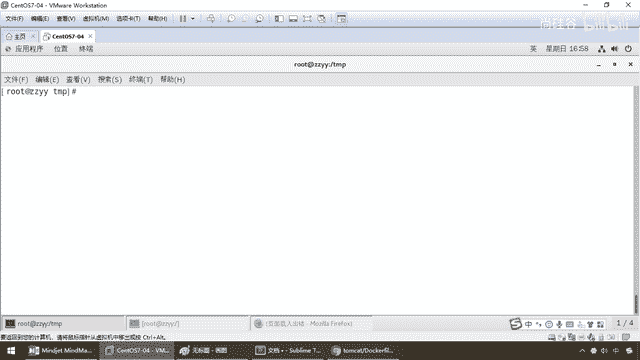
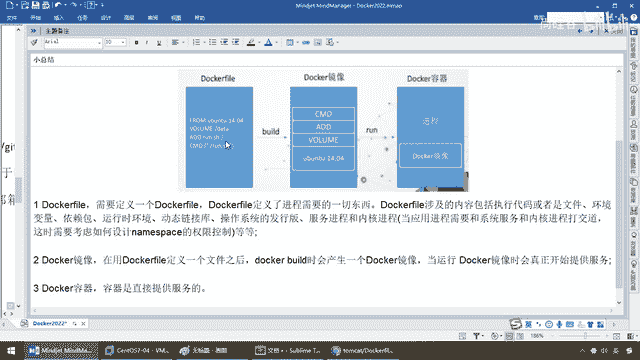
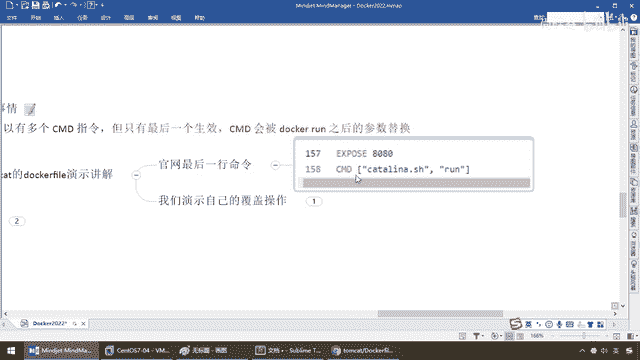
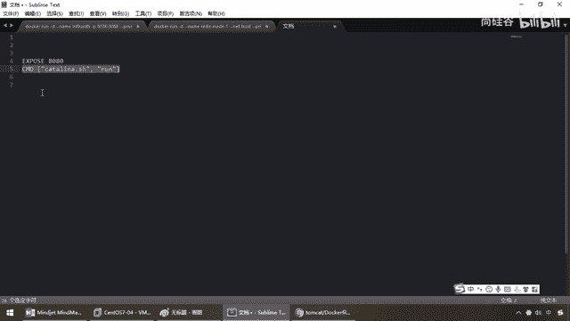
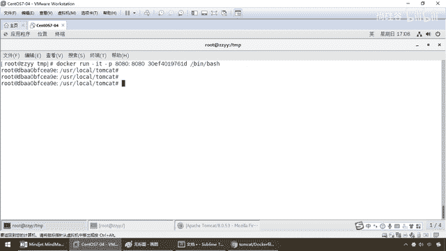
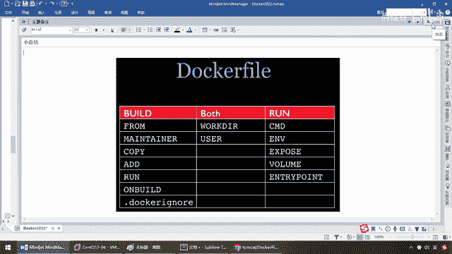

# 尚硅谷Docker实战教程（docker教程天花板） P59 - 59_Dockerfile保留字简介 - 尚硅谷 - BV1gr4y1U7CY

好，同学们，接下来我们就要对Dockerfile产用的保留字给大家做一下说明，那么在前面的解析和说明过程当中，那么说难听点，我们要编写Dockerfile，就使用它的语法规则。

用这些命令编写出一个一个的指令，完成我们最终交付的境象，那么这些保留字指令是Dockerfile的灵魂，是重中之重，请同学们务必搞懂，那么在这儿，我就已经把主流产建产用的境象。

和相关的细节将会给同学们做一个一一的介绍，那么这个请大家务必跟着下来，那么理论，十套小总结，依旧三板斧，好，那么来，首先这个Dockerfile，那杨哥我们还没见过呢。

你先别给我那个比较枯燥的来介绍这种英语单词，至少斧肉我也知道来自于哪儿，那啥意思啊，那么下面，走，分，走的原则，我先给大家介绍，那么先看看，那么大家都清楚啊。

我们在这儿的时候是不是有一个东西叫Docker Hub，我们搜个Tomcat以后，我们弟兄们都晓得，这个是什么，Hub上面是不是装境象的，那么这些境象是哪来的，那么境象，它对应的文件就是一个一个。

反解析了以后，就是一个个的Dockerfile，OK，那么来，兄弟们，他直接呢，告诉你啊，我们这个，在官网上Hub，官网上这个Tomcat这个境象，你可以去这个去看。

你看这是不是叫Dockerfile的连接，那么隔到这儿了以后，由于这个GitHub打开呢，非常非常的慢，那么阳哥呢就提前先把它打开了，比如说我们的Tomcat最新版是10了，我们继续加把8的话。

那么大家请看，来，第一行，哎，这儿有个浮肉，好，那么兄弟们，这儿是不是也有一个浮肉，没问题吧，那么先来看看，你这个Dockerfile，他到底是干些什么事，那么红色的就是他所谓的关键保留字。

那么这儿有什么，ENV啊，什么WorkDIR啊，然后呢，RUN啊，等等等等，以及，当然中间这些注射，你可以无视，那么他中间呢，就编写了一堆堆的命令和指令，最终，大家请看后面，哎，暴露出一个端口。

叫8080，然后，command一般就是指命令，那么，katalina。sh run，至少到158行这儿，你应该明白，那么，换句话说，他的意思就是，你在官网上，我们就不会给你解释什么Tomcat了。

对吧，那么他说，你怎么用，你怎么使用这个镜像，那么大家请看，他告诉你，运行默认的Tomcat server，相当于，你这儿一启动，屁股后面，其实就跟着一个，是吗，katalina。sh run，哪来的。

就是这个docker file，他后面也跟着的，那么你凭什么可以，通过8080端口，去反问docker上的这个Tomcat容器实例，也告诉你了，哥们，我对外暴露的端口，就是8080，那么，粗浅的看一下。

我们就会明白，原来，我们每一个镜像，其实到后面，都会有一个什么，docker file，作为理论的支撑，那么，这一副药，怎么来的，当然有药方，那么这个药方谁开的，当然是个老中医，OK，那么所以说，药方。

抓药，最后出成品，这么一步一步，那么所以说，我们这儿明白了以后，我们接下来，我们大致，大家不要怕，你不要担心，哇靠我的妈呀，这个我要写这么复杂的docker file呢，一百多函，不用。

去掉注射和与你相关的，基本上你只要能看得懂，能够照猫画虎，OK，照葫芦画瓢就行了，都是一些脚本参数，都是一些脚本文件，好，那么同学们，开工，第一个参数，腐肉，听好，基本上都出现在什么。

我们docker file的，第一函，代表你现在心要构建这个镜像，来自于哪，你的源头来自于哪，说白了就是你继承的负累，基础镜像，OK，那么来兄弟们，当前你要产生这个新的镜像，基于哪一个镜像，我来自于哪。

那么指定一个，一般是指定一个已经存在的镜像，作为模板，然后我们在这个的基础上，再开始，后面的构建，所以说一般第一条都是腐肉，那么来同学们请看，他就告诉你，假设他们Kite这个，镜像的话。

他这个docker file的第一函，是不是来自于亚马逊，这样的一个镜像，版本号是8号，然后再继承了别人的基础上面，我又添加了一些其他哪些功能，好，这是我们的第一个，那么第二个。

Maintenant 维护者，什么意思，就是这个镜像谁做的，可以留下作者的什么，名字和邮件地址，好，好说，过，第三个，那么大家请看，这儿是不是也有一种东西叫RUN，你看叫什么SET什么什么，什么之类的。

这个就是指什么，在我们这个docker file里面，写好这个RUN，就是代表在构建的时候，就会执行这个命令，那么大家请看，容器构建的时候，什么叫构建，就是这儿，再多说一嘴，我们在这儿的时候。

是不是有一个东西叫Build，意思就是说，我只要到第二波Build的时候，就会去读取你，Docker file里面，用RUN关键字所编写的一些指令和命令，那么来，容器构建时，需要运行的命令。

它有两种格式，一种叫SHELL，一种叫EXEC，那么假如说这样，RUN，这就是命令函的命令，等同于在终端操作的需要命令，阳哥，你把官网翻译给我，我也看不懂，看着。

我跟你说人话。

那么弟兄们，我们都晓得，以前我们在这儿，Ubuntu，我们在不含有的这个时候，我们是不是要Docker，最终要Commit，我们这个时候是不是在，丹田的这个不含有的这个镜像里面，我们干一件什么事。

什么apt，还记不记得，相当于说就是我们的YAM安装，干y，VIM，类似于这样，那么相当于说，如果说我现在就告诉你，我在这个文件里面，我现在要，干嘛，装一个VIM的功能，那么现在相当于怎么编写。

那么这个时候就是，RUN，听到，那么yam安装，那么insta，你要安装一个什么动作，安装一个VIM，明白了吧，那么相当于说这一行，就在这一个Docker file的文件里面，那么到时候我一build。

一构建设，我就晓得，明白了，这个哥们儿，然后继承了某一个镜像，在这个镜像的基础上，现在它需要，用run这种命令，然后来运行这么一个，加强的功能，安装，vi，你看是不是在终端操作的需要命令，类似于这样。

OK，能理解了吧，当然，暂时不理解也不怕，后面我们有案例，一看就懂，不难，那么第二种格式，就exec，那这个，我觉得是有点难受，那么它用了这么一个，有点类似于阶层创，这样的一个组合性的命令。

命令参数1参数2，那么run这么一个，等价于run这么一个动作，OK，好，那么各位同学，那么这块的话是两种，当然就看你了，我可能个人的话喜欢用这个，用这个多一点，那么你非要用这个也可以，由得你。

那么所以说，记着run命令，就是在构建的时候，直接运行，那么，第四个，不用多说吧，单前容器对外暴露出的端口，还记不记得，我们是不是讲过什么，小P和大P的端口映射，哎，好，不废话，那么这儿，叫什么。

workdir，代表什么，指定，在容器创建以后，默认终端，默认登录进来的工作目录，就是一个落脚点，什么意思呀，那么大家请看，我单纯给你演示，那么兄弟们，docker，那么我这run-it，比方说u版图。

那么这个时候，我们，bash，我们都晓得，如果我运行成功以后，它这是不是给我返回，大家请看，这是什么，默认，终端默认登录进来的一个工作目录，什么，落脚点，那么现在我进了以后，pwd，大家请看，什么意思。

假设u版图，这个，进下你运行成一个容器，你用了it这种模式，你进去登录，登录到什么地方，u版图的，根目录下面，OK，那么我的落脚点，就是我的根目录，好，那么这儿退出去，那么docker，imagis。

那么假设我现在docker，run-it，我现在就运行这个，他们kate8，这个，那么好，兄弟们，粘贴，bash，那么好，那么当然，这个的话，我们，直接，干小p8080，冒号8080。

一般他们kate配个端口，但是注意，其实它是不用加这个的，我故意的，那么大家请看一下，有没有发现，它登录了以后，登录到什么地方，是不是user，local他们kate，这个路径。

刚才u版图是直接登录到根目录，而我们现在运行的这个进向，他们kate8是直接登录到什么，user，local他们kate，那么它为什么会有不同的落脚点，不同的。

登录以后的地址。

就是这个walk。r，就是你指定登录终端以后的落脚点，哪个目录，好，那么这个是我们的什么，第5个，那么下面，user，什么意思，指定该进向，以什么样的用户去执行，如果都不指定，默认是，root。

那么一般我们都不指定，不用去在那个进向里面，去搞一个什么权限，没必要，所以说这一块过，那么下面这个叫什么，env，那么再来看看我们的他们kate，它是不是也有env，这么说，能跟上，那么大家看。

上面是不是也有walk。r，katerina homo是哪一个，你看你配的是哪一个，哪一个就能看到，那么一样，对比着下来，它有没有env，也有，这个叫什么，运行时环境，好，作为一个环境的配置。

那么用来在构建进向过程当中，设置我们的什么，环境变量，那么弟兄们，请大家看一下，比方说env，kv，建置对，我的意思就是说，这个环境变量可以在后续的任何run指令中使用，run指令我们后面说。

那么现在它的意思就是说，我设了一个环境变量，比方说叫mai，pass，我默认这个pass叫user-mai-test，那么假设我walk。r，到那儿，引用这个动作，那么相当于说，我一登录的时候。

是不是就可以落在，user-mai-test这个路径下面，那么这样呢，其他指令当中，是不是就可以直接，引用这个环境变量，说难听点就是，你在前面先定义了，后面我就可以引用，那么回到我们tomcat。

官方的这个参考，那么大家请看，我设置了一个环境变量，叫katerina homo，这个是key，value叫什么，登录user-local-tomcat，刚才我们是不是演示过。

就可以登录user-local-tomcat，为什么，就是因为这个，docard file里面做了设置，然后完了以后，大家请看，walk。r，我登录终端以后的落脚点，是哪个。

引用了katerina homo，到了katerina homo，哪一个，就是user-local-tomcat，所以说最终我们就是，登录user-local-tomcat，我相信到这儿，我说清楚了吧。

OK，好，那么接下来，兄弟们，这个呢，就是我们的，登录目录，emv和walk。r，一般他们两个会常用，那么下面，最后这个，和，这个，这个都好说，这个可以提前说，什么意思，容器券，用，不用我多废话了吧。

意思就是什么，相当于我们干v，能理解，那么只不过这块，不叫干v了，写了个value，用这个单词代表我们的容器券，一说就秒懂了，好，那么下面，重要的是，第一组，第二组，这两个命令，听好，有一个叫add。

一个叫copy，他们两个一样，那么这个copy，还记不记得，以前我们在讲，容器的基本命令的时候，我们学过一个命令，叫，dokar，copy，把容器内的，路径和主机的，可以做个关联，拷贝，这波，能理解吧。

它呢，作用类似，那么现在，先看一下，这两个，一般用哪个呢，我习惯用add，它跟copy，有点类似，来，将宿主机目录下的文件，拷贝进镜下，且会自动处理URL，和解压踏压坐包，那么假设。

这个add的意思就是什么，copy加解压，两个命令的合体，那么大家请看，我们这儿小总结说，这儿是不是有个，add，听懂了吧。

那么这儿。

相当于说，我可以，把，某一个宿主机，某个路径下的，一个文件，拷贝进，我们的，镜下里面，且能够解压，那比如说，我要在我这个镜下里面，装一个JDK8，那么这个JDK8，比方说，它是个java8。tar。

gz，这么一个压缩包，那么我就可以把它从，宿主机上，拷贝进我们的镜下，并自动给它解压，所以说add是什么，copy加解压，OK，好，那么这个copy呢，类似add，拷贝文件和，目录到镜下中，那么将。

从构建上下为目录中的，原文件，复制一范，到我们的目标路径，那么基本上，它做的作用就是，copy，原到目的，原文件，目的路径，OK，那么好了，那么这个呢，很简单，类似于我们以前讲的。

dokarcp这个命令，那这个呢，要比add，要比copy强大一些，我一般习惯的是用这个，那么这个就看你要不要，解压文件，其实两个都具备，将本宿主机上的东西，弄进我们的镜下里面，好，那么这个。

容器卷说过了，那么最后，这有个cmd和，entry point，那么这两个，稍微费点事，那么同学们，打起精神，把这个听完，首先先看tomcat，大家告诉我，tomcat最后是不是有，暴露了8080端口。

按下告诉你，这个镜下，你，打包完成以后，一运行，按照这个镜下模板，来做容器的话，它要执行的命令就是，cataline2。sh，干嘛，run，意思就是什么，启动tomcat，听懂了吧，那么好。

这个时候请看，先来看，cmd，指定容器，什么什么什么什么什么，启动后，它要干的事情，那么就像这个tomcat，现在相当于说什么，暴露出8080端口，这样就是把cataline2启动，那么相当于。

我后台启动以后，你呢，静静的等着你，给我部署，我那只tomcat猫，如果你反问localhost 8080，那只tomcat猫是不是出来了，那么相当于说这个，它就干嘛，不做什么太多的事情。

但是有些时候我们启动了以后，大家请看，是容器启动命令，cmd指令格式和什么，run是相似，也支持，share和exec，那么就是这种，在中括号像素组一样的，OK，那么大家请看，cmd，参数1参数2。

注意它这有句话，在指定了entry point指令以后，用cmd，指定具体的参数，相当于，entry point，只要有的话，cmd就变成给他传参数了，这先提一嘴，待会我们详说，那么请大家看一眼，它这。

是这，Dockerfile中，可以有多个cmd指令，就是代表你，启动了以后，你要干什么事，那比如说，我们在这块就是，运行完了以后，就是告诉你，按照上面的Dockerfile。

给我把tomcat的这个镜像启动，我后面没加什么佐料了，没加什么参数了，启动就完了，这是简单的，可问题是，它可以有什么，多个cmd指令，但只有什么，最后一个生效，OK，有点类似于，最终那个指令。

永远是最后一行，它会把前面的那些覆盖，然后，cmd，会被Docker run之后的什么，参数替换，读到这，你杨哥有点糊涂，我们别着急，马上，我们参考tomcat的Dockerfile，演示来讲解，啊。

官网最后一行的命令，是不是，暴露出8080端口。

cmd就这么一个东东，没问题吧，相当于说我这儿，执行了以后，没问题，那么相当于说，这一块执行，这个就是我最后一行，就是你启动他们cat就行了，那假设，你又加了些别的，就有可能把这条命令，给它覆盖了。

它可能会不生效。

那么来，同学们，那么描述一下，现在啊，Docker PS，好，没有什么运行，那么来，我们来演示一下，Docker images，那么Docker exec-it，请看我案例演示，那么兄弟们。

我们启动这个tomcat，直接带猫的这个，OK吧，那么大家请看啊，我现在是不是直接让你运行，这波能跟上，那么干屁，8080冒号，8080，那么对应着，我这个后面是不是什么都没有命令了，对吧。

run后面是不是，那个啊，抱歉啊，Docker run，这一波没问题吧，那么相当于是Docker run，干it干屁，8080启动，这个进行，那么相当于说这个进行，他最后就是告诉你，他他Linna。

给我启动，8080端口，暴露服务可以反问，完活了，那么这个时候同学们，我一运行，你晓得的，这个是我们最经典的，看到了什么，run了一个镜像，那么他们看，大家请看。

Katarina start server start，在这块，那么好了，这个时候请看，localhost在我们这儿，8080，弟兄们，这只猫，如果不出意外，是不是他们看他8053这个版本直接出来了。

到这儿，OK，那么一切都是是吧，合法合规，言辞合讽的，没什么好说，对得上我们的逻辑，因为你最后一行就是启动给他们看，接下来看着我干坏事，不好意思，请看我的这说什么，最后一个生效。

CMD会被Docker run之后的什么，参数替换，哎，就是说如果我Docker run后面加了参数，会把他原本的这个，给他什么，覆盖替换了，那比如说啊，兄弟们，我这儿很无聊，我加了个beam。

bash，double eye，这个东西一回车，好，我们来看一下，别的，Docker，PS，那么大家告诉我，我这个8080他们看他有没有成功启动，成功启动了，这个没问题，但是啊。

这儿有加了个beam bash，相当于后面这一行。

又加了一个什么，我们的这儿，有点类似于加了一个什么，刚才你晓得的，beam bash，那么是不是就会，把我们原有的这个好端端的给他覆盖呀，那么这个时候同学们，Loyer，我还是反问这个地址，怎么着。

找不到服务器，相当于你只是容器，启动了，但是抱歉，相当于这一行，你把它灭掉了，那么这个时候我们他们看他启动，就有点不好看了，OK，好，那么这个呢，就是我们的什么，自己演示的一个覆盖操作，那么弟兄们。

好端端的，你根本就不用加这个，但是你一加这个，相当于又往这个配置文件里面，加了第二个command，那我就把它提换了，这一行就没了，所以我们他们看他启动，就有点不舒服，好。

那么最后我们来看一下他和run，命令的区别，都叫运行命令，记着，run是在什么时候，构建的时候运行，command是在什么时候，run是和运行，哎，这个两个是有严格区分和区别的，大家一定要搞清楚。

那么最后一个entry point，这是干什么的呢，来，也是用来指定一个容器，启动是什么，是一个容器启动是要运行的命令，但是逐渐，他类似于cmd，但是entry point不会被。

docker run后面的命令覆盖，而且这些命令，含参数会被当做参数，传给entry point指令，指定的程序，还支持传参，不废话，杨哥，理论，听不懂，看案例，来兄弟们。

entry point执行的命令参数一参数二，entry point可以和cmd，一块用，一般是什么，参数变参才会用cmd，什么变参，就是我还想，传参数更进一步的去给他，那么，这里的cmd。

如果你跟entry point一块要，相当于是在给entry point传参，意思有点类似，如果都是要运行的话，这个哥们比cmd更狠一些，他们两个运行的话，都是entry point在前，cmd在后。

相当于要运行哪个命令，运行这个，cmd，那么变成了一种传递的参数，当指定entry point后，cmd的命令含义就发生变化了，不再是直接运行，cmd作为一种命令运行，而是作为一种什么，可变参数。

传递给entry point的指令，真真真真要运行的，老大执行的，变成了这个entry point，那么来兄弟们，都说无限，比如说啊，我们先做一个简单的案例，就三行，不难啊，同学们跟着我走，先听懂。

待会我们再说案例，你一说你就明白了，假设我已经通过多克法尔，构建了一个镜像，叫nginx，然后冒号，然后呢，标签这个tag，就叫test，那么现在我来自于谁，自己，nginx，frog是第一行。

相当于我继承的附类就是自己，nginx，entry point，我要启动nginx，是不是叫nginx-c，这个是固定参数的写法，对吧，那么现在，nginx一般要指定一个配置文件。

那么现在我也在里面写s，叫command，etc目录下面的nginx，nginx的看付，那么来，兄弟们，请看，是否传参，按照多克法尔编写的话，我们在这就是entry point，实际的命令。

command，再加后面这个就是他传递的参数，叫变参，那么，对应的多克命令，假设我们这个镜像好了，我们要运行这个镜像，是不是叫，dokkar run，这个镜像叫nginx的test，就上面这个镜像。

那么相当于，它一运行以后，延伸出的实际命令就是nginx-c，然后是etc-nginx-nginx-conf，这么一个指定好的配置文件，说白了，就是命令，这还有nginx。

多克法尔里面写的是entry point，nginx，那么按照我们的公式，说是entry point，要执行的命令，那么相当于说，要执行的命令就是nginx，这个nginx，相当于这个nginx。

这个c，相当于这个干c，那么，如果entry point，后面跟着command，相当于command，就不但是个命令，就变成一个什么，传参数的小跟班，那么相当于说，你现在，这儿就给我传了个参数。

那么就是nginx-c，我要运行的配置文件，就是command里面，写的这个变参，OK，好，这是我们的第一个，第二个，请看，如果你多克run nginx-test，这个镜像以后，后面你不老实。

你在后面干嘛，加了这个参数，那么请看我们command上面，怎么说的，多克file当中，可以有多克md指令，只有最后一个生效，cmd会被多克run之后的参数，是吗，替换，所以说在这，你没加。

那么就是这个效果，你加了以后，相当于你这个多克file里面的，这个command，会被run后面的参数，所替换，那么假设，你虽然说在多克file里面，你写死固定了一个变参，反问nginx。

conf这个配置文件，但是我在run后面，我又新加了一个，那么以克付run后面新加了这个为准，会去覆盖文件里面的，那么这个时候就会变成，nginx-c，nginx命令-c-c，那么不好意思。

这个本来是在这，现在我后面run后面又追加了一个，就把我覆盖掉了，那么相当于说，即便你在多克file里面写了，我最终要执行的，还是依照我run后面的，添加的新参数作为实际情况，OK，好，那么同学们。

这个就是我们多克file，常见常用的保留字，那么都给大家做了一个整理，那么待会我们将用案例来贯穿这些，几个案例过了以后。

将会加深大家的理解。

熟悉和掌握，好。