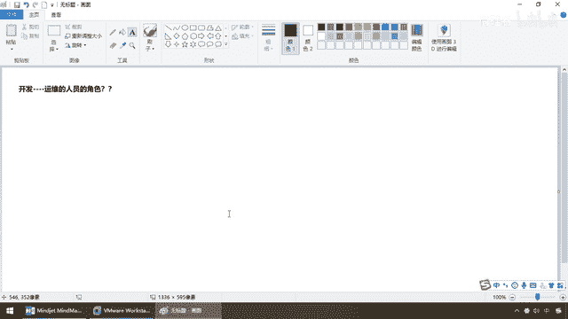

# 尚硅谷Docker实战教程（docker教程天花板） P6 - 06_docker能干嘛解决什么问题 - 尚硅谷 - BV1gr4y1U7CY

好 同学们 我们继续接下来了解Docker是什么，容器和虚拟机的概念的比较，那么我们明确的得知，容器轻量小 比传统虚拟机更加利于快速的发布和部署。

那么通过前面的介绍 有没有发现Docker这种理念出来以后，慢慢的我们的开发工程师是不是有点扮演了运为人员的角色。

对吧 那么好吗，以前开发完了 交完原代码 提交到平台，运为从GitHub私有库上拿下来自己去安装，那么现在有Docker了以后，我这儿本地运行什么环境 通过Docker打包成镜像。

发布到对方的测试和运为环境以后，一模一样的跑 丝毫不走样 平滑的迁移。

那么所以说我们这个Docker它能解决的问题，延伸了一种新的开发理念 那么也就是现在非常火爆的。

对吧 以前吧 大家经常两三年前吧，三年前吧 大家听到有名字叫全站开发工程师，但是后来发现前端 后端 更后端，比如说大数据 比如说现在我们前端 H5 VUZ，后端 Java 再后端 大数据等等。

那么从以前的数据仓库变成了数据壶各种概念，发现你想真的全站 比如说一个人精通全部技术太难了，那么慢慢的还是返璞归真 回到前端是前端 后端是后端，但是Docker出来以后出现了一个新的工种。

那么就是Devolve OPS OK 那么就是开发兼运为，那么大家呢 先来看看Docker理念概念出来以后。

对我们工种的影响 第一个 技术职位的变化，那么大家经常对我们程序上有些调侃 一些自黑，那么现在来看一下 第一种叫Coder，你只是个编代码的 那么换句话说，也就是我们大家口中所说 自黑开玩笑说的 马浓。

其实这样的话呢 我还是这样的呼吁一下，各位还是应该说自己是工程师 不要天天自黑了，省得外界对我们有些太多的误会 坦白讲的话呢，目前而言的话 薪水还可以吧 OK。

那么在于对于这个 也就说你就是砍锤C 砍锤V，你能够做点基础的软件工作就完了。

但这个基本上不大值钱的 OK，那么下面继续进阶 来，Programmer 你从马浓 编码Coder，终于变成一个程序 那么可能对于部分模块，是有自己的心得 能够按照标准的规范。

写点东西了 OK 那么再进一步，那么注意 从程序变成Softengineer，那么这个时候是软件开发工程师。

那么这个才是真正对我们职业的定位。

我们是工程师团队 不管外界怎么黑我们，或者我们有时候调侃的自黑 无所谓，那么希望各位同学要盯紧了这个技术和本事的发展，不要整天只会说自己什么格子伤 掉头发 关头了。

找不到女朋友了 没有办法在生活中面向对象了，请慢慢扯淡 杨哥身边周围的弟子，包括我周围身边搞IT的 混的都还挺好的，那么 哎呀 黑不过他们 我们低头干活就行了，那接下来 终于 由于Docker的出现。

那么兄弟们 出现了这个Devops，那么就是DVDevelop开发，而这个就是运为 两者结合的开发，运为混合型工程师 那说白了，就是把以前传统的开发 慢慢的迁移到了我们的。

容器云烟生平台 成为了开发运为，两直兼任于一体的新一代开发工程师，所以说 结合这儿 我们也可以得到，Docker出现了以后 一次进线，一次构线 随处运行 那么它的好处，轻便 灵巧 发布快。

那么能够把我们的运行环境完整的，打包进线了以后 处处运行，所以说 它拥有更加快速的运用，交付和部署的能力 你比如说啊，以前我们交个代码 我们还要给运为一大堆安装，程序和配置文档的说明。

各种繁琐的配置以后 才能正常运行吧，那么现在Docker化了之后 容器化了以后，我只需要交付少量的容器 什么啊 镜像文件，多次强调过 反正我们虚拟机上能跑上，模拟Sentos 7 我只给你个S啊。

我没有给你别的什么操作手册说明文档，就这么一个 一放 哎 那么这样的话交付起来，是不是更加的快速和方便，第二个 便捷的什么 升级和扩缩容，那么 弟兄们 我起一台 起一台 起一台。

每台五分钟 但是Docker呢，不是这样的 现在呢，微服和Docker的发展呢 大量的应用，都是通过微服的方式去架构 那么每一个微服，至少连一个不同的库 那么这个时候。

我们有了Docker这种技术 大乐高寂寞，每个容器呢 就会变成一块块的寂寞，堆叠 堆加起来 应用的升级，将变得非常容易 不管是扩还是缩，都可以 所以说通过静像可以进行新的容器。

快速扩容 也可以从原先的什么，分钟级别 变成什么，小时级别变成分钟级别变成秒级，那么这是它的第二个优势 那么第三一个，更简单的系统运为 以前啊，各种环境还有监控啊什么的很头疼。

那么现在容器化以后 大家都跑到Docker上面，好吧 运送货物的都是这条巾，生产 开发 测试 高度一致，都是同一范 那么现在容器，将整个环境和状态完全什么 封装起来，我强调过了 都是一个个的集装箱。

我现在在岸上装一头猪进去，装集装箱里面 运过去 打开不可能跑出来一只鸭子，对吧 所以说呢 这种不会因为，底层的架构基础的不一致和修改，来应用的影响产生bug，那么这个时候的话呢 我们所有环境都一样。

要么不出错 要出错 同样都是一样的，那么一个地方出错了 我们可以通过测试环境，迅速的快速定位 修复和模拟出来 那么最后，当然了 主要是节约钱 对吧，你看容器虚拟化 不再模拟硬件了。

那么这个时候 老板的money是不是可以节约，它是什么 内核级虚拟化技术啊，如果我这个软件 我要跑在linux上面，我其实只需要linux最核心的那些配置。

我不需要linux什么加载给我 加载linux的一些什么地图啊，加载linux的打印机接口啊等等 不需要，那么这样 我不需要额外的，虚拟支其他非必要功能的支持，所以这台物理机上面 我可以跑多个容器。

大大提升了我们物理机的CPU和内存的利用率，那么这样 所以说我们Docker的应用场景呢，都这么回事，随便你各种开发 完了以后，把你的微服务通过Docker这种容器，打包成镜像 OK 前面我们讲过了。

不再啰嗦了 比如说我们的古丽山城镜像，一丢 在这运行是这样，那么拉取同一份镜像，我们都有一个古丽山城这么一个镜像文件，它这跑到Docker上 能跑，我们从搬家到搬楼，那么一样的拉取同样的镜像都能跑。

所以说在这Docker就借鉴了标准集装箱的概念，将同样的货物运转世界各地，那么唯一不同的集装箱运输货物。

而Docker是运输这个软件。

所以说呢 它呢 能解决的问题，能干的事情就是这一些，由于我们现在开发和运为一块招，那么Devops开发工程师，也就是下一代的基于Docker K8S，这样的新一代云原生形开发工程师，全部上云 跑在云端。

那么这个时候 都是为了什么，更快 更高 更强 那么更加的，节约计算机的资源，好 那么这个时候呢 我们来看看哪些企业在使用呢，那么各大产现在呢，都在用 甚至有些我所知道的一些大产。

他们对Docker容器的实力 那是百万千万级别的，那么扩缩容非常非常的多。

所以说大家非要掌握Docker这面技术，比如说我们的新浪 那么大家请看，新浪的系统呢 那么基于Docker容器的，混合架构 那么首先啊，因为部分的工作 80%怎么着，由Docker容器来实现了。

你看扩缩容 基本上5分钟，多少 30多万次，那么这个时候的话是很恐怖的，那么这个时候大家请看啊 如何10分钟以内，完成1000节点的扩容能力呢，好 那么 如果这种动作你用传统的。

虚拟机来做 可不可怕 我点一个容器，就要5分钟 而它是要10分钟以内，平均下来要1000个节点的扩容 那么，用Docker 米售斯等什么动作，容器新技术 使大规模的动态调度。

成为可能 所以说业界趋势各大厂，都在上云 都在上这些什么 容器技术，好 那么来看看美团，为什么是Docker 请大家看这句话，耿清亮 基于容器的虚拟化，仅包含业务运行所需的。

Runtime环境 Central Asset，最高一万图的基础境限 多少，170券 所以说这就是为什么Docker比较快，好 那么这个时候，我们呢 后续安装编码的时候。

我们再回来看这张图 深刻理解这句话，干嘛 仅包含业务运行所需要的Runtime环境，不用像以前传统虚拟机这样，用得到用不到的 反正我带环境安装整套给你，我只要按需取数据，需要什么给你什么。

最小你小运行的就快，好那么最终像我们的蘑菇街，你看都强调一个什么，轻量秒级的快速起动，OK所以说Docker它能干些什么，主要就是基于容器化技术，开发运为合二为一，能够达到我们更快的交付，更平滑的迁移。

那么好最终完了以后，那么前面强调的这些理论，我们接下来就要进行实战，Docker的安装和配置，那么老规矩，凡技术必登官网，那么去哪下呢，这个就是我们要给大家介绍的，Docker它最主要的两个网站。

一个是官网一个是Docker的仓库。

