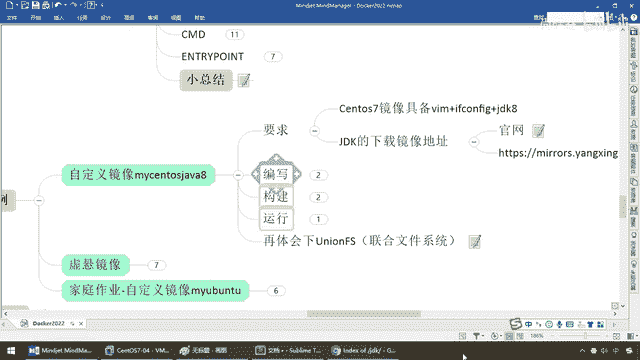

# 尚硅谷Docker实战教程（docker教程天花板） P60 - 60_centos之dockerfile需求说明 - 尚硅谷 - BV1gr4y1U7CY

好，同学们，接下来，直接第二板斧，理论，石韬，那么是不是叫案例书画，上面如果你听了有点晕晕乎乎的同学，没关系，谁学都是这样的，我开始也是不懂，我照官网看的时候也挺痛苦的，对吧。

我也不知道这些大概是个什么意思，但是呢，慢慢的摸索，一定会达到成功的彼岸，那么请大家坚持，好，那么接下来，不废话，干嘛呢，我呢，讲前两个，什么都不到，家庭作业，OK，那么这一次呢，我们换一个。

自定义一个镜像，因为U版图我带着大家已经定义过了，对吧，我这次换一个，Santa OS，听懂，那么这个时候你应该不会再来问我那个问题，杨哥，为什么在虚拟机上面你装了个Santa OS。

又装了个Docker，Docker上面又跑Santa OS，再问我这些问题的同学就可以，OK吧，好，打屁股了。

好吧。

那么来，同学们，我们直接Docker images，我这儿先提前下载好了一个Santa OS，那么大家看一下它的image ID是这样一个东东，OK，最新版的，那么来，Docker run-it。

我的呢，叫这个，然后呢，bin bash，OK，这个是我从，HUB上，远程仓库上拉下来的一个最原始的Santa OS，那么这个Santa OS，大家请看一下，VIM，A。txt，有没有，没有。

ifconfig想查看一下IPC，有没有，更没有，那么再来一个，有没有，我想这个Santa OS里面，现在带着VI命令，ifconfig，甚至还给我装好这个Java 8，那么弟兄们是不是做梦啊。

那么这个时候，同学们，请看一下，啥情况，Docker images，Santa OS，各位亲，多少，200多兆，你怎么可能，对吧，那些功能都具备，我们强调过Docker运行这些镜像。

迅速形成容器实力给你使用，都是一个什么，简单版的Linux，很小，很巧妙，对吧，高效简洁，所以说不具备那些额外的功能，那么回到我们这儿，对吧，我们相当于说是不是要构建一些增强型功能的了。

那么接下来我们的需求就是希望我们用Docker file对这个Santa OS进行改造，那么我们现在要加三个功能，那么这三个功能分别就是要求大家具备VIM，EveConfig命令这两个，再加个GDK8。

因为你小子不可能说Santa OS7，Ubuntu哪个镜像下来就给你带着GaWa8，那么反过来讲，我今天教你这些，你要学会这个Docker file编了以后，以后你的某个镜像。

你就可以往里面不停的加功能，加了以后，自己形成一个镜像，那么从此以后是不是就直接在Docker下干活。

一拉出来就具备了很多软件就已经给你安装好了。

再说直白一点，就有点类似于说，兄弟们，你们现在假设专系统是Win10G，那么11这个是一个什么，系统，对吧，我希望这个系统里面直接就带着什么，微信加QQ，再加什么，压缩软件，对吧，假设再加一个QQ影音。

影频或者什么东东都可以，对吧，或者再加安装好一些什么，百度云盘等等等等，就是你，那么再加什么，Office，365等等等等，那么相当于说我这些功能，默认的Win10G不会带这些功能。

那么你现在把这些软件安装好了以后，又拿它再做一个新镜像，那么后续是不是你直接装这个新镜像，你打开以后默认都带这些功能了，一个道理，那么所以说这块听懂了以后，那么兄弟们我们来看一下我们该怎么做呢。

首先GTK的下载，镜下的地址，官网是这个，那么由于以前阳科在备课或者在讲解的时候，我那个时候的话，我下的是加瓦巴的171吧，但是现在好像我看了一下，我看一眼还是给同学们，好像它已经升级了以后。

已经变得已经更加新了，我们看看，那么这个时候无所谓，那这个时候，只需要请弟兄们，你自己去下载，那么在这块我们是在Linux下面，那么你请你找到一个TAR。GZ这么一个GTK的包就行了，那么注意。

我们是用，最好是用什么，压缩过的，64位的Linux版本的，那么这是301，它慢慢的更新，你看现在都到311了，你只要下那个TAR。GZ就行了，随便你啊，但是我做的时候是才到170多呢。

那么这个时候你自己下载是多少就是多少，好，那么这儿官网地址呢也给你，如果你觉得这不好下，那么你非要是跟阳哥保持一致和同步，这个也没有任何问题，那么在这儿啊，大家请看我是171这个版本，你爱下哪个下哪个。

那么如果你想附用我的这个脑头笔记，你就下这个就行了，好，那么这儿呢就说一下，这个是一个GTK下载静像的问题，好，那么下面兄弟们，我们呢对于我们的需求，我们那就先说到这儿。

待会儿我们来进行Dockerfile散布区编写构建运行。

