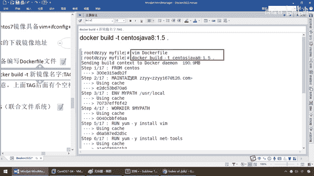
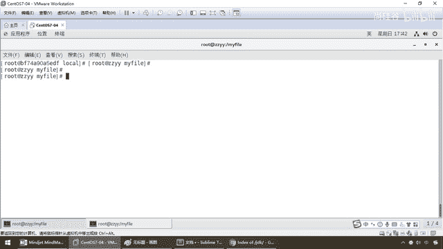

# 尚硅谷Docker实战教程（docker教程天花板） P61 - 61_centos之dockerfile案例演示 - 尚硅谷 - BV1gr4y1U7CY

好，同学们，上一讲我们讲清楚了我们案例的业务需求，原始的Santa Rosa期间并不具备VIM EVE CONFIG和Java8相关的三个功能，那么现在我们要用DockerFi编写一套镜像文件。

构建了以后，使得我们Santa Rosa期间具备这三个功能，好，那么来看一下结合我们前面的保留字这些相关的讲解，我们怎么来进行这个文件的编写，以及它要求的与法规范和业务诉求，第一个。

编写DockerFi文件，那么请大家注意一下大写字母D，这个D一定要大写，那么大家请看官网上人家叫的什么，是不是叫DockerFi，这么说，能跟上，OK，那么再来这吧，DockerFi，兄弟们。

没问题吧，它叫什么，我们跟着规范和与法操作就行了，这个也不用去纠结为什么，那么下面来，搁到这，新建一个文件夹叫MyFile，这一波能跟上，那么现在我因为要打进去一个GDK8，那么现在我选的版本是这个。

第二次强调，因为后续有些同学要是复用我的脑图的话，那么你最好这个GDK的版本也跟我一样，否则如果你去下最新的，是不是要把这个171改成那个311，所以说，它最新的版本已经是变成300多了。

那么如果你想去跟阳哥下一样的，就用这个就行了，OK，好，那么这是我们的第二个，那么现在我在这个路径下面已经给你整个蛋带了一个好的一个，Java8的这么一个踏点，GZ这么一个包，然后在同一个目录下面。

我用vimDockerFi，OK，那么开始进行我们相关的编写，那么来，兄弟们，我们直接拷贝相关的内容，待会儿再逐行给大家进行解析，那么这些请大家不要去费劲的去编写，听到吗？，直接拷贝粘贴。

然后我们来看一眼，首先，大家摞眼，我们呢，FromSantaEarth，我们前面强调过在这块的话是什么，From第一个命令是什么意思啊，是不是相当于是继承啊，那么来，兄弟们，摞它一眼，是不是基础竞相。

相当于说我现在要在哪个基础上面太高，是不是在这个不具备那三个功能的SantaEarth上面进行编写，所以说我的顶层，我的天花板就是这个SantaEarth，那么现在天花板要打穿了，要更进一步的增强功能。

所以说我的继承竞相是这个，OK，那么好，这是第一个问题，那么第二个，请同学们看，干嘛？，这个是不是指定作者和游戏啊？过，第三个关键字，EMV环境，MindPass，我告诉你，我登录了以后。

进入User Local这个路径，那么Worker，DIR，我引用你前面定义好的这个EMV环境变量，Key，Value，没问题吧，那么接下来请看，RUN命令。

那么就是run yaml-y install vim，这一波就是我们刚才的第一个功能，直接要安装vim编辑器，那么前面我们来说这个run的时候，是不是也给大家强调过，那么两种格式，效或者这个。

那么相当于说，大家请看，这个效什么意思？，等同于在终端操作的这个效命令，那么大家请看，是不是相当于说，我在构建那个时候，直接就告诉你，往这个净相，还没出产的，在工厂里面给我做好了。

你就要具备这个vim命令，好，那么这个是我们其中的几个，那么接下来，请同学们继续，干脆这样吧，我在脑图，我用这个命令，我们来回到编辑器上来看，第二个，安装if-comp个命令，那么run关键字。

dockerfile的保留字，yaml-y install net-true，OK，好，第三步，安装Java 8，以及它需要的lib库，那么在这一块是配置Java 8的标配，那么现在我们干的这活就是。

g libc。i686，那么先把它当做一个gcc的加强安装包，否则到时候装这个jdk的话会出错，然后run，你看，相当于说我们只要run的意思就是说，你在linux的操作系统操作那些命令。

直接在我这都可以用，那么这一步的意思就是什么，make dir建立一个目录，user local然后java，好，add是相对，它的意思是相对路径，当然我们现在是不是都在，这一个文件夹下面，大家请看。

mifile这我再进来，在单线路径下面，大家请看，我们这是不是有一个，jdk8171的这个，然后呢，docfile我们两个在一块，尽量要把家的东西都给它放一块，给它好找，那么这个时候干嘛。

相当于说把这个添加到容器当中，那么安装包必须要和docfile文件在同一个位置，那么add我们前面说过了，这个add是什么意思，来将宿主机目录下的文件，打进镜像里面，且会自动处理，ul和什么解压。

这一步就很经典了，那么相当于说，在单线这个路径下面就会把java8这个踏包，打进去，然后解压了以后，打进镜像，解压这个路径下面，OK，然后配置环境变量emv，那么这个呢，好说，就是我们什么。

构建java那些什么pass classpass，这个呢我就不说了，那么最后，弟兄们请看，暴露出80端口，当然我们这个sentelOS也不需要暴露什么端口，你可写可不写，那么最后写了三command。

eco相当于java里面的，sytem。outprintln，那么打印出我们的mypass，然后呢，如果到这一步运行成功，那么说明我们构建，后台我们看到这个提示说明我们整个docfile的构建完成。

那么最后，这个命令就告诉你，sentelOS最终是不是需要一个，尾中端，来跟客户进行进一步的沟通和了解，OK，那么所以说兄弟们，在这一块我们就完成了我们的第一步，docfile相关的编写，好。

那么接下来，构建，那么注意，公式就是，docbuild-t，那么build是构建的意思，那么这个t又是什么意思呢，那么docbuild-help说过了，哪里不懂查哪里，那么这个t有这么三个意思。

那么此时，因为这个t呢，一般是taglist，但是这tugget-string，你看设置tugget-build的什么构建状态和步骤，OK，那么所以说我们在这，docbuild-t，注意新进向的名字。

冒号tag，那么这版本号注意，这有个点，OK，那么这个非常重要，那么来兄弟们。

相当于说啊，我这呢直接呢，就执行这个命令，在当前这个路径下面，mfile，已经具备了我的docfile，那么要把我们的java8打进去，那么根据我们的docfile前面的编写，我们已经看到了，那么。

我在这是不是转转两次，安装了vinmware和是吧，ifconfig命令，那么相当于说，前两个命令用run打进去，最后这个jdk在这给你摆好，拷贝进去后你做设置，那么好了，那么现在在当前路径下面。

我docbuild的干替，我的名字叫santos java8，版本是1。5，点，当前目录，那么一回车，那么大家请看，如果不出意外，大家请看，多少步，17步，一步一步一步的给你做，那么当然我首次构建。

它也需要从网络上去安装我们的亚默，稍微有点费时，那么在我呢，稍停一下，暂停一下路平，那么还有经过漫长的等待，终于完成了，看到了我们successfully这个单词，ok吧，那么大家请可以看一下。

大致的话，它这一圈圈，各种的插件，还有第三方包去引导，那么我下的过程当中，因为我可能，网速稍微有点慢，还是等了大概这么，小半分钟，那么在这可以看得出，那么运行我们这个，make dir这个命令。

然后请看，添加这个ok，那么设置环境变量等等等等，一圈下来以后，那么大家请看，要运行这个，cmd echo success，你看这一行是不是ok到这了，那么command bin bash等等等等。

全部下来，最终给你完成了我们的自定义的，什么，centaerase新版的，dalker is centaerase 7，那么大家请看dalker，emegis。

那么这我们有个centaerase 7加8，1。5版本的就是这个，那么你晓得的，默认出产那个才200多兆，你看看我这个多少，是不是干到了700多兆，当然要比这个功能更强大一些，那么好，行不行。

咱们验验货，那么现在我们的什么，第二步构建就完成了，那么下面我们的运行，是不是变成我们的dalker run-it，我们新进项的名字1。5，这个来看看我们的效果好不好，来兄弟们，哎呦，dalker。

emegis，那么dalker run-it，现在我的进项，是这个名字，好，粘贴，bin bash，那么来，兄弟们，pwd，大家请看，我需要我登录的时候，登录进user local，有没有完成，搞定。

为什么，因为我们这，说的很清晰，在这块以后是不是说过，我们设定的环境，mipad，就是叫user local，我现在walk。dl，登录并引用，那么相当于我的落脚点，就是它，好，第一个功能达成，第二个。

vim a。txt，兄弟们，请大家看一下，111 center，os，那么vim，加ifconfig，加java8，ok吧，那么大家请看，边写边写，没有任何问题吧，那么第二个命令，是不是搞定。

那么第三个，ifconfig命令，大家看，我在这个容器里面，以前的center os7，是绝对不会支持，这两个命令的，现在都已经完成，那么再不行，你也晓得，那么java-version一回车。

你看我们java8171这个版本，是不是安装成功，你再怎么也应该相信了吧，对吧，以前出产的center os，是不可能带着java8的，那么现在，你晓得的，我当前这个容器。

刀卡ps。

