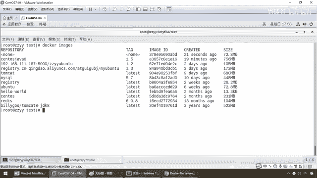
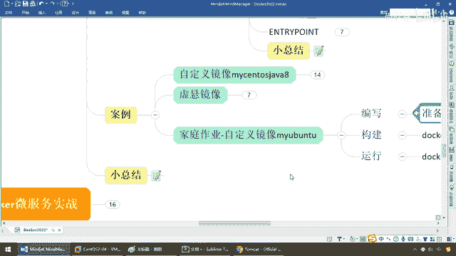

# 尚硅谷Docker实战教程（docker教程天花板） P62 - 62_虚悬镜像 - 尚硅谷 - BV1gr4y1U7CY

好，同学们，那么通过前面我们的构建，我们已经知道了，当前我们这个通过我们多开发要构建出来这个新的镜像，那它是不是天生骄傲，出生就牛逼，自带着vim，ifconfig还有java8相关的三大功能啊。

那么完成了我们的镜像功能的增强，OK，那么好，那么现在呢我们再体会一下这个联合文件系统，就是以前讲过的那个花卷，好吧，那么弟兄们都清楚啊，当初构建的时候，大家请看，这儿是不是有。

我们的容器和这些镜像ID，这儿也有，这儿也有，这儿也有，层层堆叠，一层层的叠起来的，那么所以说，回顾一下，你应该明白，这块我们就清楚，联合文件系统是Docker什么，镜像的基础。

你这个镜像最终也是要反映到我们Docker file的，所以说，镜像可以通过什么，分层来进行继承，好，那么结合我们前面所请，那么大家请看，我们VIMDocker file，大家都清楚。

我们第一行是不是就是继承了我们的Sentel OS，在这个基础上，我们做了一些配置，加了一些功能，一层一层一层的叠加，相当于说，有一块什么，老面，那么这个花卷是出示了。

就是基于最原始干净的那个Sentel OS，然后一层一层的加，最终大家，符合成一个复杂的功能，完成了我们的新功能的添加，形成了一个新的镜像，这个要大家记得，好，那么接下来，我们来说一个新的知识点。

那么就是，虚悬镜像，还有印象吗？前面提过一嘴，不废话了，仓库名和标签名都是NUN的镜像，俗称Darling EMAG，那么Docker file，咱们写一个，好，很简单，那么兄弟们，Front U版图。

就干这么一个事，VIM，Docker file，然后呢，直接Docker build，注意我没加那个干贴，小点，好，那么现在，我退出，那么假设，Make DR，那么现在呢，就是我们做一个，Test。

这么一个文件夹，兄弟们，没问题吧，OK，那么现在VIM，我们Docker file，在这个里面，我们构建一个，Front U版图，然后呢，command，我就。

Echo 打印出这么一个Action is success，没什么，好，这个是我专门做一个测试的，那么现在Docker build 点，好，同学们请看，successfully 有没有成功，绝对成功了。

但是注意，他就两三步，你看Front U版图，就打印一句话，什么都没做，其实说出来，还是原来那个U版图，那么现在这个successfully 说明我的Docker file，的语法编辑没有任何问题。

那么讲这个干嘛，Docker images，兄弟们请看，这儿是不会出现，那是既没有仓库，也没有这个标签，也就说有时候哈，我们大家在进行，因为Docker 它保不齐在你删除，或者修改，重新打标签的时候。

会出现那种情况，那么这种动作出现了就叫什么。

虚悬境象，听到，注意我这个写的没有任何意义，是我故意写一个，算是有天生有残缺的，无聊的这么写了一个虚悬境象，听懂了吧，一般他在日常工作中，产生的概率是有的，但是不多，但是一般有了，对你的系统。

可能会存在一些隐含风险，而且这个面试题也被人家考过，说一下什么叫虚悬境象，就是构建时候或者删除，境象的时候出现一些错误，导致仓库和标签都是那，那么对于这种东西，请一定把它Kill，请一定把它干掉，删除。

听懂，好，那么下面我们呢，写完以后，那假设我就想单独的查看，我们这个虚悬境象呢，可以，你给我把你本地Docker，引擎上面的全部虚悬境象，给我查出来，那么当然如果这个越多，当然越不好。

因为它本身就是一种，是吧，错板的错乱的，并且还占你的空间，听到，那么接下来查出来以后，干嘛，直接删除，那么怎么删呢，那么大家请看我一查弄到这，那么好删除的命令要用是吗，虚悬境象已经失去存在价值。

可以删要用这个命令给他删除，OK，这个PRUNZ这么一个命令，OK，我们来试试啊，那么查询出来以后，我们现在呢，直接就来按照我们这个，Docker image prune。

那prune是修剪裁剪的意思啊，我们在这块一删，它就问你，警告，将会移除所有的，你看Darling images，注意是什么，所有，整，不用怕，最好不要有这种虚悬境象啊，我的意见是，那么来，兄弟们。

删关了，大家看，没有了，OK，所以说呢，这个留在系统里面，也算是祸害吧，不大好，好吧，都是烂烂的，小心你误删除，那么这个时候，那么请大家了解一下，我们的虚悬境象，好，那么接下来，兄弟们。

我带着大家做了个复杂的，那么你呢，给我做一个U版图，三步，熟悉并了解一下Docker file，作业一定要动手，OK，边写个Docker file，build构建，注意加点，然后呢。

run你构建的新境象，那么这个干什么呢，就是复习一下我们以前的，我在U版图上面去做，那么你继承谁，你在哪个上面经常去做，搭台，看戏，搭台，U版图，看戏，你要干嘛，更新索引，捡一个ifconfig。

那么这个是捡别的命令，对吧，ip，addr那个命令，那么这个是捡一些其他工具，你想捡什么，捡什么，然后呢，就完成这么一个动作，那么如果可以，你也可以在U版图的基础上，继续安装那些GDK。

把我前面那些命令综合使用，好，那么同学们，这个就是给大家介绍了，虚拳境象和家庭作业，那么最终，我们小总结一下，也就是完成了我们的什么，基于Docker，内部用Docker commit。

完成我们的新的境象，外部边写Docker file，构建成我们新的境象，那么结合前面的，你，阿里云你个人名下的，阿里云远程库，或者你们公司私服库，拉和推，那么这由得你了，那么这样的话。

你构建出来这个境象，翻到你们公司的私服库，那么以后，你们公司的开发都在容器下，Docker下面开发，那么你新员工来了，是直接拉这么一个境象，什么环境都是跟全组一模一样啊，那么这个就要看你们。

公司的技术经历，有没有这个心情和这个经历，和这个心思，或者这个知识储备，去干这么一个，新的新员工和，入职，快速入职的研发平台，这个对新员工的，入职的这个体验是非常好的，就干一步Docker Pro。

全部拉下来，我们大家都在容器下，Docker下面开发，你跟我的环境，我跟你的环境，我们那个模板，相当于对吧，就是我们在这说的这个，Fraud，你们公司的这个境象，大家都一样，不可能出错，只要在你这跑的。

架构师，技术经理，项目经理这跑的是ok的，新员工这跑的都是ok的，只不过大家在这个基础上，各种修改，但是我们的基本盘，我们的底子都一样，所以说希望大家，可以尝试着构建一个自己的什么。

公司自己内部的私服和云平台，好，那么对于DockerFi，以及家庭作业，我们就给大家介绍到这。

