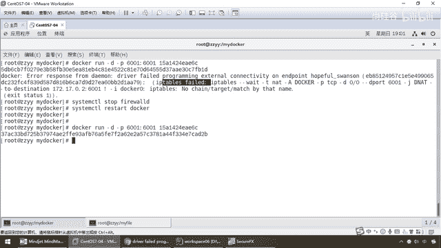

# 尚硅谷Docker实战教程（docker教程天花板） P64 - 64_dockerfile发布微服务部署到docker容器 - 尚硅谷 - BV1gr4y1U7CY

来，同学们，刚才我们通过idea工具Maven的插件package，大家看一眼，在这儿是不是就把我们的Docker、Boot这个威夫工程，彻彻底底打成了一个价包，那么它打到哪儿呢？。

打到的地方是不是在我这个工程下面的target下面这一段，OK，刚才有同学来问我这个路径怎么出来的，给我干崩溃了，多说一嘴，那么在这块大家看successfully说明什么，打价包是吧OK了。

那么100%，那么现在你看，构建的这个价包的地址是88888在这儿，这一波没问题吧，那考拜这个工具也发过给大家一张，那么大家请看这个是不是我们刚刚打包的懂不懂，然后完了以后，左边是我本地。

右边是不是我167远程离那个宿主服务器，然后就这么一拖，对吧，这儿是不是就形成我们这个价包，那么这个价包就是我们刚才本地演示成功通过的这个价包，这一波，OK，不废话，这样提一嘴，好。

既然有同学问我也就说一下，那么现在相当于说在my-docker这个文件夹下面，已经有了我用supreme-put编好的一个家吧，为服务，好，那么下面我们就要把这个为服务。

通过Dockerfile的编写打包到我们的镜像里面，并形成容器运行在Docker，好，那么下面我们的第二波就来了，通过Dockerfile发布为服务并部署到Docker容器，新建好了这个为服务了。

也有了，那么来我们前面也说了，在idea工具里面搞定了为服务价包，那么来，兄弟们，得到这么一个价包，名字，OK，它形成什么就是什么，我都没改，那么注意，就很简单，这个什么没问的这个基本功。

什么clean，instore什么这些命令我不废话，那么package打包成一个，默认你是懂的，好，那么下一波，那么和前面一样，你只要做了我的家庭作业了是不是，Dockerfile三步编写，构建，运行。

那这不还一样，编写Dockerfile，构建镜像，运行这个容器，反问测试，好，那么兄弟们，来，老规矩，基本上按照我们养成的好习惯，单前路径下面，已经有要打包进去的价包了，那么，VIM，首先，干嘛。

手字母大写，第二个要打包进去的这个价包，最好跟我们的Dockerfile，在同一个路径下面，好，那么下面来，将我们的微服务价包和Dockerfile文件，扇传到同一个路径下面，卖Docker。

我们已经完成，对吧，那么Dockerfile的内容很简单，那么兄弟们走起，那么这儿，和之前一样，粘贴，好，set，NU，来，兄弟们，就短短十多行，可以再复写，那么from加把八，对吧。

因为我是一个微服务，由于Spring Boot，它作为一个价包，它是天生内欠了他们Kat容器，听懂了吧，那么这个时候相当于说，我们只需要给它加把八就行了，那么这个是我们的作者，阳哥，那么shar。

Valumes，什么意思，相当于杠V挂载了容器券，那么意思就是说，在主机的VRlibDockerfile下面，创建一个临时文件，并连接到容器的这个Tempt，OK，你可以只写一个，那么下面。

重要的是这一行命令，那么add，前面说过了什么叫add，将宿主机目录下的文件，拷贝进进线，且会自动处理，URL和解压，那么现在我们不是一个，踏点gz这么一个压缩包，我们在单情路径下面，OK。

那么大家请看，我这儿一刷新，在这个myDocker路径下面，是不是有我们这个价包，和我们刚才那个Dockerfile，那么现在相当于说，就把这个打进去，添加到容器，并且更名为。

zzyy下滑线Docker点加，那么假设，这个就随便起个名字，阳哥的这个，那么运行，那么这个Patch打印出，我们这个价包，然后，entry point执行，你看是不是加，干，加，然后运行这个价包。

那么跟我讲，这个是不是就是我们以前，以前运行一个微服务的命令，那么最后我们干嘛，以6001作为服务端口，暴露，为什么，因为我们这儿是不是也6001，OK，好了，那么兄弟们，搁到这儿，还活以后我们呢。

直接，保存退出，那么，现在，来了来了，那么现在是不是我们的Dockerfile，和我们的微服务这个价包，就在一块，那么接下来是不是就要把这个，微服务价包，让它进行，Dockerfile形成一个新的进项。

最终容器化，好，那么这是我们的什么，第一步，完成了编写Dockerfile，第二步叫什么，构建进项，那么你晓得了是不是Docker，build干贴，然后呢，加上我们的什么，仓库名字。

和我们的Tag标签版本号，那么来，直接写好，那么来吧，我们呢，编写完成，开始构建，那么现在，执行这个命令，运行我们的Dockerfile，那么来吧，我们呢，希望你build了以后。

构建这个Dockerfile，那么形成一个新的进项，名字就叫这个，那么在单前面下面，OK，加个点，好，那么下面，等它一会儿，那么我们呢，也需要加把八，这些东西，终于构建完成，那么在这儿，我们可以看到。

针对于MyDocker，这个目录下面，对这个架包，结合我们的Dockerfile，来进行构建新的进项，那么新的进项的名字，就叫它，版本号叫1。6，那么来吧，from，永远是第一函，基于哪个进项。

七步里面总共一步，那么来，叭叭叭叭叭这些，再体会一下，我们前面说过那个花卷，是不是了解过，一层一层，叠上去，发出来，那么最终进项是分层的，那么来吧，下载新的进项，加把八，然后作者是我，那么完了以后。

挂载我们的什么，容器数据卷，OK，那么接下来请看，就把单前的这个，打进我们的进项文件里面，并且形成新的进项名字，叫这个，OK，完了以后，加把架，那么来运行这个，OK，也就是说最终容器上，最后一函就是。

运行这个为服务，那么来兄弟们，Successfully，那么这个单词，是最美妙的单词，对吧，不废话，那么Docker images，大家请看，是不是就有我们的，这个，1。6版本的Docker，那么新的。

进项ID，就是它，那么完成了我们的第二步，打包成进项文件，那么兄弟们，请看，OK，好了，那么现在，完成这些以后，那么就是第三步，是不是要运行容器了，那么最简单的，不用多说了，怎么着。

那么现在是不是我们的，Docker images，那么现在我们的进项，是不是它，那么Docker run，干什么，为服务一般，是不是的后台运行，干D，对吧，小P，600，哎，6001，6001。

对外暴露的服务端口，OK，我们当然都已经写过，那么在这一块的话，我们的进项ID，或者你写这个名字，都由得你，搁到这，那么兄弟们，OK，那么我们也不需要，给它进行交货，所以说不用什么，办事脚本了。

我们最后一函，不要产生命令覆盖，前面已经说过了，我们Docker file文件的内容，最后一函，几乎是不是就是，entry point，执行这么一个命令，好，那么相当于说，这没有什么任何问题的话。

我们这一回车，大家请看，好，那么我们这出了一点小问题，看一下这个错的提示，是什么意思，我反火前，OK，所以说不废话了，stop，OK，然后注意，一般Docker的安全机制，你如果调整了，这个防火前的话。

一定要重启一次，OK，要不然的话，就是你先关完了，这个防火前，你再重启Docker，那么，start，Docker，好，此时，那么兄弟们，我们呢，防火前惹了事，我们处理一下，重启我们的Docker服务。

再来执行这个命令，大家看一下，还会不会报同样的错误，我们运行，可以了吧。

OK，所以说这个错，我们碰到了以后，就调整一下，那么注意。