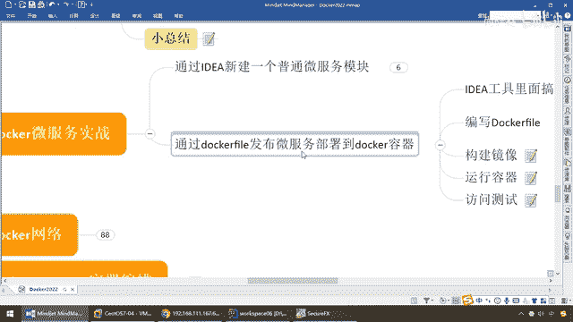

# 尚硅谷Docker实战教程（docker教程天花板） P65 - 65_测试容器上的微服务 - 尚硅谷 - BV1gr4y1U7CY

那么来同学们大家请看一下Docker PS，那么我们自己构建的这个镜像，并成功运行成了一个容器，发布到了Docker，那么接下来我们就要进行什么，运行容器，然后呢，反问测试，那么来运行容器的话。

那么大家请看，只不过刚才呢，我用Emg ID啊，这个都是一样，那么说白了就是6001服务，现在呢是OK了，那么好，运行成功以后，你既可以用CURL来进行反问，那么最经典的，咱们呢是不是192。168。

111。167，那么现在6001，那么order index，兄弟们，有吧，167是不是我们宿主机Linux的IP，现在6001反问，那么对应到，映射到我们的Docker里面的6001，那么大家请看。

和我们刚才在本地，哎要反问的这个动作，是不是一模一样啊，哎说明我们现在通过Docker来反问，完全OK，清楚啊，那么现在，那么再来看一个，那么这个是我们的，index的，那么Docker，那么大家请看。

没有任何问题，哎，搁到这了以后，当然你可以用CURL，也可以反问，这么说，能跟上啊，在这呢，我就不演示了，好，那么搁到这，我们的全部案例测试通过，那么完成了我们的Docker和微服务。

那么通过我们的微服务，Docker file形成镜像，打包了以后，部署到我们Docker容器上面，那么这样，我们微服务，是不是也就在我们Docker上，那么搁到这了以后，就会后面的。

Compress容器编排，那么一个文件就搞定了全部的发布，那么对于你，二三十个容器，实力以内，这个呢是绝对足够够用了，好，那么同学们，这个呢。

就是我们通过Docker file。

发布微服务，部署到Docker容器的案例。