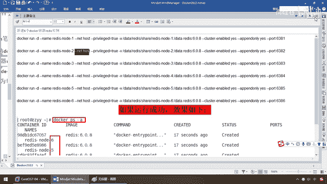
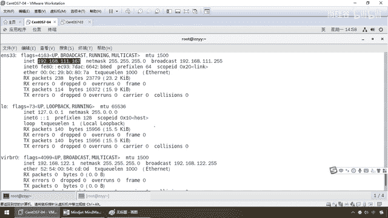
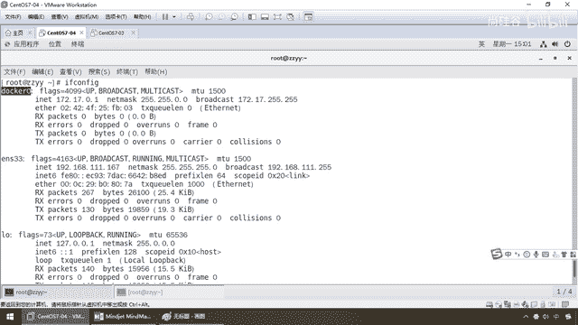

# 尚硅谷Docker实战教程（docker教程天花板） P66 - 66_docker network简介 - 尚硅谷 - BV1gr4y1U7CY

同学们，大家好，接下来我们给大家介绍一下Docker网络这张的相关内容，那么说到这张的话呢，我们不烦呢，先看一下我们前面的一个案例讲解过的啊，对于我们配三主三从Radius集群的时候。

我这有一个新建6个Docker容器的Radius实例，大家应该这个案例都编排过了吧，但是的时候，我给大家说过一个命令的话呢，在这儿，我说请大家无事，我们讲到后面的Docker网络的时候再和大家介绍。

那么现在，看名词你也明白，Net是网络，host是主机，合起来是不是网络模式代表主机模式的意思，好，那么这个具体又是什么意思呢。

我们来讲到我们的今天的Docker网络这张，给大家来进行一下详细的讲解和内容的介绍，那么首先啊，在这张呢，它在日常工作当中啊，纯粹敲命令，倒不是特别多，但是你非得抖。

否则的话到后面玩容器编排和你的网络设计的时候，你Docker容器之间可能跑的并不和谐，并不通畅，你需要对它的网络设计模式，对它的网络的桥接模式等等要做一个简单的了解，好，那么同学们。

不凡我们先回到我们的Docker平台架构图，来，前面大家呢，应该了解了，那么现在是不是要说一下567这三个动作，那么回到我们的这张图啊，反复说过多次了，那么后台的Docker引擎。

Docker服务器连上来了以后，远程库去加载，加载了以后启动的一个一个容器可以把它在内部当做是一个个的Job，完了以后大家请看，这块呢，仓库拉到本地以后，实际而言的话呢。

以这种image的形象形式存在我们的Docker上面，那么在这儿，从这儿，它内部也带着一个库，加载我们的image镜像，完了以后，大家请看，这儿一大块是不是有网络Network driver。

那么在这块的话，是它的网络驱动的时候，就像它的Docker执行的引擎一样，那么在这儿，IP端口，然后呢，各种小IP端口映射，这儿有个Bridge，你看网桥，这儿有个Network interface。

那么通过这些网络的连接，我们有时它的各种域名空间，设备管理等等，连到我们最终的Docker容器实例，结合我们的RTFS，跟启动的这些分层的加载，来进行我们Docker的驱动。

那么现在Docker网络我们就是要介绍这一小块，好，那么了解它的大体上以后，我们就来说一下，它到底是个什么东东，首先，说到网络，大家并不陌生，那么讲到这儿以后，大家都已经是熟练的操作我们的Linux了。

那么现在我就是没讲，不妨我们先回顾一下，假设这个Winvier虚拟机做了一个Sentence7的一个实例，我们这儿是不是有个东西叫网络适配器，这儿有个Net，那么这儿我们先不说Docker。

我们就说操作系统本身的，那么大家请看，这儿是不是有个叫网络连接，是Linux设备的，这儿有个叫什么，Bridge，条接，直接连接物理网络，这儿有个Net，用于共享主机的IP地址，那么大家都晓得。

我们现在用的就是Net模式，可以保证我的Linux虚拟机里面能够上外网，对吧，有线以及连接，可以通过我们的Linux它的网络，连到我们主机笔记本上的WiFi热点，然后连上去。

保证了我们在Linux的宿主机里面可以上网，那么再来看，我们在这儿有条接，有网络共享模式，那么就是用于共享主机的第三种，是不是仅主机模式，H就是host，第四种就是User-Defined。

用户自定义模式，那么来，这个Docker的网络连接和我们物理虚拟机的这个，Drums and Tiles 7的这个有相近之处，好，为了便于大家理解，我们先拿大家熟悉的先去套，大家没听过的。

那么接下来我们来看一下，我现在来给大家演示我们目前的网络，我们到底这个Docker网络，杨哥你要跟我说的是哪一块，那么现在请看第一小节，Docker不起到默认的网络情况，那么来，同学们请看。

Docker images，这个命令相信大家都不会有任何怀疑，敲烂了吧，他告诉你，不能够连接到Docker的Demo后台服务引擎，为什么？我这个Docker根本就没有开着，OK。

意思就是说我现在这个虚拟机上面根本就没有启动Docker，那么这个时候我们都晓得，一般我们在原有的，Inix上面查IP，一个叫ifconfig命令，对吧，一个叫IPaddr，那么这个时候我们来查看一下。

我们不启动Docker的时候，网络的默认情况，那么如果你的安装是跟杨哥一样的，那么应该会看到三个东西，大家请看，ifconfig，一个叫ens33，这个时候他有个init地址，192。168。1。

167，这个就是我们Linux宿主机的地址，第二个有个lo，那么这个lo的意思是local，lo cnl的简写，意思代表就是本地回还列入，127。0。0。1，基本上有网络的，这个都应该有。

那么这两个干嘛，好说，关键是这个有一个什么，虚拟的网桥，什么Lin，virbrlin这么一个动作，给你配了个IP，叫192。168。122。1，那么一般而言，我们用的比较多的是这个和这个，我们都晓得。

如果我现在用前面的Net模式，连到我的笔记本的WiFi热点的话，那么就是同样的网关，连111。1就是我笔记本上的IP，那么来。

同学们请看。

我现在是Windows的，Windows IP Config，Linux EVE Config，这要了解，那么大家请看，我这是不是有192。168。111。1，我们用WinMonet 8这样的话。

然后完成了我们的Linux宿主机，和我们Windows网络共享设置，那么这个呢，原来我们在讲Linux的时候都说过，那么现在大家不熟悉的就是这个，这个简单的介绍一下，了解一下即可，我们也用不到。

那么这个呢，是因为我们在安装虚拟机的时候，默认网络情况，假设就这三个，我们在安装虚拟机的时候呢，这两个，当然了，见过，用过，了解过，那么下面这个，VR0这个什么意思呢，它呢是这样的。

是我们在SynetOS期间安装过程当中，如果选择有关虚拟化的，虚拟化的服务安装选项以后，系统呢，就会给你自己装上一个，比如说我们现在要装Xbox，就是这个Linux的这个桌面。

它呢就要支持一种虚拟化服务，我们呢就会被安装一个以，网桥连接的丝网地址，这个叫VRB2B0的虚拟网桥，那么它也还有一个固定的地址啊，这个不是我们设的，是SynetOS期Linux自带的啊。

那么它是来做虚拟机网桥的使用，那么作用是连接其他虚拟机的网卡提供Net的外网服务，虚拟机之间可以连接，那么我们之前学习的时候，勾选了那个选项就会带着这么一个动动，它的后台服务呢，叫Lib VRT。

这个你不用管它，如果你不想要可以把它删掉，你要看的不顺眼，但是我觉得你就不用动啊，这个是我们装的时候，给我们装上去的，好，那么接下来这是第一个，第二个IP address，ADD2，第二个命令。

大家请看，ENS的宿主机Linux的本地的网卡167，回还链路127，本地回还127 0。0。1，最后你看，这三个四个，叫什么，VR，VR，VR，NIC，那就是跟刚才我们所说的虚拟网桥服务。

那么这个是我们装的时候自带的，那么现在我们又启动Docker，目前就这三个动动，好，这是它的出厂默认，那接下来我要是启动Docker呢，System CTL start，手务敲错了，好，同学们。

现在我们的Docker已经启动了，那么Docker启动以后Docker也迈起，OK，没问题了，能操作这个命令，说明后台Docker服务启动，此时大家请看EveConfig，一回车，这个，这个都见过。

居然会发现在Docker服务启动以后，在我们查询网络的命令下面，会打出来一个新的东西，叫Docker 0，IP是127，172，17。0。1，好，那么这个Docker 0就是我们今天要给大家。

作为Docker网络模式介绍的一个重点知识，来。

