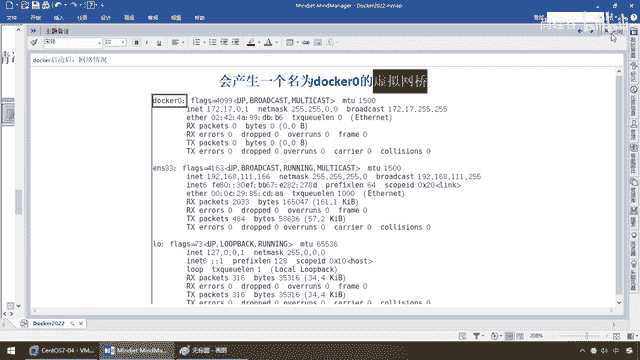
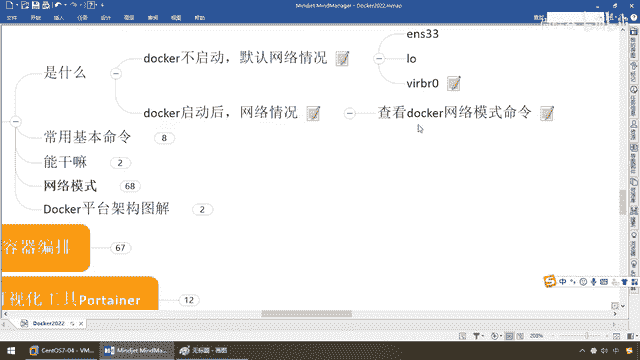
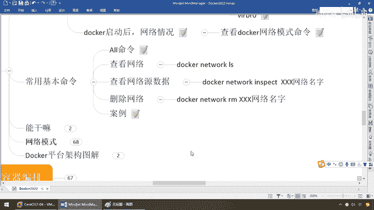

# 尚硅谷Docker实战教程（docker教程天花板） P67 - 67_docker network常用命令 - 尚硅谷 - BV1gr4y1U7CY

同学们我们继续那么通过前面的案例我们可以得知，多卡尔启动以后后台服务会有一个多卡尔0这么一个虚拟网桥，那么按照我们的笔记我们也大家清楚，这个这个都是他以前Linux宿主机的，跟我们现在多卡尔有关系的。

就他多卡尔0，那么这个就要给大家详细的说道说道，那么大家请看，他呢有个地址呢叫172。17。0。1，他就是通过多卡尔0这个虚拟网桥来跟我们宿主机，以及容器和容器之间多卡尔的进行网络的通信。

所以说他这块的话需要同学们务必了解，那么他的命令呢倒是不多。

所以说接下来我们要来看看啊，多卡尔的网络命令模式。

那么来如果你啊没装过，什么都是干干净净的默认，那么来看看多卡尔的网络，Network，注意这有个东西叫LS，来一回车，那么同学们不出意外，你应该跟我一样，机器上应该有默认。

肉眼可见三个分别是Bridge，你看网络ID，EmigID，ContainerID，你看多卡尔的很规矩，他的设计对吧，都会有一个ID，然后内幕网桥，驱动网桥，那么范围本机多卡尔都可以。

那么主要就是三个Bridge，Host，那好，那么接下来我们就可以看到啊，你安装完多卡尔以后，他会默认创建三大网络模式，这什么日常单装，常见的，当然啊，提前说主要用的，主要是他，勉强有他，一般不会用那。

你了解即可，那么前两个着重掌握，那么好同学们，那么接下来我们就要，练一下一些新的命令，多卡尔Network，这两个，连一块用，OK，那么就跟我们以前的什么，多卡尔比方说啊，Pool，然后呢你给一个地址。

或者是一个镜像地址，拉下来个什么都一样啊，那么来吧，不会用了以后，是不是Help啊，打过来，都不用去看什么官网，去找什么书，直接告诉你，写辞多卡尔Network，查看多卡尔网络命令，那么Command。

干嘛，就这些，那么刚才我们LS，是不是叫List Networks，那么也就是用了对应的命令，那么来吧，连接，创建，中断，Inspect，查看LS，对吧List，那么这个呢，前面讲过了吧，删除所有。

无效，不再用的网络，只不过我们前面用的是什么，是不是让他删除了一种东西，叫虚悬镜像啊，哎就这个，然后呢还有RM，那么来，同学们可以简单来试试，那么来吧，多卡尔Network，Coreator，AA。

下化线Network，我们随便乱写的一个，对吧，那么好，现在呢我们又多了一层网络，那么这个时候，我们呢，过来看看，LS，弟兄们，有没有，是不是有我们的AA下化线这个，你看他默认什么，什么什么模式。

是不是就是我们这个网桥模式，哎这个也是我们用的最多的，98%都是用它，好，那么下面，一样，多卡尔，那么Network，RM，AA，Walk，这么说，弟兄们OK吧，那么来，建一个，删一个，就完活了，好。

那么这些命令啊，都很简单，那么大家，请看一眼，看一下，那么大致，就这样一个，那么最多啊，还有这个，查看网络数据源，也可以给大家演示一下，多卡尔Network，Inspect，那么你要查看哪一个啊。

比如说啊，兄弟们，我们就查看我们用的最多的，这个网桥，来，干嘛，是不是出现一种，阶层串一样的格式啊，哎，你的名字啊，叫网桥，你看，默认数叫多卡尔，Network，网桥名字啊，就叫，多卡尔0啊，哎。

就是刚才我们所看到的那个，所以说呢，这个呢是，常见常用的，查看，多卡尔网络的命令，那么，所有命令，就这么一个，OK，很简单，那么，有了前面这点，感性的认知以后，我们来试试，我们为什么要学。

这个多卡尔网络，我们什么问题。

