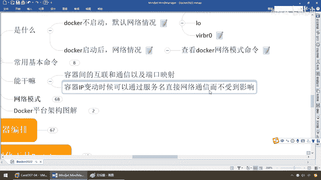
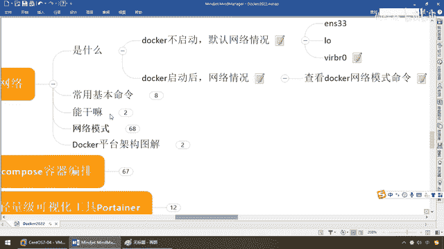

# 尚硅谷Docker实战教程（docker教程天花板） P68 - 68_docker network能干嘛 - 尚硅谷 - BV1gr4y1U7CY

来同学们，那么介绍了Docker，Network的常用网络命令，那么案例我们也带大家呢，做了一下，OK，刚才我们串了AA下滑线Network，这个呢很简单，我就不再废话，那接下来我们就来看看。

那这个Docker网络它能干些什么呢，那么同学们别忘了啊，我们第一个要明白，所有网络的反问，你要有个前提是什么，是不是叫在同一网段，OK，那么你现在玩单机版的Docker容器实验，不明显这个问题，听懂。

但是如果你去工作，实际上以后，你是要做Docker的什么，网络管理的，和什么，容器调用之间的规划，那么这个就变成你的网络桥接这些模式，你可能就需要考虑进去。

你到底是用最多的Bridge桥接模式还是主机模式等等等等。

这是第一个，那么第二个有个最坑爹的问题，什么概念，刚才我们介绍过，容器间的互联和通信以及端口映射，肯定跟Docker网络你逃不掉，第二个，容器IP变动的时候可以通过服务名直接网络通信。

而不受到影响。

那啥意思呢，假如说啊，我们现在是什么，一个Docker上面都部署了，对吧，那么有很多很多容器，假设他们在同一个网站，同一条金鱼背上，那么来沟通，这个倒好说，可不好意思啊，那假设是另外一条金鱼呢。

假如说这个Docker这是一号机，这是Docker二号机，我要一号机的MySQL去反问二号机的Redis，假如说这样啊，那么有这样的网络之间的互联和通信，那么好，你把地址IP写死，我是能反问的到。

但是你保不起Docker服务引擎重启一下，重启了以后它的IP地址是不是会变干，那么这个时候我们就必须要通过网络去调一种东西，像我们微服务一样的，去调我们的服务名，通过这样的网络设计和编排，随便你怎么调。

你IP地址该换就换，反正我只找一个，比如说我现在就去找一个MySQL服务，上次你的IP地址192。168，111。137，随便乱说的，那么好，你不能写死这个IP地址吧，你肯定要通过网络服务去调用。

反正我调MySQL，你后面重启机器你的IP地址具体分配是什么我不关心，但是我只认唯一这个名字，KeyV键值对，这个Key，服务名固定死，Value随便你换，当然不排除你们公司网络规划的比较好，比较强悍。

你也可以写死IP，这个只是建议，不说绝对的话，有些IP固定就是给那几台服务器用的，谁都不许占用，那这是另说，好，那么下面我们就会明白，Docker的网络主要是让大家了解底层原理。

保证第一个通信及调用的端口映射，二，保证通过网络服务名来调用，不要写死IP，好，那么当然它有别的，主要就是这两个。

那么下面我们就会明白。