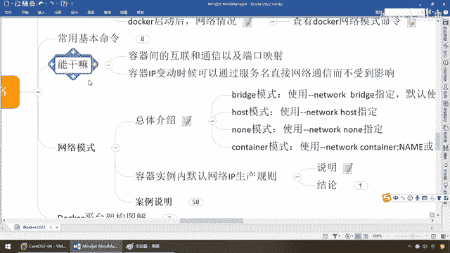

# 尚硅谷Docker实战教程（docker教程天花板） P69 - 69_docker network网络模式有几种 - 尚硅谷 - BV1gr4y1U7CY

各位同学，大家好，我们继续，那么接下来我们给进一步的给大家说一下，Docker的网络模式，那么来，这个命令呢，我相信大家已经不再陌生了，很简单，罗列一下本地的网络情况，那么大家请看，肉眼可见。

我们默认的话一般而言，会有三种，Bridge、Host、NAN，那么除了这三种以外，还没有其他网络模式呢，那么这儿，提前给大家说，共计五种，还另外两种呢，是分别是什么，容器模式和我们自定义模式。

但是一般主流的是这三种，产用的是前两种，OK，好，那么下面，我们也通过上一讲了解了Network，Docker的网络能干些什么，那么接下来我们来看看，它有哪一些网络模式，分别每一种是干什么的，各位同学。

请看，Bridge，为每一个容器分配设置IPC，并将容器连接到一个叫Docker0的虚拟网桥，默认为什么，该模式，就是说，基本上90%都是用它，那么假设你们有，特别指定和说明，我们默认。

就是每一个Docker容器，自己就带有着一个什么，自身的容器分配的IP地址，以及它的网络设置，人手一发，就跟现在疫情下面每人戴一个口罩，OK，好，下面host，虚拟机将不会虚拟出自己的网卡。

配置自己的IP，那么而是使用宿主机的IP和端口，意思就是什么概念呢，前面Bridge，每个容器有一发，人人都带一个属于自己的口罩，下面这个host，好比类似于什么，我们30位同学。

我们一起去电影院看电影，就看同一个大屏幕，所有的声音源，图像源，都来自于我们宿主机，电影屏幕的IP和端口，OK，那么大家呢就说，不是人人手上都有一发，都不会虚拟出自己的网卡，那么我们用主机的，第三种呢。

容器呢有独立的这个，但并没有对其进行任何网络设置，OK，这个几乎不会用工作上，他的意思是有，也给你分配了，你看有独立的，对吧，这些Network，但是呢你没有做任何的配置，这个需要你自己去配置。

一般我们很少用这个，那么了解一下即可，第四个Cantina，什么鬼，新创建的容器，不会创建自己的网卡和配置自己的IP，而是和一个指定的容器，共享IP和端口范围，说人话，同学们在疫情之前。

在教室里面上课经常会碰到，我们那屏幕共享了以后，沾三理四，各自看各自的屏幕，那么现在不好意思啊，沾三的屏幕突然碎了，那么同桌的你，你只能是什么，看对方的屏幕继续学习，不耽误你的进度。

所以说这个Cantina的意思就是说，我呢，屏幕坏了，我自己呢，不会创建自己的网卡和配置，我借用同桌的，来跟我一个，来跟我一块学习，那么也就说，我现在要进行网络反外，我就是什么，和一个指定的容器。

共享IP，相当于说什么，借刀杀人，借尸还魂，借用别人的，OK，好，那么这个时候呢，同学们了解一下，那么这四种模式，分别指定的，命令，Bridge，Gun Gun Bridge，你要么明确的写，你要不写。

默认就是他，那么代表你统一的使用，Docker0这个网桥，那么至于说后面是什么呢，这个网桥呢，我们会进一步展开，大家别着急，那么host，那Cantina，那么这个呢，就不再多多废话，那么无非就说什么。

你单前容器，Cantina，你借用共享谁的，我们两个，借用别人的，好，那么这个呢，就是我们对，四大网络模式的一个什么，简单的总体介绍，那么接下来，结合Docker网络能干什么，我们看一个容器实力内。

默认网络IP的生产规则，来看看，为什么大家要深度的。

了解这一块。