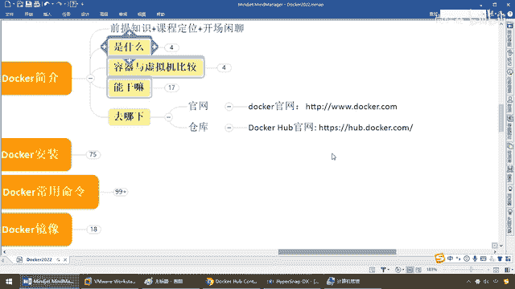
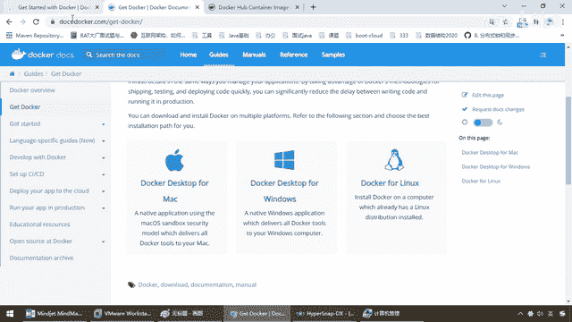
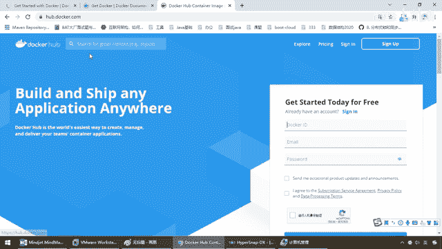
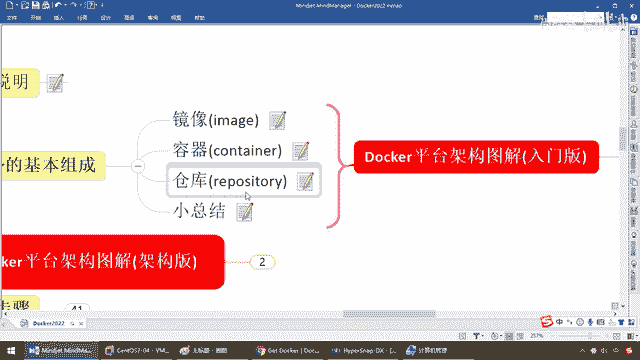

# 尚硅谷Docker实战教程（docker教程天花板） P7 - 07_docker官网介绍 - 尚硅谷 - BV1gr4y1U7CY

好，同学们，我们继续，那么前面，算是花点时间给大家介绍一下铺垫和入门的理论知识，那么稍微有点枯燥，接下来我们要真刀真铅的，运行安装配置操作我们的Docker，那么老规矩，基本上我们需要反技术。

Bitcoin官网，那么我们看看我们去哪下呢，一个是Docker的官网，3w。docker。com，第二个，仓库，Docker Hub官网，那么有这个知识的同学立马会想清楚。

有个东西是不是叫GitHub，那么国内的是不是叫GitE。

马云，那这两个分别是什么呢，首先，我们先来说Docker。com，不废话，就是Docker的官网，那么对于产品，对于开发者而言，他的博客关于我们等等，那么基本上Docker的官网，非常棒，很多技术。

查文档，或者从零基础开始，那么阳哥从哪学的呢，怎么要教大家我的这个权威的理论来自于哪呢，也来自于我们的官网，当然他稍微是个国外的网站，可能打开的时候有点慢，如果你可以通过某种方法呢，可以翻出去。

打开的更快一些，OK，那么对于我们的下载，对于我们的安装等等等等，均来自于这个网站，OK，那么假设，我们这些文档，我们大家说一下，因为要是不打开一下，很多同学估计这辈子，他不会去点这个官网。

那么GitDocker，那么大家请看，至少我们会明白，这个Docker的啊，可以装在什么，苹果上，Windows上，Linux上面，OK吧，这一堆都可以，那么安装的方法，那么对于开发而言。

要伴随着Docker，那么设置你的各种的，都可以在这获得你的答案，我们到后面会大家，反复的查阅这个官方文档，当然如果你，懒得看，都是英文的，阳哥也给你整理好了，你跟着我走，也一样可以入马。

那么这个是第一个，Docker的官网。

好，那么第二个叫，你看Docker Hub，那么这个是什么意思呢。

那么接下来，我们呢，要给大家，说几个重要的概念，那么从开始，介绍，需要给大家铺垫，陈述一些理论，那么截止到这，那么大家呢，应该会听到，首先啊，一个东西叫，镜像文件，对吧，然后呢，又说了个东西叫什么。

容器虚拟化技术，然后呢，现在你告诉我，我又给大家，说了个东西叫，Docker Hub，哎，一般官网只会，尤其已经有一份啊，对吧，那么对于，零基础的小白同学，可能会产生这个疑问，那，一个东西有两套官网。

难不成，不，这个是官网，没有任何问题，而这个Docker Hub，它弄的是，安装Docker，镜器案的，什么，仓库，好，那么接下来，我们呢，就要面对，镜像，容器，仓库，这三个概念，向大家进一步的陈述。

走过来，那么玩活以后，我们都清楚，我们的，Docker的下载，以及我们的仓库网站，就这两个，那么，终于，来到了我们的，石韬篇，理论到此结束，安装，那么来吧，我们这儿，前提说明啊，前面可以看到。

我们的安装呢，三个呢，都支持这官网上标的，那么不用废话，以我们加瓦开发工程师而言，百分之百，也必须是基于Linux的，所以说，我们现在，露颜，看一下，三台A4下面，就是Linux下面。

我们安装Docker的学习，Docker呢，它并非是一个通用的啊，容器工具，依赖，已存在并运的Linux什么，内核环境，所以说呢，Docker的实质上，是在已经运行的Linux下面。

制造一个隔离的文件环境，注意，已运行的什么，Linux环境下，我们前面是不是讲过，Docker它呢，依赖于Linux内核，那说明Linux要先启动，它赖以生存的环境是Linux内核环境。

然后我不加在那一整套的，重量级的，Linux系统，我，借机生蛋，复用，然后每一个，跑在Docker上的容器实列，隔离出来一个文件，那么它，执行效率，几乎等同于，所部署的Linux主机，所以。

Docker这个容器，引擎必须部署在，Linux内核的系统上面，OK，我们如果其他想部署Docker，就必须先安装一个，虚拟的Linux环境，所以我们现在，三套，三件套，Windows的，虚拟机。

不管你是VM还是VB，就是虚拟盒子，然后，基于它在虚拟机上面，再装我们的Docker，OK，那么接下来，我们呢，完成了，它的，顺序和理念以后，我们要看看，你自己的机器是否，符合安装。

Docker这个软件，那么现在，CentOS，仅发行版，中的内核支持Docker，必须要运行在，64位的，CentOS 7上面，那么要求，最低的配置啊，64位，内核为3。8，及以上，我们这。

选用CentOS 7，那么阳格呢，当然100%是，OK的，那么大家呢，可以看看这个命令，CAT，ETC，Red Hat，Release，OK，那么，各到这，那么我们可以看看，CAT，对吧，ETC。

Red Hat，Release，那么如果，大家请看，我们多少，是不是我们的内核是，7。4。1708，那么以各位同学学，上轨谷的Linux的话，那么，肯定，是什么，内核，是，足够的，OK，那么，实在不行。

你再看一下，你的，uname-r，这个命令，那么大家请看，我呢，3。8以上，对吧，我310啊，肯定是超过它，那么所以说，说明我这个CentOS，具备，运行，并安装Docker的，Linux的，环境。

再次强调，部署Docker，必须先安装一个，虚拟Linux环境，且你的版本，和内核要符合要求，这是第一步，好，那么这是我们的，前提说明，那么第二个，我们先要来看看，Docker的，三件套，三要素。

比如说我们现在学Java，或者说，Java这门面向对象的语言，一定听过老师说过，面向对象三大特征是什么呀，既成多坦风转，那么一样，Docker的基本组成，三大特征是什么呢，同学们，来，在这，做好小笔记。

镜像，容器，仓库，实为，Docker的，三件套，最重要的，三个元素，好，给大家十秒钟，写一下，来，同学们，我们继续，那么什么是镜像，什么是容器。

什么是仓库呢。

那看起来。