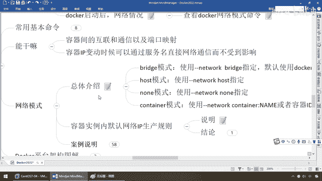
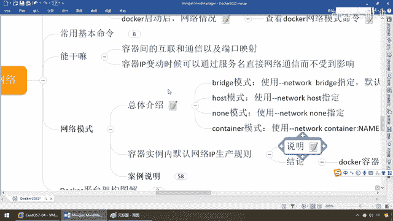
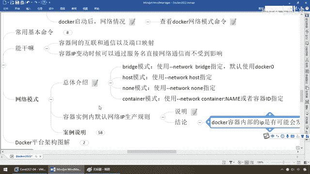

# 尚硅谷Docker实战教程（docker教程天花板） P70 - 70_docker network底层ip和容器映射变化 - 尚硅谷 - BV1gr4y1U7CY

同学们，大家好，我们继续，通过上面的讲解，我们已经了解了，Docker有四大网络模式，那么最常用的就是这个Brig，那么接下来请看一眼，再次强调，默认都是它，你只要没有明确的说明，默认都是它。

那么它是会为每一个容器分配各自的独立的IP地址，对吧，相当于戴口罩一样，人手一个，那么好，下面我们来通过一个案例来看一下。

为什么Docker的网络服务重要。

然后再来深刻的体会一下这两句话，那么来，同学们，我们Docker，RUN，IT，GANGANG NAME，U1，U1图，Bash，那么现在我是不是启动了一个什么，U1图的容器实例叫U1，好，兄弟们。

我先退出，那么下面，我再启动，第二个叫U2，那么我再退出，Docker PS，大家请看U1，U2，那是不是两个，那么按照我们的说法，人手一个口罩，那么相当于说U1，U2自己都有自己的什么，网络IP。

这么说能跟上，这些呢，都是大家很熟悉的东西了，不废话，那么我们下面来看看，U1，U2他们各自内部的情况，容器内部的情况，有哪个命令，是不是，Docker，Inspect，JUJ，U1，这么说，OK。

我们先看看U1什么情况，哇，内容是不是很多，这样的话是不是不好看，那么重点我们是看后面倒数这20函，那么大家请看，我们创建那个U1的容器实列，网络模式叫什么，Bridge，IP是多少，172。17。0。

2，那么现在U1就是这个IP，我们的网关就是它，这么说，能跟上，那么来，如果说你要是觉得不好看，那么从尾巴看，罗列出，倒数20函，那么加入这个以后，大家请看，目前的网络就叫条件网络。

它的网关是01这个网段，U1，它是17。0。2这个IP，好，那么这边过了，那么接下来，如法炮制Docker，Inspect，然后我现在是看的是谁，U2，我也来看看U2这个容器启动以后，它的网络设置情况。

那么大家请看，Networks默认的还是条件网络，没问题吧，那么也就说人手一份，何以见得，请看，U1，它的网络地址是多少，172。17。0。2，那么我们的U2网络地址是多少，172。17。0。3。

大家看，这个时候回答我，是不是人手一份，各自独立，挺和谐吧，那么现在，注意，假如说我现在Docker，不是stop了，RM-F U2，我们前面先说好了，U2是多少，IP的地址是这个，是3号，没问题吧。

现在我把它删掉了，好了，那么现在呢，我们直接再新起一个，RAM-IT-NAME U3，那么U版图，来，Bash，进去了以后，我们再退出来，此时我们再来查询一下，我们U3它的IP，兄弟们，多少，3，你看。

这是说明什么，Docker容器的变化，容器实力的变化，它的IP也是会变动的，以前如果你IP写死，你认为，我172。17。0。3，这个网段下面，我反问的容器实力是U2，但是保不起U2，突然淡机了。

或者其他情况，你可想而知，同样的172。17。0。3，却又变成了我们的什么，U3，这台容器实力，也就是说，你如果固定IP写死了，这是很麻烦的一件事情，你网络调用的情况，是会出错的，同样一个IP。

以前我分给U2，你现在U2突然挂了，还是IP，但是又分给了U3，那么现在告诉我，是不是服务和内容会变更啊，哎，所以说同学们，这个你一定要小心，我们这儿，可以看到，两个U版图，各自查看，你看U1是02。

U2是03，U2淡机了，我们再新建U3，再来看看U3这个IP，03这个IP就付给了U3，那么这个时候就说明什么，我们底层的网络，是会变动的，这个很危险，会导致一种什么问题呢，Docker容器内部的IP。

是有可能发生改变的，如果这个时候，你在调服务的时候，你默认的，0。3这个IP，假设啊，你想的可能是调的是U2，这台容器实力，结果到最后换成U3了，某些服务就调不通，所以说。

我们要进行我们的网络设计。

和规划，那么相当于说，要保证，我们都明白，假设这是条金鱼背，那么上面啊，它呢，这四个服务，假设要跑通，甚至是什么，我们另外一条金鱼，你们要进行互联合通信，有一个前提，一件IP地址发生变动了。

不能影响你们的调用通信出问题，第二个，最经典最主要的，是不是希望你们需要调用的服务，怎么着，是不是出于我们，同一网段啊，哎，那么什么叫同一网段，为什么我们指定容器的时候，要说这个，相当于说啊。

假设我现在，Docker，然后呢，Network，Creator，BB下发线，Network，我现在是不是就创建了一个新的网络，那么现在，假设我们某些重要的服务，或者一些按照我们的规划，我们就。

不再希望你跑在默认的Bridge上面，我们要求其中的某三个容器实列，全部跑到我们的什么，BBNetwork这个网段，这个网络里面，这样来保证我们安全加过和网络通信，所以说。

创建这个在你日常的集群规划里面，是有所需要和了解的，哎，那么所以说呢，这儿我们就会明白，容器内部，IP是会变的，所以我们要通过我们的网络。

写好。

规划好，我们的网络服务，通过服务来调用，好，Julian。