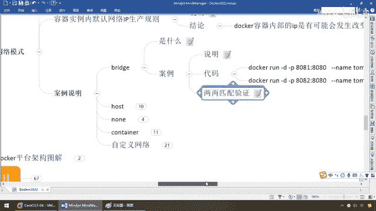

# 尚硅谷Docker实战教程（docker教程天花板） P71 - 71_docker network之bridge - 尚硅谷 - BV1gr4y1U7CY

各位同学大家好，我们继续，那么接下来我们按照我们介绍过的网络模式，通过更多的案例来给大家进一步的了解这些网络模式，它的深层次含义分别是什么，来，共济有这些东东，那么来同学们，我们强调过，默认呢就这几个。

最多的就是他，那么有些时候我们对安全加固网络通信一些服务的特别设置，我们要求某些网络就要跑在我们指定的网络范围以内，比方说现在新建的bb network，那么好，这四种的话，结合我们前面所说，总体介绍。

这个这个这个，那么来看看每一个网络模式，它内部到底什么样，来吧，同学们，那么，Docker，Network，只要是看内部就是inspect，那么来，我们现在要看的是哪一个呢，比如说我们刚刚新技。

或者我们先从默认的看，再来看最后的，再来看我们新建的，我们就看Bridge，来兄弟们，一回车，Bridge，大家请看最上面，这个网络模式叫什么，Bridge模式，范围是本地，你看它的驱动模式是什么。

就叫Bridge，好，这是我们的第一个，最常见最常用的，而且前面说过一句话，Docker0默认就是Bridge，来，第一个，过，那么第二个，我们host，我们再来对比的看看，现在名字叫host。

范围也是local，我们的网络驱动模式叫什么，host，就不再是像刚才那样的，变成了我们的什么，Bridge，好，这是我们的第二个，第三一个，同学们，Nuck，来看看，名字叫Nuck，驱动，什么鬼。

Nuck，没有，所以说，这个就是我们前面所说的，你体会一下，它有这些独立的东西，但并没有对其进行任何设置，好比，我原材料是有的，我买来了菜，但是根本没开火做饭，好的，那么最后一个，那么同学们。

bb消化线，network，这是我们自定义的，看看我们自定义的，建出来的什么样，同学们请看，名字叫bbnetwork，驱动模式是什么，Bridge，从这就进一步证明了，我们默认都是用它，好，那么来。

同学们，那么接下来，我们来看看，Bridge它到底是什么，那么你一再跟我强调什么，Docker0，这是个啥，那么来，同学们，首先，Docker后台服务起来以后，会默认会创建一个Docker0的网桥。

那么它上面的有一个Docker0的内部接口，该网桥的名称就叫Docker0，它在内核产注意，重点，连通了其他物理或虚拟网卡，这就将所有容器和本机主机都放在了什么，同一个物理网络。

我们必须是不是在同一网段才能通信啊，那么Docker，默认指定了Docker0接口的IP地址和字腕研码，让主机和容器之间可以通过网桥通信，这个就是它最大的意义，那么根据我们前面所看到过的这些命令。

我就不再重复敲了啊，Dockernetworkinspect，我们看过网桥了，只不过，再查名字的话我们都晓得，默认网桥名字就叫Docker0，那么EFConfig也说过，Docker0它也会有。

那么接下来我们来看看它的网络模型分别是什么样，来，听好，先看图啊，我们晓得啊，我EFConfig以后，我真真真正Linux宿主机，这台机器，我的网络，我需要看ENS33，也就是我们这的192。168。

11。167，那你只要一启动Docker以后，那么Docker根据我们前面的理论，非常重要，我跟你跟你说了，让Linux宿主机和容器之间可以通过网桥相互通信，那这个网桥是哪来的。

这个网桥就是我们的Docker0，那么来兄弟们回到这，主机这，ETH0也就是我们这的ENS33，它通过叫Docker0的这个，你看是不是叫默认都是用的最多叫网桥Bridge。

它这块就是我们的Docker，然后Docker上面跑了1233个容器服务实例，每一个容器，只要你没有指定默认都叫网桥，自己自带着自己的一份网络配置，那么相当于中间，这个就是一个交换机，两个水晶头互相接。

123，我们通过Docker来进行通信，我们之间是各自独立的，听懂了吧，一号容器，二号容器，三号容器，我们不可能横向反问，假设这个要反问这个，只能通过这个交换机。

这个就是我们Docker0网桥存在的意义，所以说，宿主机和容器要通过网桥，容器和容器之间勾搭上也要通过网桥，那么来，它的意思就是说，在Docker0这你起一台容器，再起一台容器，每一位容器，每一台容器。

都有自己的一套网络设备叫ETH0，那么相当于模拟出了一个新的，精简版的Linux，你看Linux是不是也带着ETH0，只不过我们这叫ES33，所以说同学们请看，Docker使用Linux的条件。

在宿主机虚拟出了一个Docker的容器网桥，那么就是我们这的Docker0，也就是我们这的Docker0，OK，那么完活以后，Docker启动一个容器时，会根据Docker网桥的网桥段。

分配给容器的IP地址，我们称为容器IP，那么同时Docker网桥是每个容器的什么，默认网关，相当于金鱼背上的N个集装箱，N个容器实力，和宿主机上的宿主机，相当于就是大海，大海上面有一条金鱼。

金鱼背上有N多个集装箱，那么你们之间的通信，也要通过我这个Docker，好了，那么现在我们呢，就可以看到，在同一个宿主机内的容器，接入了同一个网桥，我们是不是都在一条金鱼背上，一个锅里面吃饭。

那么这样容器之间就能通过容器的，容器IP进行通信，那么来，同学们请看，Docker运行容器实力RUN的时候，没有指定Network的话，我们就是用默认的Bridge，使用的就是Docker0。

也就相当于说我现在，一般我们都不指定，我们都是用网桥，那么我们就可以看到，我们就通过Docker0，和自己后面创建的Network，那么来进行通信，那么假设我这个ETH0。

我Linux现在我只插着一块虚拟网卡，那么就是网卡123，那么我们也还看过这个LO，还记得吗，LO，这代表什么，Localhost，那么这个地址，表现网卡的IP地址，那么比如说Inet等等。

这些呢前面呢都说过了，好了，那么现在重点是第三条，网桥Docker0，创建一对，注意，对等的虚拟设备接口，一个叫VETH，另外一个叫ETH0，怎么着，一一匹配成对，成双成对的匹配。

我这个就是一个大交换机，我这有个插槽，这有一台笔记本，通过网线，不但插上去，一对，两对，三对，那么所以说，整个宿主机的网桥，都是Docker0，类似一个交换机，有一堆接口，每个接口。

在交换机上面就叫VETH，每一个VETH，就可以连Docker容器实例里面的一个ETH0，那么，这样的话，一对接口，我们就叫做VTH PYRE，那么在每个容器实例内部，也会有一块网卡。

每一个接口就叫ETH0，那么来，现在说容器内部，通过ETH0，连到我们Docker0上面这个VTH，两两匹配，来完成我们，各自的通信和配对，那么通过上述，宿主机上的所有容器，都连接到这个内部网络上面。

两个容器在同一个网络下，会从这个网关下，各自拿到自己分配的IP，此时两个容器的网络，也是互通的，那么前面强调过，容器是各自互相独立的，但是只要你们连同一个网桥，在同一个交换器，同一个锅里面吃饭。

你们可以用1号机，通过它去连到3号机，好，那么理论上说完了，我们两两匹配，代码验证，来吧，首先兄弟们，我们现在已经晓得，我们现在启动容器的时候，我们这儿以他们Kite为例，8180，8280。

那么这个叫他们Kite，8G这个叫他们Kite82，那么现在相当于说，哥们我就干了什么，两台容器实力，第一个，弟兄们，走了吧，那么来，第二个，兄弟们，走起，到这一步，没有任何问题，那么此时。

我们查看一下，现在我们宿主机上，Docker PS，说过了，乱了以后马上PS，那么现在，之前的U1和U3，这个不用管它，干脆先删掉，省得影响大家的视觉，好兄弟们，Docker PS。

我现在就有两台他们Kite，8180，相当于是不是，实际启动了两个容器，这个没有任何问题，那么我们前面强调过，每一个容器，自己是带有自己的IP的，要通过Docker 0，来跟我们的网络通信。

那么现在大家请看，IP，ADDR，在我们宿主机上面一回车，此时，兄弟们，我们又多了很多很多很多很多内容，那么在这Docker 0，没问题吧，但是这儿，大家请看，我们这儿多了一组，叫VETH。

比如说这儿是23，22，这儿是25，24，哎，结合我们这儿的网络说明，我们在宿主机上叫VETH，1E匹配，那么现在，大家请看，VETH，23，25，这么说，能跟上，那么匹配，来现在，Docker。

EXEC，-IT，TAMCAT，8E，我现在呢，进去看看，这么说，能跟上，那么来了，这个里面，我们来看看，同样是IP，ADDR，它会有什么样的情况，那么现在大家晓得。

我是进入到了TAMCAT 8E这个容器，来看看容器内部，也就相当说，进到这个容器里面以后，看看他们有没有，有没有ETH0，自己的网络，我们用的是Breage，大家请看，诶，ETH0，23，那22，23。

来，兄弟们，相当于说8E这块，它是有ETH0，回到我们宿主机这，大家呢，可以，诶，再来，重新看一个，ADDR，回到我们这儿了以后，大家请看，宿主机这是不是叫VETH，那么来，宿主机这是不是叫VETH。

它呢，就是22和23，一对，大家请看，22和23一对，这波，能跟上，好了，那么这个是我们的什么，TAMCAT 8E，那么再来，回到这，我们Docker，exec-it，TAMCAT 8E。

bash也进来，进来了以后，IP，ADDR，大家请看，多少，24，25，在TAMCAT里面，我叫什么，ETH0，这个时候，大家请看，24，ETH0，25，对到我们的主机上，是不是有，25，VETH24。

那么大家请看，是不是就像一个插槽一样，两两匹配，互，互，相通啊，那么所以说，Docker0上面，都叫VETH，每一个Docker容器内部，都叫ETH0，它们两个的数字，是对的上，成双成对，一一匹配。

OK，好，那么同学们，回到我们的理论，整明白以后，我们就晓得，只要是BRAGE，每一个容器内部，都有自己的一个，网络模式，BRAGE，ETH0 0 0，每人自带一份，那么，两两匹配验证，大家请看。

在宿主机上面，假设IP地址，我们看最后倒数，8函，来，28，27，30，29，红色对红色，蓝色对蓝色，那么，案例我们都做过，再过一遍笔记，大家请看，宿主机上面，叫VETH，没问题吧，那么，28。

对的是什么，27，内部，插槽，那么大家请看，这是进到，我们他们看的8E，IPAD。2，查看容器内部的IP地址，大家请看，多少，是不是ETH，8E，容器内部，有ETH网络，对应着我们的28。

我们的VETH，那么一样，这是红色情况，那么蓝色情况呢，8E，我进去了，IPAD。2，我自己有一份网络，ETH，29，对的是30，我这30，我在交换机上面，外网的宿主机上面，我的VETH。

对应着你的29，你的29，对应着我们的，ETH，30，蓝色对蓝色，两两匹配，哎，所以说同学们。

这就是我们的第一个模式，😍。