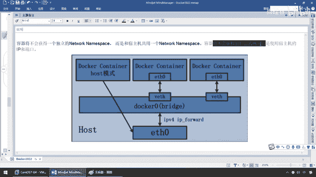
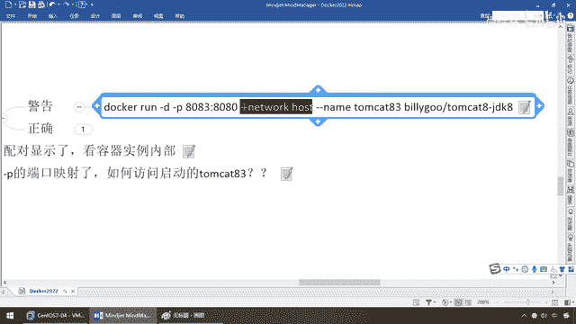
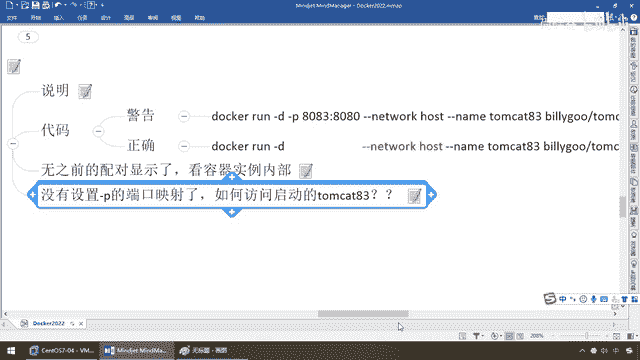

# 尚硅谷Docker实战教程（docker教程天花板） P72 - 72_docker network之host - 尚硅谷 - BV1gr4y1U7CY

同学们我们继续上面我们介绍了Bridge，接下来我们给大家介绍一下host，那么再来看一下Bridge是每个Docker容器实验都有自己独立的，他们通过Docker0来跟宿主机通信。

或者说容器和容器之间通信，相当于这就是一个大的网桥交换机，对吧，那么两两匹配，一一匹配，ETH0 VETH，好，那么接下来主机模式，那同学们来了，什么呢，直接使用什么，宿主机的IP地址，以外界进行通信。

不再需要额外进行网桥的转换，网络地址的匹配，说穿了，以前是什么，这是宿主机的一份，对吧，这是网络容器实例的一份，各是各的，现在咱们借用，来吧，一看图就懂，容器间不会获得一个独立的网络命名空间了。

就是没有自己的模式了，因为你现在从Bridge的网桥模式，默认的改为了host模式，那么为主机马首是瞻，他就是你的带头大哥，他用什么你用什么，那么所以说，这个时候我们Docker，host模式下的容器。

将会和宿主机共用一个network name space，一个网桥的一个配置，容器将不会虚拟出自己的网卡。

而是使用宿主机的IP和网口，好，那么同学们，在这我们来，看一下案例，警告，正确，这有些小细节和小坑，但是注意是不是Iro错误，不是的，那么来同学们，现在呢，我们来看一下，Docker run，干地。

小p 8083，映射8080，他们看它嘛，都好说，注意，这个是不是我们Redis以前，三主三从所用的一种模式，叫Net或者叫Network host，用的就是它。

那么现在加了这么一个。

它叫他们开头83，好，我们来看一下，我启动起来了以后，会变成什么样，那么目前我们后面启动两个，81和82，各自独立的，那么现在，来看看，加了host，网络模式的，我们此时一回车，它会告诉你。

有没有成功启动，启动了，但是呢，Warning，Publish发布的端口是不被推进的，当你用host网络模式的时候，OK，那这是什么原因呢，注意，是警告，你无视它也可以，它不是Error，不是错误。

那么这儿，同学们，它总会遇到这个动不动，我们再可以，不放心的同学们来验证一下，DockerPS以它为准，那么大家请看，83是不是成功启动，但是注意，我们干了干屁的，8083映射8080。

有没有像以前那样的，81对80，82对80，没有，居然我们的端口这儿是空的，这什么意思，来吧，原因是只要你，干了这么一个网络主机了，你的端口映射没有意义了，因为你都是跟主机同用一范，所以说。

这个时候就会受到警告，你看，当你用这种host网络模式的时候，它是什么，R-Discardie的，不大推荐，就说，这些你即便你这么写，语法上没错，但是起不到任何作用，端口号会以主机，断口为主。

假设碰上重复了，那么它自己去D3，所以说，各位同学，解决的办法，你就是用网络模式，比如说Bridge，当然这不废话了，又绕回去了，这样可以解决，或者说什么，直接无视，OK吧，好，那么同学们，在这儿。

你说，那我就不想去，用这个呢，也可以，那么来吧，Docard RM-F，他们开头，8383，我给它删掉，现在相当于说，我们这个小屁，这样一个动动，直径端口的，已经没有太大的意思了，听懂，好了，那么干嘛。

你正确的，你，就别写，明白，那么然后，大家请看，我这儿故意留这么一段，就是告诉你，我把这块抠掉，因为你用主机的话，这个端口音设，就没有意义了，那么来，同学们，我们呢，搁到这儿，怎么样，没有警告了吧。

Docard PS-83，是不是成功起到，那么来了，接下来，我们就来看看了，那么，第一个，我们来先看看，素主机的IP-ADDR，同学们请看，是不是有一大堆东西，什么12345，212325，那么这个。

随着我们的网桥，搭建的越多，和Docard服务启动的越多，那么它后面，对应的信息，会给你出来，那么我们呢，ENS自己的网卡，和我们的Docard 0，我想说的是什么，这是我们素主机的主机，看图啊。

我这儿说的意思，是不是，我们有自己的网络配置的，Goom用一套，那么相当于说，这些网络的命名，那么你，ETH0是什么样，我这个里面，是不是也会是什么样啊，所以说，我们先看看素主机的，是长这个样子。

看看里面，会不会跟我一样，那么首先，我们现在外面看，Docard，Inspect，TombCat，Basen，这么说，能跟上，那么现在看看，Basen这个容器实力，内部的网络情况，大家看，哥们儿。

我的网络模式是什么，host，由于我跟素主机附用，共用同一套，我就没有自己的网关，和地址了，所以说我这儿是什么，空的，OK，那不妨，我们要是看看，以前的8。1呢，大家请看，8。1叫什么，默认。

用Bridge网桥，我会有自己的网关，和我自己的一份地址，0。4，这么说，能跟上，那么好吗，再来看看，我们的8。2，是不是也是有我自己，你看，8。2的话，也是Bridge，默认的网关，叫Bridge。

桥间模式，然后它的网关，0。1，IP，0。5，所以说，这个时候是什么，我们各自，8。1和8。2，人手一套，各有各的，但是回到我们的8。3，兄弟们，请看，我的网络模式，是什么，Host。

你有没有自己的IP，没有，我跟主机，共用一份，所以说我没有自己的东西了，那么好，这是在外面看，那么接下来，Docker，exec-it，他们看了它，8。3，我进去看，这么说，能跟上，那么来，同学们。

IP，8。2，这个时候，哎，有没有发现，它的网络配置情况，几乎是不是跟我们外网，也是在外面，看宿主机的，几乎是一模一样啊，哎，这就有力的证明了，我们的，Host模式，没有自己的，用的都是宿主机的，好。

那么这儿，我们完成以后，无之前的配对显示，看看容器内部，我们刚才也已经看到了，对吧，8。3的话呢，是，我Host模式，没有自己的IP，好，全部用宿主机的，那么现在没有设置，干批的端口反射。

那个端口映射了，如何反问，启动这个他们看的8。3呢，那，我不跟你废话，那么现在我先退出来，不管怎么说，给个面子，他们看的8。3这个容器实力，有ID返回，是不是，启动的，那么启动，我是不是应该看到那只猫。

那么主机，此时，我们宿主机的IP，我们强调过了，是多少呀，是不是，11。167，换我们以前，我们是不是经常是，做一个什么，主机的端口，在一个容器的端口，现在还有没有映射，没有了，没有了怎么办。

那么请大家看，端口号会以什么，主机端口，也就是它这些默认的，为主，那么所以说，我们回到我们宿主机上面，来，兄弟们，192。168。111。167，能跟上，那么不再有什么端口映射了，那么就是还是8080。

一回车，跟宿主机一样，下面在主机上装了个他们看它，那么说白了，167是不是localhost，8080完全可以反问到我们的，8。0。53，这个版本，OK，好，那么同学们，这个就是我们的什么。

host模式，那么在这儿呢，我们也给大家说过了，宿主机的IP，加8080端口，没有什么端口映射了，就那些默认的，他们看的默认端口，不就8080，相当于你在机器上，就装了个他们看一趟。

我们在原来刚刚学他们看的，是不是就在机器上装完以后，就是localhost的8080，那么现在localhost是167，这个IP就OK了，好吧，那么所以说，此时容器的IP是借用主机的。

也就是主机的IP，就这么回事，共享了宿主机IP，我们也看到了我们的猫。

成功启动，好，同学们，这就是我们的host模式。