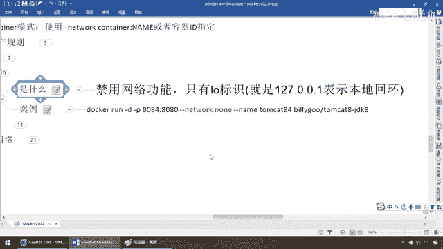
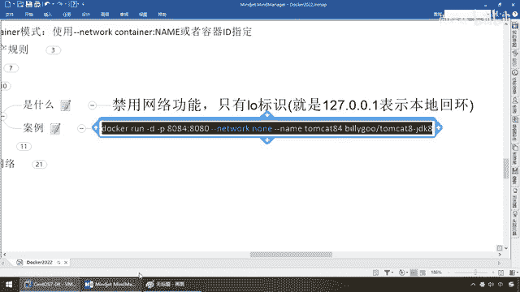

# 尚硅谷Docker实战教程（docker教程天花板） P73 - 73_docker network之none - 尚硅谷 - BV1gr4y1U7CY

同学们我们继续接下来我们介绍第三种，NAN，前面介绍过NAN就是没有网络，那啥意思呢，同学们请看一下我们现在进入到8。2，8。2是用默认的Bridge，挽桥模式，那么IP-ADDR。

那么大家请看它是不是至少有两个，一个就是LO，另外一个有我们这个自己的ETH0，有自己的依法，那么大家可想而知，如果是NAN呢，过来看看，怎么着，禁用了网络功能，只有LO了，相当于说，8。

2我们现在是挽桥，假设你把它变成NAN，那么就没有这块了，自己就根本没有网络设置，只有一个LO，local 127。0。0。1，那，换句话说就是，只有LO标识，表示本地回还，那么它是什么呢。

在NAN这个模式下面，并不会多卡容器进行任何的网络配置，也就说，这个多卡容器，没有网卡，IP，路由，NAME SPACE等等这些信息，只有一个本地，链路的回还地址，我们需要自己为多卡容器。

添加网卡和配置，那么这个呢，我们平时呢，很少用了解一下即可，那么来同学们，请看，固定写死。

我们现在启动第四台机器，8084，一个个的案例，带大家做下去，把全部的网络模式搞通，不写，就是不锐解，写了，是host，或者现在的第三种，NAN，那么现在我们启动的，叫84，他们看的84，来同学们。

请看这个是，8084没问题吧，好了，到这个时候，同学们请看，我们现在外面看，inspect，他们看它，84，来，兄弟们，一回车，或者你直接，它要-N20，因为前面的不用看，就看这个，GATWALK。

什么模式啊，NAN模式，大家请看，有网管吗，有IP吗，没有，所以说这个时候，请看，我们根本就没有，做任何的网络设置，好，但是84成功启动，外面看，看过了，进去看，exec-it，他们看它，84。

写错命令，OK，那么这个时候，同学们请看，IP ADDR，LOOK，怎么着，前面说过吗，如果是82，默认BREED，人家有LO和ETH0，但是你现在用的是什么模式，NAN这个模式，大家请看。

只有一个LO，OK，好。

那么这个我们只需要了解一下，不做过多的展开了。