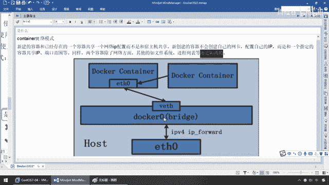
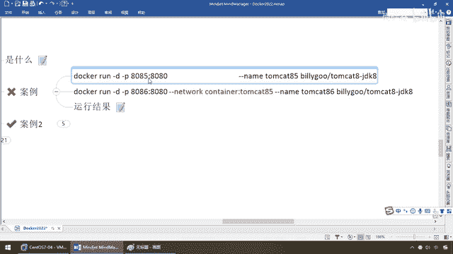
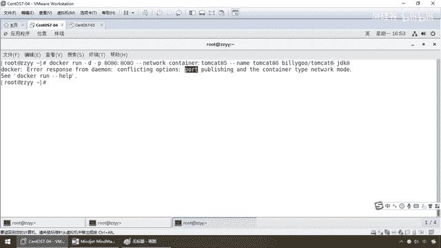
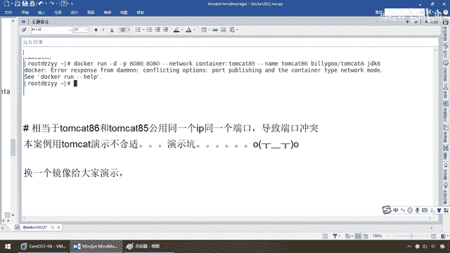
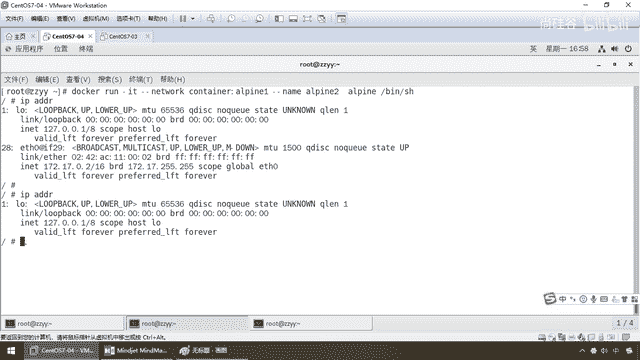

# 尚硅谷Docker实战教程（docker教程天花板） P74 - 74_docker network之container - 尚硅谷 - BV1gr4y1U7CY

好，同学们，我们继续，接下来我们为大家介绍第四种网络模式，container容器，那么下面先看理论，再说案例，再来小总结，那么来，兄弟们，container。

新创建的容器不会创建自己的网卡和配置自己的IP线，而是和一个指定的容器共享，那说白了，我借用别人的，好，那么现在大家请看，那么它是什么呢，一看图就明白了，新建的这个容器，假设这个是新建的啊。

和一个已经存在的一个容器，共享同一个网络IP配置，而不是和宿主机共享，那么相当于说container1，container2这两个容器都借用，或者说container2。

借用container1的同一段IP网络设置，来去访问我们的docker0，那么新创建的容器呢，就不会创建自己的网卡，配置自己的IP，没有，我自己没有这份独立的eth0属于我自己的。

而是和一个指定的容器共享IP和端口范围，同样，两个容器除了网络方面，其他的呢，当然还是隔离的，各是各的，也就是说，后面这个容器只是借用你的网络，其他我们两个还是两个独立的容器，说人话，那么就是什么。

两张嘴，共用同一个吸管，喝同一杯奶茶，讲完了，OK，好，那么同学们，按理演示，那么这呢，不用说，会有一些坑。

来吧，同学们，现在呢，我们所要做的活呢，8085他们开头，85，8086他们开头，86，那么相当于说，这是容器一件，已经建好的，这是容器二，一看命令也应该秒懂，意思就是说，86的这个网络模式。

我附用借用85的，8685，对吧，两张嘴，共用85的吸管去喝同一杯奶茶。

那么好，那么同学们，来看看，我们这个OK不OK呢，那么现在啊，我呢，8085，没问题吧，好的，那么现在注意，8085是OK的，刀砍，PS，8085，启动了吧，好了，那么下面8086，我现在要干的这活呢。

是86要借用85的，对吧，看字面一次，一回车，哎呦，刀砍，arrow，反映到demo上，conflicting，冲突的选项，端口的发布和这个容器的网络类型是冲突的，啥意思啊。

这个就是一个堪。

来，兄弟们，相当于86和85，共用同一个IP和同一个端口，那么两台tmcat，对吧，都要用8080，那可不是会导致端口冲突了，本案例呢，要用这个，人家直接跟你说的。

你的对外发布的这个端口和这种网络容器的模式，是不兼容不匹配的，听懂了吧，所以呢，我们呢，不大合适再继续用tmcat给大家演示，换一个镜像。

给大家来说明这个问题。

好，那么这个呢，是我们其中一个坑，那么接下来我们来看看，我们用alpine这样的一个小巧的镜像，alpine呢，也算是一种，面向安全的，清晰的linux的发行版，那么来吧，它是这样的啊。

有点类似于比我们的U版图更小，那么alpine呢，它呢，巴拉巴拉这些呢，我就不再读了啊，那么它呢，小，简单，安全，所以作为一种什么，基础镜像是非常好的一个选择，它是麻雀虽小，五站几拳。

里面很多命令都具备啊，但是只有六兆，很爽，所以特别适合这种容器的打包和案例的演示，那么来，兄弟们，搁到这儿了以后，我直接tmcat rmcat f，tmcat 85，这么说能跟上，用不了了。

那么dokar，ps，那么tmcat 1234，这四个东西先起着，那么现在我们主要演示alpine，演示我们的第四种，kantena，容器网络模式，好，那么接下来，第一个，只有六兆币。

应该拉的会稍微快一点，那么来，同学们，run的话呢，本地有，直接运行，本地没有，远程扩去拉一下，那么注意，它是什么，bin，sh，听懂，那么所以说它使用sh是另外一种效果脚本，好，那么这个呢。

是我们的什么，alpine 1号，那么下面呢，我们来看一下alpine 2号，那么，它2号去用1号的，简单的意思就是，那么来，同学们，alpine 2去容器alpine 1，好，大家看，没有再报错了吧。

也反馈给你了一个，伪装端，等着你命令输入，跟我交货，那么现在我们要验证，运行这个结果，验证，共用，是吗，同一个网桥，那么来吧，进去了1号，那么来，同学们，我们这个时候的话呢。

我们是先从alpine 1这个镜像开始，这个容器，那么ip，attr，兄弟们请看，28，29，那么现在是不是0。2，这么说，能跟上，这是我进入到容器里面的，这个没有任何问题，那么一样。

这个我也进去容器里面，ip，attr，兄弟们请看，28，29，0。2，说明什么，说明是不是验证了两台容器，共用同一个网段，同一个ip，这么说，能跟上，那么所以说，同学们，看我们的笔记。

这是alpine 1，这是alpine 2，1号的话是eth，15，16，eth，15，16，0。2，0。2，和我们这块的一样，只不过我们这是28，29，对吧，由于我们做的次数很多，它的底子往上翻。

但是呢，1号和2号都是28，29，这一波，ok，好，那么现在兄弟们，这是我们的alpine 1，ok，我们下面，我呢，干坏事，比如说，我们现在呢，就把alpine 1给它停掉。

我们来看看alpine 2，它的网络会什么情况，那么现在，我退出，对吧，docker ps，那么现在，docker，然后呢，stop，stop，alpine，直接一退出，它就停掉了，更好，对吧，那么来。

现在呢，请同学们看一眼，docker ps，干擦我exec以后，alpine 1是不是就已经停掉了，对吧，一退出就关闭，那么现在就说，关了以后，共享园关闭了，你alpine 2还有戏吗，一回车，兄弟们。

请看，怎么着，28，29，eth的这个是不是就没有了，在alpine 1启动的时候，你是有的，可以跟我共用，我alpine 1停掉了，没有了，你这个alpine 2自己，怎么着，也只有一个lo。

本地回还连路了，好，那么同学们，说到这儿，我相信大家应该明白了，怎么着，什么叫基于容器的继承，那么来，笔记上呢，跟刚才演示，关闭alpine 1，再看看alpine 2，那么，没有关闭之前是有的。

关闭以后，alpine 2也就没有，只有一个回还本地lo地址了，ok，好，这个就是我们的第四种container。

