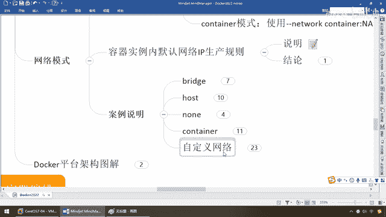

# 尚硅谷Docker实战教程（docker教程天花板） P75 - 75_docker network之自定义网络上集 - 尚硅谷 - BV1gr4y1U7CY

同学们我们继续接下来介绍我们的第五种，自定义网络模式。

那么在这个之前，我相信大家还应该还有印象，我们见过我们自己的一个网络，这三个基本上是系统默认的，对吧自带的，我们是不是见过一个叫BB什么network，那么我们建这个网络，我们前面说过了，一演示命令。

第二个要给大家演示什么，我们为什么有时候需要自定义一个网络呢，希望所有的容器，分门别类仅仅有条，在各自的网络里面和谐共存，并且能够完成网络之间的通信，我们前面是不是演示过一个小问题，就是这儿。

还记不记得，Docker容器内部的IP是有可能会发生变化的，好那么在这儿我们带着问题来看看，你容器和容器之间，如何用我们的网络来进行通信，别忘了，两个要解决问题，容器IP变动的时候。

可以通过网络名直接网络通信，而不要受到影响，好那么下面我们来说一下这个自定义网络，在说自定义网络之前，在官网上同学们可能会听说过一种技术，叫Docker Link，我站在拿出来说一下，本次不讲。

以前我讲的，但是在课堂讲后来没必要，理由如下过时，OK，那么首先大家来看一下，官网上这儿有个Network网络模式Links，他直接告诉你了，这个warning了已经是，这个警告的话。

对于这种未来的这种Docker的发布的版本的特性的话，他有可能会被Remove掉，所以说如果是有Docker Link这种技术的话，大家就不用学不用再用了，好这是第一个，所以说不用的话，那我们用什么。

我们可以通过这种网络互联，就用自定义网络来更好的替代和解决，下面按理说话，那么现在我不用自定义网络，可不可以呢，完全可以，那没用之前是什么样的效果，用了之后是什么样的效果，我解决了哪些痛听。

杨哥你为什么要告诉我们要学这个东西，好，那么下面啊兄弟们，我们干脆Docker，Network RMBB，我先把它删掉一下，删除的命令大家都会了，那么现在呢，我们Docker。

Network LS还是原来这三个，这是最没有干扰的，好，清清爽爽的带着大家做，那么现在就是我没有用自定义网络，来同学们，还有印象这个吧，就是那个他们看他，他们看的8G他们看的8R。

之前我们是不是启动过，默认就是我们的晚桥模式，最经典的那个，不多说了，那么现在Docker PS，大家看现在是不是后台也是干干净净的，我们重新来过，那么来再启动啊，这些命令我就不在手挑了。

DockerRAM后台启动，小P8081应声，哎不说了好吧，你要懂了应该是好，那么现在接下来，那么现在请看啊，大家楼眼，我们按照最经典的晚桥模式，什么都没指定，默认是不是Bridge晚桥模式。

8182成功启动，那接下来干嘛呢，我们用EXE进入各自容器内部实例，那么大家请看啊，假设我们是Docker。