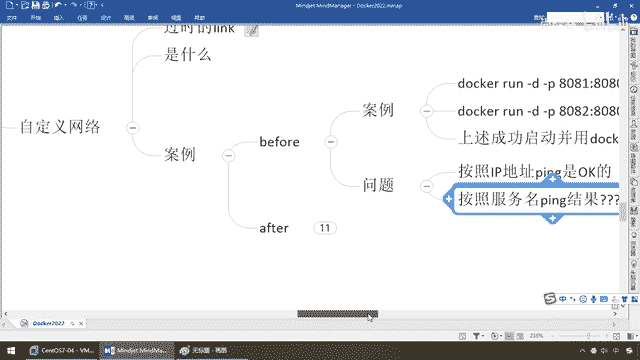

# 尚硅谷Docker实战教程（docker教程天花板） P76 - 76_docker network之自定义网络中集 - 尚硅谷 - BV1gr4y1U7CY

好，同学们，我们进入到我们的容器内部，这个呢是8081，这个呢是8082，好，那么来吧，dockerexec-it。tomcat81，好，我再进来这个，dockerexec-it。tomcat82。

OK，进来了，那么进来了以后，我们要干什么呢，我们按照IP地址看看能不能平通，再按照服务名看看能不能平通，我们这个网络主要要完成的是这个，来，兄弟们，对于现在是8081里面IP addr，兄弟们。

我的IP是多少，是不是172。17。0。2啊，那么现在8082这IP addr，大家请看，这是不是0。3，好，那么现在我们先在8082上面去拼我们的8081，拼，172。17。0。2。

我们的8081IP是多少，是不是0。2，那么来，同学们，拼一下，能不能平通，没有任何问题，OK，那么说明什么，说明是不是金鱼背上的这两个集装箱，2拼1能够拼得通啊，好的，那么再来看。

我们现在是不是一样拼172。17。0。3，我自己是2，8081我要去拼，我自己是0。2这个IP，我去拼8082他们cat的0。3，好，同学们，low也能不能平通，完全没有任何问题，好。

那么貌似到这是不是挺和谐的，那么跟我们的什么，自定义网络好像扯不上边吧，那么别忘了，我们前面演示过，你这个IP地址是会动态的波动的，那么这个时候，我们是会出现一些潜在的情况的，那么我们最终。

为了避免这个东西我们强调过，最好是通过服务名调用，那么此时，同学们请看，假如说我们想干的这个活，看笔记，这个是互相拼的话是能够拼通的，和我们刚才也是一样，那么现在假设我们按照服务名来拼呢。

请大家看82上面，干嘛，我们现在81上面去拼82，82上面去拼81都会报什么，名字或者服务不知道的这种错误，来吧，同学们请看，这是8081，拼他们cat的82，怎么着，这个时候同学们请看。

我在8081上面去拼我的82，他会得到一个什么样的效果，那么同理我拼他们cat，8G，大家请看，他又获得什么样的一个效果，那么等他一会，好，出来了，大家请看，他搜索了一会以后。

8081就是他们cat的8G，他们cat的8G去拼，他们cat的82，直接告诉你，名字或域名不知道，那么同理，我们现在这也看到了，8082就是他们cat的82，82上面去拼服务名，他们cat的8G。

不好意思，名字或服务不知道，那么所以说我们得到我们的第一个痛点，怎么着，他这一块，你要是不用自定义网络，你按ip地址写死去拼，是可以拼通的，因为我们确实是在同一个网段，对吧，我们都是这个。

刚才已经看到了，我们都是172。17。0这个网段，OK，同一个网段，当然能反问，ip能够拼通，容器和融式之间通信是OK的，但是我们按照服务名去拼，就挂了，那么在我们的网络设计规划里面。

在我们的网络设计和规划里面，你怎么能够把我们的ip地址写死，对吧，所以说我们必须按照什么，服务名去拼，而且，他这个地址，我们某台机器淡了，前面演示过，后面后来者居上，他又会把这个地址，比如说172。

17。0。3，现在是8082他们看的，82这个容器，又可能会换成别的，你一定要用，可能调用错了，所以说这个就是我们没有用之前的一个，TOM。

自定义网络必须给我安排上。

