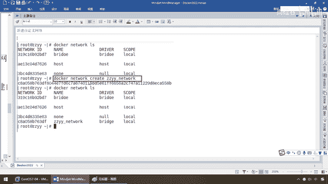
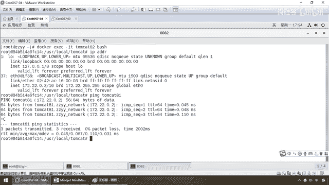
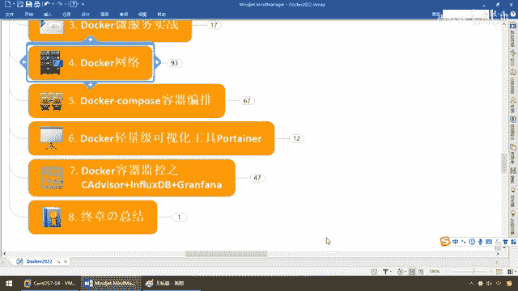

# 尚硅谷Docker实战教程（docker教程天花板） P77 - 77_docker network之自定义网络下集 - 尚硅谷 - BV1gr4y1U7CY

同学们大家好，那么接下来我们的before演示了，我们来演示一下after，没有用自定义网络之前，两个网段按照服务名是拼不通的，OK他们开他8G和他们开他8，挂了，那么下面after我们来看看。

引入自定义网络能不能解决我们这个问题和痛点，第一个自定义桥接网络，那么自定义默认网络上使用的，也还是用我们最多的不锐解，就是他这个网络模式用不锐解，但是你那个网络的那个名字，你可以叫a叫b叫abc。

随便，那么所以说我们这首先新建自定义的网络，大家看目前是不是只有这个不锐解host，那这三个对吧，那么我们创建呢前面也见过了。

那么现在呢假设我们建这么一个，以阳哥命名的network，network那么好，大家请看多卡，network，ls大家看只有这三个吧，那么来吧，creator，那么阳哥版的network，好。

创建成功查询一下，那么这个时候大家请看，network的网络名字叫这个阳哥网络，但是呢他的驱动模式，也还是叫不锐解，我说过了我们用的最多的，就是他日常工作中里面就这么用，但是呢现在要干的一个活。

就是要让我们的他们cat，8c他们cat，8a通通加到加进入我们自定义网络，来保证按照服务名能够互相通信，好，那么下面这是第一步完成，那么第二步新建的容器，加入上一步新建过的自定义网络，阳哥的那个网络。

那么来重新执行我们之前的命令，那么大家请看，用默认的那个不锐解不ok，所以说我们现在network阳哥的这个网络，没问题吧，好了，那么来吧，那么第一个，搞定，那么第二个，搞定，OK。

那么这样呢是8081，那么老规矩exec，他们cat，8c进去，那么ipaddr，来兄弟们这个时候现在的话呢，他是不是有0。2这个没问题吧，那么来吧，docxexec-it，那么cat8。

那么过来ipaddr，我们强调过，02和03是不是在同一网段，纯粹iptipin绝对没有任何问题，那么接下来我们来看看，现在我是他们cat8c，那么pin服务名叫什么，他们cat8，来兄弟们能不能拼它。

完全可以，那么这个时候就说明什么，我们一定要写死服务名，绝对不能写死ipc，工作建议上是这样，除非你有保证你们ipc一定是什么，地球不爆炸，ipc不会换，那么我闭嘴，否则的话请按照阳哥这个操作来。

那么所以说以后我们做，多个容器之间的集群规划，一定要走服务名，好，那么现在我们在他们cat8，那么来兄弟们，我们这个时候大家请看pin他们cat，他们cat8c，这个时候请大家看是82。

通过8c这个容器名字。

相当于我们的服务名字去pin，也能够拼通，OK，那么就搁到这儿，我们就解决了我们在什么，集群未来的集群环境下面，如果是多台他们cat的话，多台容器的话，那么主要是容器，那么这个自定义网络最好给它加上。

你自己做好这个网络设计和规划，不管是你的他们cat，radis，mycircle，只要是多台机器的，那么均走同一个网络，或者就走是吗，我以前那个radis三组三重，我是不是都走主机后次的。

其实走主机是不是都，复用同一个网端同一个服务名，都一样，好，那么所以说兄弟们，我们得到我们的结论，重要的问题说三遍，所以说自定义网络本身就维护好了，主机名和IP地址对应关系，保证IP和域名都能够拼通。

好，那么同学们，这个就是我们的什么，网络模式，五种情况，Bridge，host，那cantina，自定义网络，那么最后那么大家来，看一下这个图，现在能不能理解什么，Bridge，host，各种网络接口。

IP网络端口的映射，Docker内部的这种，引擎驱动还是挺啰嗦的，在这一块，你听完这个网络以后，你才能明白，他到底这块讲了什么，好，那么同学们，Docker的网络就给大家介绍到这，完成这个以后。

我们下面来更精彩的，Compress容器编排，那么也会成前其后的，你会明白为什么要学Docker网络。

