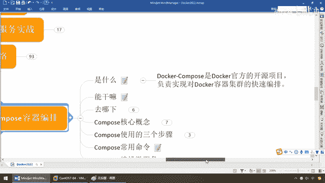
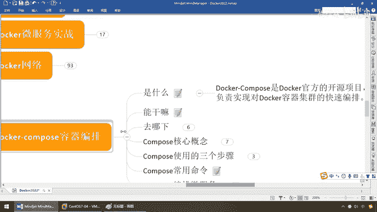

# 尚硅谷Docker实战教程（docker教程天花板） P78 - 78_compose是什么能干嘛 - 尚硅谷 - BV1gr4y1U7CY

各位同学，大家好，接下来给大家介绍新一章的内容，Docker Composer容器编排，好，那么又来到了我们的提问环节，它是什么，它能干什么，给我们解决的哪些痛点，有什么好处，那么在说之前啊。

这个只要你单独用Docker就是还没上k8s之前，几乎3、4、5这三章百分之百你是需要从操作到原理都需要了解的，那么这一章极其重要，说穿了，就是说你的容器实力太多了，你该如何管理。

假设一个Docker上面一只鲸鱼背上有20个集装箱，那你这个是不是要开始来进行一下管理，比方说容器之间它们涉及到启动的顺序，容器之间涉及到网络通信的调用，那么你都需要有一个大总管来给你管理起来。

所以说这章非常的重要，那么也给大家安排上，带着大家来编排编排，好，老规矩，是什么，Docker Compose是Docker官方提供的一种开源项目，负责实现对Docker容器集群的快速编排。

那么一言以蔽之，只要是集群了，是一个还是多个，那少说是什么，七八个，十多个以上的Docker容器实力，你推用Compose值得，如果是简简单单的，就一两个，那你就完全的就玩简单版手工就行了。

那么它给我们解决的问题，以及它出现的咚咚和前因后果是什么呢。

来，首先兄弟们，Compose是Docker公司推出的一个工具软件，可以管理由多个Docker容器组成的一组，或者是一个大型的应用，我们和Spongebob差不多，需要一个Yam文件，写好多。

注意这句话重点，写好多个容器之间的调用关系，然后只要一个命令就能同时启动或者是关闭这些容器，说白了，是不是就是我们刚刚所说的那句话，需要容器之间的一个带头大哥，一个大总管，好，那么现在我们来说一下。

它能干些什么，来，同学们，我们拿大家已经熟悉的，来给大家讲解大家不熟悉的，那么Spring，兄弟们，没问题吧，那么这个是我们Docker Compose，好，那么搁到这儿了以后我们来看看，它是什么。

它能干些什么，来，同学们，以前没有Spring的时候，我们都晓得我们需要对象干什么，是不是NEO一个对象，兄弟们，没有任何问题吧，接下来问题是，对象多了以后，甚至涉及到有些对象我们需要。

你先NEO这个对象，我再NEO另外一个对象，那么他们涉及，对象的启动顺序，和什么，加载条件，及要求，那么对于我们这些特殊需求，是第一个，第二个，对象越来越多了，你要考虑到复用。

我们是不是了解过Spring是单立模式，讲过吧，那么你总不可能永远是NEO，甚至就是你NEO出来的东西越来越多了，那么这个时候，不和同学们一起来，这个时候弟兄们，我们干了一件事。

我们是不是给Spring，类似于说过他，其实他也是一个容器，我们干了一件事，是不是找到了一个配置文件，叫Plication，Context，Smeno，有印象吧，兄弟们，这个货，这个货完了以后。

他是不是可以对我们，相当于他就是一个Spring的容器，那么是对我们的并对象，统一，集中，把你起来，那，说不定了，在这个里面弟兄们都写过，这种动作，看过吧，Pin，ID，Smini，什么什么。

然后是Class，你什么什么，好，假设啊，这是一个用户Pin，那么呢，你呢，Pin越来越多了以后，他们是不是就需要有这么一个配置文件，给你统一的，截条，把你起来，甚至有些累啊，我们还给你加上这个什么。

事务的控制等等等等，那么所以说兄弟们，在这就要注意一下，我们以前Spring的容器，主要就是玩这么一个配置文件，这一波，OK，那么诸如此类，类似的，Docker Compose，他呢，又是怎么出来的呢。

那么具体而言，弟兄们，我们要明白，他主要说的是，Docker Compose，什么，Yaml，OK，那么，等同于我们的这个Application Contacts Xml，只不过Spring。

是去对并对象进行管理，Docker Compose，他是对什么，我们一个一个的，容器，来进行管理，尤其多个，容器构成集群以后，那么他是怎么干的呢，那么，来吧，弟兄们，我们也一样的道理，首先啊。

我们大家都清楚，我们要，在Java里面需要对象，你有一个，Occas里面需要容器实力，我们run一个，那么好，现在呢，我们呢，需要一个容器，假设这个是我们的，Redis，Redis，OK，那么来。

再来一个，他是，Docker Run，这是我们的MyCircle，再来一个，我们再来一个，Docker Run，像是说Nginx，OK，不如此类等等等等，那么弟兄们，说实话，你是不是又发现。

你现在的后台的，Docker的容器实力，就越来越多了，那么这个是也会涉及到这样，对象的启动顺序和加载条件，比如说我们现在，Docker Run一个，后台，为服务，假设一个订单为服务，我们要运，运行。

这个容器要跑的话，要，OK的话，他要有什么，前提条件，那么，也就是说我们的什么，MyCircle，加Redis，容器，要先启动，那现在就涉及到一个什么，容器，实力越来越多，第二个，也涉及到他们的启动。

和加载顺序，那么这样的话，我们就需要有一个大总管，就像Sprint Application Context管并一样，就需要有个，Compose文件来管理，这些，启动的容器实力，OK，好，那么这个。

就是我们Docker Compose，来实现的功能，那说白了，比如说我们这个系统，需要有十个容器实力，我能不能够干的一种事叫什么，一键，启动，那么自然而然，也可不可以一键，Stop，比如说，我们现在。

启动这个文件，我们要做到的，先启动，Nginx，再启动Redis，再启动MyCircle，再启动这个Order为服务，好，这是四个，那么现在我们换了其中一个，我想保证某一个，同时上线，和同时下线。

那么一键启动，一键Stop，这样是不是方便我们管理，否则你要不停的去执行，Docker，Stop，要把这四个容器实力都关了，那么你要来写一堆，容器ID或者是镜像ID吧，那么所以说，回到我们这，它是什么。

来，写好多个容器之间的调用关线，然后，一个命令，一键就能同时启动，和关闭这些容器实力，说白了，就一句话，Sprint通过Application Context，管多个并对线，那么Docker。

通过Docker Compose，管多个运行的实力，就这么简单，OK，那么兄弟们这样对标来理解，没问题吧，来，所以说呢，它，那么我们刚才所说过，如果你RUN，你的容器越来越多。

比如说前面我们做了三组三组的Radius，那是不是就是什么，一个集群了，那么自然而然东西多了，就需要有这种集群的编排工具，来保证你一键部署，一键重启，一键停止，甚至是什么，容器和容器之间。

谁上谁下谁起谁停，好，那么Docker Compose能干的就这活，那么，来，讲完了以后，现在来读这段笔记，就应该能整明白，那么Docker建议我们每一个容器中，只运行一个服务，没问题吧，那么现在。

Radius，MyCircle，Enginx，好，本身它的资源占用就小，我们最好是将每个服务单独的分割开来，但是这样我们就又面临一个问题，那么我们RUN出来的容器实力是不是越来越多。

假设我们同时需要布好几个服务，难道我们要为每个服务单独去写Docker FI，然后再构建金线，构建容器，累都给你累死了，对吧，那么所以说Docker官方就给我们提供了这么一个。

Docker Compose多服务部署的容器集群管理工具，比如说，我们刚才说过了，我们要做一个WARP的微服务项目，那假设，我们有一个订单微服务，你这个要下一个订单，要存到，Enginx在前面挡着。

要存到Radius，再存到MyCircle里面，或者其他的容器实力里面等等等等，总之要以大对中间件，包括你还上个卡付卡，或者你来个Search，OK，那么这些完了以后干嘛，除了这个微服本身以外。

你是不是还有加MyCircle Radius，注册中心，有RUKA，卡付卡等等等等，那么这样的话，容器实力越来越多，你要是一口气写30个容器，要运行30次Docker Run，那我估计你也会疯的。

那么你一定会想的，我能够一键就起到10个，20个，30个需要运行的容器实力，并把他们安排的明明白白，那么对于这样一种，大主管，大总管，那么我相信你是不会拒绝的，好，所以说Docker也想到了这块。

大规模集训部署开发时候的痛点，那么Docker呢，就出现了Compose，允许用户通过一个，注意，几个，一个，项目配置文件，来定义一组相关联的应用容器，为一个项目，这么说，能跟上。

比如说我们现在就做了一个订单，Word部输成，就是下个订单最简单的，它作为一个微服务本身，Spring Boot加Spring Cloud，加上代码，编的一个容器实力。

那么假设配合我们Docker File，把它编成一个镜像，一转，又做了一个容器实力，起来，那么前面要有Redis，Nginx，MySQL这些，先起到我这个微服务，才能卡进去，才能使用。

那么这样的话是不是，我们这一组关联的应用容器，这四个，订单，微服务，MySQL，Nginx，Redis，共同定成了一个项目，Project，那么就是我们的输成，微服务，OK，那么这样。

我们就可以通过一个配置文件，定义一个或者是，一组，多个容器的应用，然后使用一条指令，安装这个应用的，注意什么动动，所有依赖，刚才我也说过，比如说你这个微服要启动，那么是不是数据库要先取到。

否则的话我存数据存哪去，对吧，所以说我这个微服就要依赖于，你的MySQL，Redis先启动了以后，甚至Nginx先启动了以后，我在最后再起我的微服务，这些是我能够运行的前提条件，好，那么就把，这些。

完成构建安排的明明白白，那么所以说，Docker Compose就解决了容器，和容器之间如何管理，编排的问题，谁上谁下，谁停谁起，能不能一键不说，一键生成，OK，好，那么同学们。

这个就是我们Docker，Compose。

它是什么，能干什么，以及它出现的意义。