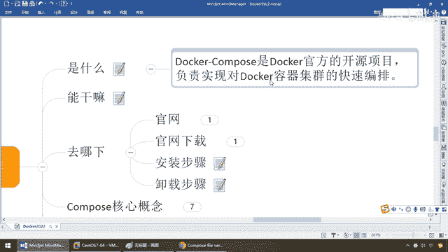
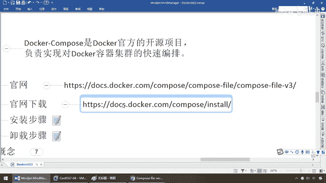

# 尚硅谷Docker实战教程（docker教程天花板） P79 - 79_compose下载安装步骤 - 尚硅谷 - BV1gr4y1U7CY

各位同学大家好，我们继续上一讲，我们给大家介绍了Dorker Compose的容器编排，它是什么能干什么，诶，以后这个技术，它给我们解决了哪些痛点，克服了哪些难题，那么熟悉阳格套路的都清楚。

我们刷一门技术或者一个知识点，一定是是什么能干什么，那么接下来，天上飞的理念必须要有落地的实现，凡技术必登官网，我们是不是要给大家讲一下，去哪下如何安装主流常用的API，或者是操作命令是哪一些，然后呢。

来个Hello World，对吧，好，这是我们快速入门一个新技术，上手一个操作的最佳的入门流程，那么来吧，再看看，首先是Dorker官方的什么，开源项目，哎，人家格子和步调还是挺高的，是个小项目的。

负责实现对多个Dorker容器集群的快速编排。

那么最后说一遍，快快的复习一下，说穿了，类似于Compose文件，类似于我们的Application Contest XM1，是普通容器的，人家容器管理的是多个病，甚至是那些事物等等，那么我们呢。

也一样，他管理的是Dorker Run起来的一个个容器实列，你容器多了以后，如何进行协作，如何进行通信，那么我们就需要有一个Compose文件，给你统一管理起来，他是管病，我是去管理Run出来的容器。

那说白了，金鱼背上集装箱越来越多了，这些集装箱涉及到的通信，启停，以及配置，我们需要有一个带头大哥，来给我们管理起来，这个文件就是Compose，好，那么接下来，由于官网呢，比较慢。

那么阳哥呢就提前打开了，那么Compose的话呢，他的官网地址和官网下载地址如下。

这个是他的一个文案，介绍这个Compose File，怎么编写，那么大家来看一下，首先，你看这个叫Dorker File Reference，这个叫Compose File，所以说呢。

应该来给大家介绍的理论知识的出错，均来自于官网，不可能错，除非官网写错，那么对于我们，后续如果你想进一步的，精进自己的技术，那么可以多看官网，照着官网的案例，再做做思考和案例的提升。

那么接下来Compose File，那么他呢，有两个版本，Version 2，Version 3，那么按照官网建议，你们尽量呢，全部用Version 3了，他比2要好很多，虽然说2现在也能用，但是呢。

Version 3，他有一个要求，需要你呢跟我们的Docker引擎，他的版本能够匹配，就像我们的Spring Boot，和我们的Spring Cloud，对吧，大家要有一个版本的匹配，那么所以说。

那Compose，Docker File的版本，要求的Docker引擎，他是有一定的规定的，不能胡搞，尽量用3以上，那么大家请看，只要是3以上的，1。13这个版本引擎就够了。

那么现在我们几乎是2021年，11月份，接近都快2022年了，我们架载的最新版本，肯定符合，所以说我们也严格按照官网来，到后面我们编写，一个什么Docker File的时候，他的版本我们都是3。0以上。

这一波，OK，好，那么这个呢，就是我们对Compose File，所做的一个介绍，那么有兴趣的同学，可以看一下这个官网，你看内容还是很多吧，那么这一块的话呢，Compose File里面就介绍了。

一个一个参数，后面我们主流常用的，将会拿出来，给大家进行容器和微服务的整合，以及编判，好，那么这是我们的Compile File，他编写规则，与法要求的一个文字版的，相当于一个API的介绍，那么接下来。

我们第二个叫什么，下载，毕竟人家是个小项目，对吧，那么来吧，搁到这儿完了以后，那么安装Docker Compose，那么安装他的一个容器项目，那么来同学们，也是这样的啊，Docker Compose。

那么你看如何安装，那么他的要求安装Compose，那么苹果Windows不废话，我们直接选的是Linux，OK吧，那么第一波，第二波，然后几乎就搞定了，然后呢，第三步，测试，你看安装很简单吧。

所以说阳哥的知识来自于哪，也是这儿，那么请同学们对吧，Chrome浏览器一搞定，变成个中文，哎呦，不好意思啊，那么可能呢，这个我的网速呢，太慢了啊，好，刷一下，难道我的Chrome浏览器插件。

出了问题啊，那么我们再试一下啊，好，那这一块呢，就不废话了，那么同学们反正他也很简单，改吧改吧，看看也能够整的清楚，好，那么现在的话呢，我们呢回到我们的主题，啊，来吧，安装步骤和卸载步骤。

那么按照我们官网上的要求，在Linux服务器，我们是Centralis器，那么就这些命令，那么由于啊，注意大家请看啊，你安装有可能会不成功，因为什么，github。com，对吧。

那么你自己可以想一些办法，或者是什么，多试两次，我们这个呢，懂的你就懂了，好，那么下面安装步骤，就三步，第一个，均来自于官网这些命令，由于我是直接root用户，我就不管前面这个了，直接看，好，那么来吧。

这条，这条，这条，那么安装的时候，它会去github上面相应的去下载，然后完了以后去整合，然后呢，开启，你看加了一个读写权限，你看这一步是什么意思啊，你看，应用，写的权限。

对于我们的这个Binary命令，对吧，Change Mode777类似于，我们原来是不是讲过，OK，那么当然这个是加了一个写，写的，这个，读写权限给它放开了，然后呢，两步就完成，装没装好。

就用Docker，compose-version，弹出来，那么如果是有这么一个编号打出来，代表你本地，compose安装完成，那么也就是我们这的，是吗，这一步，OK，好，那么话不多讲，同学们。

你们看我演示，我们一步，我们呢，ZYL，然后呢来做一下这个连接和探测，看看能不能，编排上，来，同学们，在这块啊，我们呢可能要稍微等他一会儿，我看看我配了一下这个，软件，然后呢看看这个能不能迅速的完成。

好，来同学们还可以啊，给个面子，反问，毕竟在中国大陆现在去反问Github，确实挺慢，还可以，那么来，兄弟们，第二步，我们呢，Change Mode，海边user。

localb和compose下面的这个，放开这些读写权限，给它付全写操作，加强一下，那么第二步，OK，没有消息，就是好消息，搞定，那么第三步，那么同学们，我们来看一眼，到这，完活，那么来，弹出这个。

就证明我们的Docker Compose，安装配置完成，怎么样，兄弟们，严格的按照官网的步骤来，没有任何问题吧，也挺简单的，不难啊，那么当然，卸载步骤，当然你现在就不用卸了，好吧，都不用废话。

如果你要用C11的方式安装了，那么卸载Docker的话呢，就是RM，把这个一关，就OK，那么这个命令，那么这个命令又是哪来的呢，那么同学们，一样的，uninstall，那么你看，是不是就是这一端。

相关的，拿出来的，好吧，所以说严格按照官网操作，那么大家呢，多看官网，好，那么这个时候呢，我们就完成了我们Docker Compose。

相关的下载和安装工作。