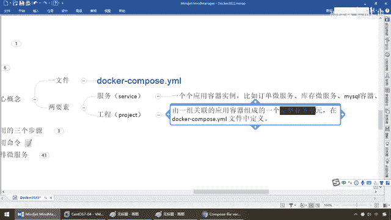
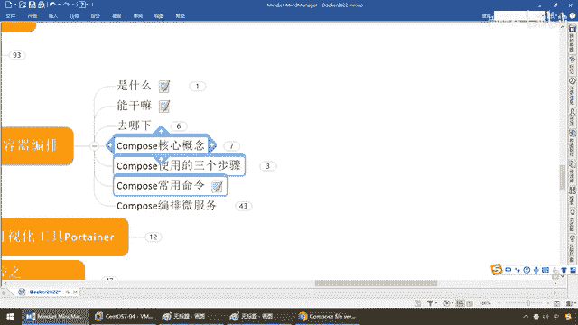

# 尚硅谷Docker实战教程（docker教程天花板） P80 - 80_compose核心概念 - 尚硅谷 - BV1gr4y1U7CY

各位同学大家好，我们继续，那上一讲我们完成了我们多卡看pose，对应的下载安装，然后呢也验证了我们本地的这个版本，到这一步说明我们的多卡看pose，OK，那接下来。

我们就可以用多卡看pose进行我们的容积编排和集群服务的管理，好了，那我们往下看，在开始我们的实际案例之前，我们需要有小细节再跟大家阐述清楚，那大家跟着我来，看pose它的核心概念，分为一个文件。

两大要素，一加二，那么这一个文件，一句话就叫，多卡看pose，点亚姆，因为看pose这个英语单词，是不是叫是组合组成编排的意思，对吧，那么从字面意思也会明白，那么请问，多卡你要对他编排编排什么。

多卡跑的是什么，是不金鱼背上一个一个集装箱，那么一个一个集装箱是什么，是不是就是一个一个的，容器实力，好，所以说它有两要素，分别是服务和工程，那么什么叫服务呢，就是金鱼背上的一个一个集装箱。

一个一个的容器实力，过来看，那么就是一个一个应用容器实力，比如说，单位服务，库存位服务，MyCircle容器，Nginx容器，或者是Redis容器，那么来，什么叫工程呢，那么他们两个的关系呢。

什么概念呢，就是一个工程，其实说穿了，就是由一组关联的应用，容器，就是上面这么多个服务，其实就是一个个应用容器实力，组成了一个，看红色的字体，重要。

完整的业务单元。

在Docker，Compose点Yam文件当中，定界，说白了啊，我们对外，我们要进行管理，这个黑框框，就是我们的，Docker，Compose点Yam文件，那么这个里面就给你安排好了，那么来吧。

假设这一个，哎，兄弟，就是我们的，Docker，乱起来了，我们的Redis，好，不如此类，那么，在这吧，那么第二个，假设就是我们的MyCircle，第三个，那么就是我们的什么，订单为服务，好吧。

那么在这了，以后，那么弟兄们，那么，OK，那么在这一块，就是我们的MyCircle，那么在这一块，就是我们的什么，订单为服务，不如此类，或者是库存啊，或者是什么的，等等等等，那么，这一个容器哪来的。

是不是我们之前，在这块，尤其是这一个容器，听到，那么它呢，是哪来的，是不是我们在外面，比方是用Idea，加我们的Spring，Pool，开发出了一个为服务，对吧，那么结合我们的，Docker，File。

然后，就是让它形成了一个，很像，所以说，最终还是，逃不过我们的DockerFile，那么，为服务加DockerFile，形成了一个我们的业务的，这么一个容器，那么结合我们Docker官网上的这些，那么。

我们，谁先起刀，组合一键部署，统一的，写进一个DockerCompose，点Yam的文件里面，给你一次性搞定，所以说，说穿了，就是什么，我们这一个工程，就是一个，DockerCompose的Yam。

我们这一个，工程，不等于，多个服务，那么这个所谓的，每一个服务，是一个个的什么，容器，应用实力，OK，那么可以是我们的，微服务这样的，也可以是我们的，Redis，Miracule，那么，他干了这活。

就这么回事，说白了，工程就等于多个服务，服务一二三四五，那么，全部给他，完整的，串联起来，最终，大家，会成一个版图，组成一个完整的业务单元，好比说，我们都要暴露，我们叫中华民族，实际而言。

我们的服务有几个，民族有几个，56个，那么是不是就是一个一个应用，容器实力一个一个的，是吧，我们的民族称谓，构成了中华民族，这个整体，那么对外暴露出一个，完整的业务单元，好，那么这个呢，就是我们的。

体现两大要素，服务和工程，最终有多开Compose的亚摩，都要暴露，是他的核心概念，那么下面，三个步骤，怎么玩呢，第一个，先，先写多开File，定义各个微服务应用，并构建出，对应的镜像文件，哎。

那么弟兄们，我们也清楚啊，你看，是不是哪哪，只要，Docker跟微服务，板一块了，基本上多开File，是你逃不掉的，所以说前面，我们呢，是做了详细的讲解，那么，在这儿，我们也给大家画好了。

那么之前我们用，IDR，Spring Boot Cloud，开发出了一个微服务，对吧，用Maven的Package，让他形成一个架包，然后呢，通过多开File，打成一个镜像，有镜像了。

才能在Docker上，以容器的实力，对外发布，对吧，那么所以说呢，第一步，我们那些自己的业务逻辑，就写那些加上代码，微服务，一定是要构建，构建出对应的镜像，那么第二步，使用多开File，Compose。

YAML，定义一个完整的业务单元，那么比如说像我这个，就是由两大容器，Redis加MySQL，加一个微服务容器，那么就是我们的，订单微服务，对吧，前面的案例，我们呢，给大家做了一个，最简单的。

Docker微服务的一个发布，后续我们再加上什么，Redis MySQL，给他越来越复杂，给同学们深刻体现，那么所以说我们首先，用多开Compose，那么以我这个案例来说的话，那是不是有三个容器实力。

对吧，那么定义一个完整业务单元，安排好整体应用中的，各个容器服务，这是第二步，那么第三步，干什么，那么你这个文件弄好了，我们就要什么，像运行多开File一样，来运行这个，多开Compose。YAML。

这个文件，所以说它的命令，最经典和常用的叫，执行多开Compose。UP命令，那么来启动并运行，整个应用程序，完成一键部署上线，说穿了，假设我现在，多开Compose，然后呢，UP，即相当于一键部署。

一键发布，就去读这个YAML文件，那么他就一读发现，哦，这个YAML文件里面，有一个Redis容器，有一个MySQL容器，有一个订单微服务，那么说白了，三个微服务，我就挨个按照你的顺序，或者我们的编盘。

一二三，给你启动，相当于点一下这个命令，听到吗，同学们，他等价于什么呀，一句话说明白，你这样，一次性，运行了，多开RUN命令，怎么说，能干啥，以前我要运行一个Redis，是不是要多开RUN，Redis。

MySQL多开RUN，MySQL，对吧，那么现在我们给他编排好了，相当于把多个多开RUN拆进来，然后呢，最外发布一个整体，一键生成，就这么简单，OK，好，所以说呢，三步，多开File。

把微服务变成我们的镜像，并构建成我们的镜像，然后跑，第二步，安排进去，第三步，启动，好，那么这个呢，相信大家也可以举一反三，比如说，Docker Network，用过吧。

现在只不过从Docker Network，变成了我们的什么，Docker Compose，OK，这个命令的中间这块的前缀，稍微做了一下变更，其实都一样，那么来，Compose常用命令，我们弟兄们，留言。

干H，我们还要p，对吧，up是启动，但是什么，停止删除，相当于重新刷新，重新来重新加载，那么，然后呢，config是检查，这个Compose文件，有没有语法错误，好，其他的一些什么，Restart。

Start，Stop，我就闭嘴了，我觉得一看看，也能整明白，好吧，好，那么同学们，这个就是我们在进入，边用Compose，编排微复实战之前。

所需要明白的一些概念。

和理论知识。