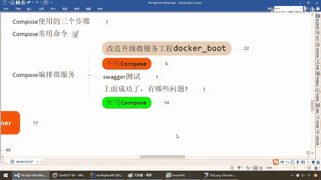
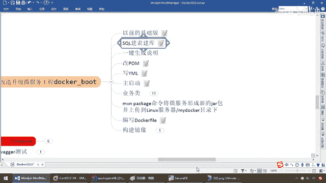
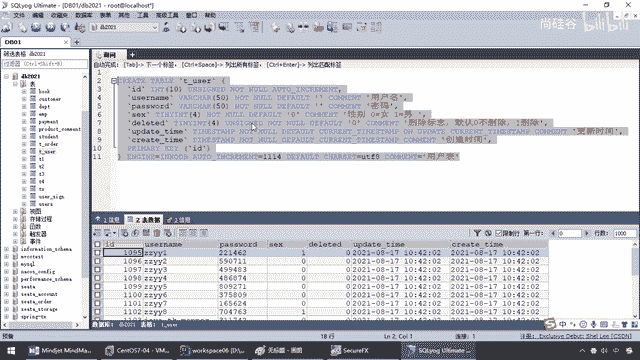
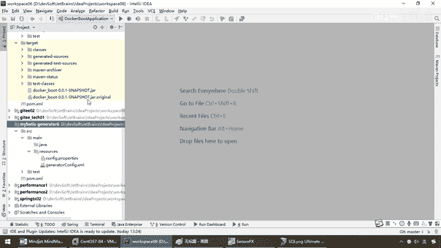
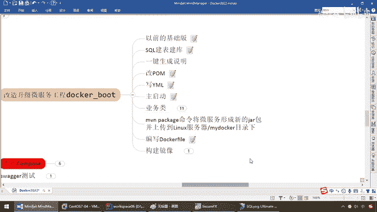
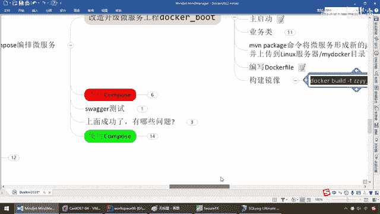

# 尚硅谷Docker实战教程（docker教程天花板） P81 - 81_微服务改造升级并生成新镜像 - 尚硅谷 - BV1gr4y1U7CY

各位同学，大家好，我们继续，通过前面的讲解，我们已经完成了Docker Compose的容器编排的理论知识的相关介绍，以及本机也成功安装了我们Compose的。

那么接下来我们就要进入重要的验证和落地实战篇，那么这个案例也是我精心准备的，给大家完成了一个麻雀虽小，武战俱全的实际生产商用得到的一个案例，那么大家请务必动手参考并练习，那么接下来我们就来看看。

你Docker Compose说的这么牛，对吧，可以把多个容器管理起来，最终的目的我们是不是想给大家验证什么叫一键发布，一键上线啊，好，那么开工，那么结合这个案例，我们先要说一下他的业务诉求。

来达到一个什么样的目的，那么熟悉阳哥风格的都了解，我是不是说过一个东西叫AB学习法，阳哥，理论知识我知道了。

求证明，Before，After，用Compose之前，和用过Compose之后，两者的效果有什么不一样，我不用行不行，我不用的时候会有哪些问题，所以我要用，给我解决了哪些痛点，你理论说的那么多求验证。

好，那么下面我们就，口述无凭，手下见证章，Show your my code，OK，那么下面兄弟们，我们来看一下，我们这个小案例呢，很简单，主要是讲解融线，而不是加码编码，所以说大部分工作。

我就提前做好，并且用一键生成的软件，给弟兄们搞定，那么在我们这个业务上呢，就干这么一件事，兄弟们呢，都用过这个Spring Boot微服务，来做一些查询，增上改查的日常操作，我们最经典的。

那么假设这个呢，是我们的前面的Redis，然后呢，Redis如果查得到，直接返回给我们的微服务，如果查不到，咱们呢是不是再去找我们，后端的MyCircle，所以说呢本次呢，主要是给大家讲解。

那么对于我们的微服务，比方说User一个模块，那么就进行两个验证，一个是图，一个是写，两种操作，第一说，首先什么数据都没有，我User先来下个单也好，或者做一个操作，先做一个写操作。

那么去完MyCircle里面，插入数据，插入成功以后，再回写Redis，那么下次来查询，我上一步插入的数据，那么是不是直接先从Redis里面，查取给你返回，对吧，那么大家在做电商啊，在做医疗项目。

金融项目的时候，这种模式的话呢，是写过太多太多了，OK我们在这儿，不废话，那么前调过，重点不是说这个加碼代码，所以说提前给大家搞定，那么待会我们直接说，Compose，好，那么明白了以后，就是做一个。

结合Redis加MyCircle，构成的一个读写操作，那么第二个，干嘛，那么是不是军事，Docker，Done后，那么慢慢的引入融计化，那么说能跟上，所以说呢，我们的这些东西啊，包括微服务等等。

全都部署到，我们的这个，红色的Docker上面，然后呢，在Docker上面，给大家跑起来，好，那么把这个业务诉求，我们说清楚以后，那么弟兄们，开工，首先啊，我们来，复习一下，承接着我们，以前的基础版。

来进行改造，什么叫以前的基础版呢，大家还记不记得这一章，Docker微服务的实战，我们就是做了一个，最最最最最最最，最简单的一个，对吧，主要是告诉大家，我们用加瓦编写的，Spring Boot，微服务。

结合我们的Docker File，如何，发布微服务，并部署到Docker容器，形成一个新的镜像，然后跑出来，一个新的容器，对吧，那么我们的泡沫，也很简单，几乎就没什么东西了，对吧，一个Warp。

一个Test，然后呢，我们的Yam就更简单了，就是一个，小小的端口，6001，其他的主启动，EVLAY，EVLAY就是Order，就有的这么两个，OK，那么这个呢，之前讲过，没有什么太多的问题。

那么接下来，我们再看看，以前的基础版，我们就得到，这么一个小东西，好吧，只有一个Ctrl，Order，然后呢，形成了这么一个，CNX服务器，然后来通过Dockerfile，形成镜像，跑起来容器。

让我们的微服务，跑到Docker上，OK，这是我们之前的，前情之实回过，那么接下来呢，我们就要干的呢，稍微复杂一点点，结合我们刚才的诉求，有Radis了，也有MyCircle了。

更多的还有Rabbit MQ，Elexk Search等等等等，我就不再全部引入，那么弟兄们，我们抖起来，现在就是，用一个User实例，来完成我们的业务诉求，那么我们就要，把这个键表键扩，那么来。

兄弟们我们这儿。

有一个T-User表，我本力呢，是在这个，DB2021这个数据库下面，那么新建了这么一张，T-User表，OK，那么大家请看，ID，那么主键，用户名，密码，性别，是否要删除，更新时间，创建时间。

脚本一张，即可，OK，那么大家请看，键表的时候呢，注释都给大家写清楚了，那么注意，那么，0女，1男，然后呢，是否删除，默认值也是0，然后这个呢，我们就晓得，只要你动了，它会有，自动或者数据库，把你更新。

和创建这两个update time，和create time时间，那么来，建一个数据库，比如说DB2021，然后呢，建这张表，那么待会儿呢。

我们就要往这张数据库表里面。

把它移到容器里面，在Docker容器那个实例上面，来进行，增伸改查，好，那么这是我们的第一步，那么第二个，一键生成说明，那么这块我们节约时间，那么阳哥呢，已经呢，把它呢，全部做好，那么之前我们的基础版。

只有这么点东西，那么现在，我们大家看一下啊，我们呢，这是我们的，Docker，Boot这个工程，那么就有了配置啊，Control啊，调service，调我们的DIO，然后呢，NTT，对吧，然后呢。

结合我们的，那么整合一个Mapper，然后呢，得到UserMapper的XM1，等等等等，最终又形成一个，新版本的，甲包 达到，Linux服务器，那么来啦，这儿呢，我们节约时间，这些呢，我提前写好。

那么这儿怎么生成的呢，这个呢，顺便说一嘴，说一句搞笑的，我特别记得，我在这个，去年发布Spring Cloud，Spring Cloud，Spring Cloud，应该是，不是Boot。

Spring Cloud 2020版的时候的话呢，有同学呢，就是我在那儿，亲自动手编代码，一大堆弹幕，过来呢，教我怎么用一键生成，把我干崩溃了啊，所以说呢，希望各位网友，或者粉丝呢，就是你阳哥。

还是懂什么叫一键生成，好吧，那么这这块呢，那么来吧，我们呢，用Spring Boot，结合我们的，Metis。

来做这么个小案例，那么来，兄弟们，我这儿是不是，T-User，在本届，有这么一张表啦，那么好了，我们这边呢，用的一键，省得你们说，我不会用对吧，我们自己生成一个，我们用TK，Mapper，那么也是一个。

映射工具，那么来，配置文件啊，Adgui果，Docker，那么是不是，就这个啊，然后呢，连上我们本机的，3306端口，DB202G，好了，那么完活以后，这儿，是我们生成的配置啊，那么就是我们的。

Metis，我们用的是TK，Metis，这个一键生成工具，有很多种啊，随便你了，那么这些呢，我们之前都讲过了，快快的，再过一遍，那么这个配置文件，这儿呢，驱动，URL，用户名，密码。

那Package点内幕，那么弟兄们，你晓得的，Package点内幕，是不是就，KammerAdgui果，然后呢，Docker，OK，那么完了以后，我们这儿，生成后台的，实体内 entity。

Mapper，点XM1和Mapper，这个接口，那么对应着我们这个，哪个数据库啊，DB202G，对应着哪张表，那么是不是TUZAR，这张表，然后完了以后，生成哪一个实体内，叫UZAR，OK。

那么做了这个配置以后，回到我们的，没问，找到我们配置好的，一键生成工具，选择它，选择这个插件，选择我们的，Metis Generator，那么，双击，鼠标左键，等它自动化生成，Success，这一波。

OK吧，好吧，来，上次呢，我搞得我很郁闷啊，我所有东西，也亲自手敲，结果被鄙射，好像感觉，非得用一键生成，你们才觉得这个，装逼才够，是吧，我觉得这些工具，在我眼睛里面看来，没有任何价值和意义，我们扎实。

这儿多说无解，那么来，Come at，Grego。Docker，那么大家看，这儿是不是生成了一个，Entity，那么这儿是不是生成了，一个Mapper，然后，这个是Mapper接口，Metis的。

这个是对应的，UserMapper。XML的配置文件，对吧，做Metis映射的，那么来，我们的User，那么对应的哪张表，是TUZER，那么这些，只要你写了注释，所有全部自动化，给你生产。

那么结合我们的，之前的这些，就不用讲了吧，就是一个，Mapper完了以后，大家请看，这个是一个接口，OK，这个接口里面很干净，没有那些，需要明显定义，那些什么增伤改查的，不需要了，那么接下来，在这块。

也很干净，只有一个resultMap的一个映射，这些都是，Metis的基本功，之前我们讲过，不下八遍了吧，弟兄们也应该操作熟练了，那么大家请看，MBG，Metis自动化生成，OK，只是做了一个什么。

表和我们这个，字段的各种映射集壳，那么这些自动化生成以后，我呢就把它拷贝回，我们的Docker Boot，这个威服工程，达到了我们的，一键生成加码代码，这些增伤改查的，我们就不写了，好。

那么完成一键生成的说明以后，我们就改一下泡沫，我们这个泡沫呢，那么请同学们啊，就是你直接粘，都应该保证粘成功，不许偷懒，一定要动手，那么来了，我们完了这些的话呢，就是加了这些，常见常用的啊。

我也是从我们的，项目当中抠出来的，那么我们给大家讲过，那些金融系统还分布式事务，阳哥当时带着大家做过的，对吧，Boot呀，SWAG呀，Spring Boot Redis整合。

Spring Cache等等等等，那么这些泡沫你直接粘，那么Yam呢，稍微改一下，以前数只有个6001，那么现在呢，就是阿里巴巴德鲁伊数据库，连接池的配置啊，那么这些不用我多说了吧。

那么现在我们Linux服务器，IP是169，那么在这儿，弟兄们，那么注意啊，IP是多少就是多少，我这儿是169，所以我就写了169，那么用户密密码啊，等等等等，那么这个是我们的MyCircle。

和数据库连接池的配置啊，这个是我们的什么，Redis的配置啊，对吧，这个是我们Metis相关的配置，那么结合我们的Metis，告诉你，要在classpass下面，新建一个Mapper，这么一个文件夹。

然后再把那些，user-mapper。xml配置文件，拷贝进去，entity是在这儿，所以说呢，我们到后面一键生成以后，是不是就按照我们的配置，把这些i-GIRL i-GIRL的，拷贝进去，就OK，好。

那么来，同学们，这个是我们的YAML，那么主启动类，尤其我们用了，TK没被提此这样的，自动化部署工具，我们在主启动类上面，添加MapperScan，就不在每个介面上添，保证我们读到的这个DIO。

就是我们的Mapper接口，指定我们对应的路径，OK，那么这是我们的主启动类，那么业务类呢，首先，config配置类，那么这儿，两个，一个是RADIUS的配置，那么来吧，我们呢，用Liters，OK。

生菜这个，不再用解ADIUS了，那么这个呢，就保证我们那些序列化，这种工具类的动动，那么当然，RADIUS template，不废话了吧，只要是跟着我学过的，都懂了，那么这儿是一个RADIUS的配置。

那么第二个呢，是我们的什么，斯瓦格，对吧，对于我们的，这个REST的接口，等等的话呢，都需要通过它，来进行我们对应的连条，所以说这是一个配置类，一，搞定它，是RADIUS template，二，斯瓦格。

保证我们的接口调用，好，那么这个是我们的，业务类的第一步，那么下面，新建entity，那么注意，我这个下面啊，自动化生成了，entity，只有一个user，那么直接拷贝过来，没问题，但是我们晓得。

在日常工作中，这个user，一般是在，DIO层，映射我们的数据库，我们一般在，controller和service层之间，我们需要有个传递，数据的，对象，一般我们把它称为。

Data Transfer Object，数据传输对象，那么所以说，我们这儿，也做了一个什么，User DTO，那么这个是我们的，User，刚才我们的一键，生成工具，自己搞定的，那么来，拷贝着它。

来了一份，User DTO，来进行，我们相关的业务，映射和说明，那么这个API mode，什么意思，是不是就是我们，SWAG里面的，那么待会我们连条的时候，出现了一个界面，每个字段，到底是干什么的。

那么这儿，都给大家，统一生成好，写好，好，那么这个就是我们业务类的，第二步，配置，Entity，那么Entity完了以后，阳哥的习惯是倒着，我先把环境整好了以后，我们再去写业务类。

那么Entity完了以后，怎么着，是不是新建Mapper，那不用多说了，那么这个Mapper，第一个，新建User Mapper这个接口，我们自动化生成的，好说，那么就是我们的，注意我们用的是TK。

没被T4，OK，那么User Mapper，继承了以后，因为我喜欢它，它是什么呢，里面的话，日常的都给你封装好了，就是个空的，很清爽，很干净，那么这是第一步，那么第二步，都晓得，我们是不是要在。

Resource文件夹下面，结合我们的，YAM的配置文件，我们看这儿，是不是要，Class pass下面，要新建一个Mapper文件夹，然后丢进去，我们这下面，自动化生成的，这个XML。

User Mapper的XML，丢进来，那么来，也就是从下面，拷贝过来的，它这个里面的，Circle，也给你处理的，干干净净，OK，好，那么这个呢，是我们的业务内的，第三步，新建Mapper。

那么第四步，新建Service，那么在这个Service呢，我们呢，就需要，手写，那么它也很简单，其业务逻辑呢，就两个，啊，弟兄们，来吧，这么看，不害怕了吧，我们前面，这个数据的验站，就是一个读。

一个写，读写都支持，就OK，那么User Service，来，由于我们要先，存进MyCircle，然后再，回写进Radius，那么Radius，这个key，标准的，就要有个前缀，那么对于User。

我们这个key，就是User冒号，就是我们所有key的前缀，然后呢，User Service，我这儿偷个懒，我就没有再去写那个，什么User Service的这个，接口。

然后再写个User Service，Input实现类，啊，快快的过，我们讲这个，Pool和Cloud的这个，加瓦代码，这些我们做过太多了，杨哥，几个月前大家就快坐腻了吧，你们都已经一键生成，很熟练了。

那么接下来我们再看，User Service，调两个接口，一个叫User Mapper，一个叫Radius template，那么首先，新增，数据，那么来，很简单，那么弟兄们，Service。

这块的话呢，Add user，那么前台传过来User对象，那么，第一步，先插入MyCircle成功，那么首次的话，是Radius也没有，新建数据库，新建记录，是不是先要往数据库里面，插入记录。

那么所以说，直接用User Mapper，人家给你封装好的，Insert Selective这个方法，把前台传User，传过去，如果是按，比如说，大于0，就说明，插入成功，100%数据库里面有了。

那么数据库里面有了以后，干什么呢，再从数据库，把数据库里面的，记录，查出来，然后呢，得到它，这是第二步，然后干什么，这个时候，这个key，OK，User冒号，结合我们，从MyCircle第二步。

查出来这个User，得到它的主建ID，绝对，不会重复，是唯一的，然后把这个key，干嘛，和Value这个对象，大家请看，再通过Radius template，Set，插入进Radius，这一步。

是不是相当于，我们的SetKey，Value，这个key，就是我们的User冒号，比如说第一条记录是1，然后呢，这个就是，User冒号，一件Value值，就是我们传过来的这个，对象。

最终会以JSON串的形式，存进我们的，Radius里面，为什么，因为我们这是不是，做了Radius，相关的，序列化的工具配置内，OK，好，那么弟兄们，这个呢，就是我们的，写入操作，只要插入数据库成功。

马上会回写进Radius，那么这条记录，下次来查询的时候，只会走我们的Radius，就不会再走我们的，MyCircle，减轻了后台，MyCircle数据库的压力，好，这是我们的写操作。

待会看验证能不能成功，那么接下来，这要干什么，是不是就是我们的读操作，那么我是不是要按照，User ID去查询，那么来，首先User肯定没有嘛，那么结合我们这，你一查肯定是来，User的ID，传过来。

那么，先从Radius里面去查，那么结合我们，Radius的前缀User冒号，来到这，假设User冒号，这个就是key，这个key，先从Radius里面查询，如果有直接返回，如果没有。

咱们再去找MyCircle，有的话，那么大家请看，不进来这一段，对吧，有的话，直接就从Radius返回了，如果没有呢，那么，Radius里面没有，再继续去查，MyCircle里面有没有，那么在这。

来查一下，这个呢是从，MyCircle数据库里面查，来看看，如果说MyCircle里面，你还是call，那么这个时候就变成什么，是Radius里面也call，MyCircle里面也call。

那么Radius加MyCircle里面，都没有这个数据，那么记录下导致了，穿透的这个key，回写进Radius，OK，那么当然，如果说MyCircle有，需要将数据写回Radius，保证下次。

缓存命中月，OK，那么假设，Radius里面没有，但是MyCircle里面是有的，那么这个时候，过来，把我们的数据，从MyCircle里面该返回的返回，但是呢，MyCircle有的时候，还需要再将数据。

回写进我们的Radius，保证下次，可以从Radius里面查到，OK，好，那么同学们，这个就是我们的什么，service内，那么最后一个，弟兄们，大家看一下，是不是就是我们的controller了。

之前我们做这个，最简单的，对吧，这个不说了，就是赌一个最简单的订单，那么现在我们的，controller，也很简单，那么来，弟兄们，第一步，那么是不是，也是我们的controller，调service。

那么这些呢，不介绍了吧，那么这个是，Radius的controller，算了反而是知道，对吧，那么这个时候，User add，那么来，我点一下，下单说调用add方法，干嘛呢，一次性插三条记录，那么来。

对应着我们的，对吧，我们这儿呢，也不用自己去写，那么它说User。Z，ID，是吧，你要一个一个的写，没必要，那么这个时候，也基本上一键生成，那么来，弟兄们，你看，我为什么只写了三条呢，那么第一个，主键。

需要吧，主键是MyCircle，那是吧，Auto Increasement，动画生产，那么第二个，用户名，我们这儿写了一个，比方杨哥加这个i，是几就是几，对吧，好，已经有了，那么password。

我们的糊涂工具包，里面的simple，yoyoid，然后呢，8个6位，这儿，也有了，那么sex，我们呢，直接，默认呢，它都是0，对吧，我们这儿，你看，写的是不是都停，规范的，default是0吧。

为什么，直接是Neo Random，它随机点，随机数是2，2的话，就是0到1，那么这块，字节的话，因为，我们这儿，用的是，迷你版微小版的，int类型，对吧，因为它这个sex的话，性别嘛，两种，零接。

大家你不要给我扯淡，什么泰国人要第三种，什么的，那个有些同学调皮，我们就不说了，那么这儿呢，过来了，保证呢，这两个，那么其他的这个，什么删除啊，我们这儿呢，也就不再去写，但你要想写也可以。

所以说我们只差，用户名，密码，和密集性别，那么插入进去，OK，好，那么接下来这一块呢，查询一条记录，那么弟兄们，说白了简单了吧，那么你丢个ID进去，我查出来，就完活了，那么这个，就是保证了，我们大家。

新建我们Ctrl了，OK，好，那么，如果说我们的编码，没有问题了，结合我们之前的操作，那么，MainPackage是不是，让微服务，形成新的一个加包，哎，拿这个加包，是不是上传到。

我们的Linux服务器的，比方说，MyDocker这个目录下面，然后是不是又跟成，跟我们之前，讲的这个，一模一样，这个案例，是不是通过DockerFile，要发布微服务，部署到我们的，Docker容器。

说穿了，现在。

做到这一步以后，我们本地的这个，微服务，加把代码，写完，搞定了，然后呢，MainPackage，OK，那么走起来，我们的，这个Line，然后呢，Plugin，然后呢，不是，是这个，那么找到我们。

这个哥们，刷新一下，Docker，Boot这个微服务，新版的这个，带着我们一些，复杂功能的，Redis什么MyCircle之类的，OK，Package，给它编排上，完了以后，我们本地，在目录下面呢。

就会形成我们的一个加包，那么这个加包，上传到，Linux服务器的，MyDocker目录下面，然后是不是，借用我们之前，那么是不是，还叫这个名字，然后呢，再重新编译一次，变成这个，新的，进项，然后到时候。

跑到我们的Docker上，好，那么同学们，Successful，没什么问题，那么来，Plugin就是它，那么现在这个下面，生成了，那么在这，我们刷新，好，兄弟们，这个就是刚刚生成的，那么老规矩。

这是我们Linux服务器，MyDocker服务器下面，拖过来，马上上传，OK，上传以后，我们呢，回到我们的，MyDocker文件夹下面，来了来了，那么这个时候，同学们请看，这个是不是我们刚刚。

上传的这个微服啊，然后结合我们的Dockerfile，那么这两者一结合，Dockerfile，一去构建的话，那么，是不是，就会生成一个，我们新的进项，那么这个进项的名字。

按照我们的Dockerfile的，编排规则，是不是叫，这个名字，这一波，OK，好了，那么编写Dockerfile，然后呢，是不是开始构建，进项，那么，原模原样的命令，还是熟悉的配方，还是熟悉的味道。

兄弟们请看，Docker6的Gantt，还是叫这个进项，好了，那么，兄弟们，我们来执行一下，注意啊，一定是在MyDocker，这个目录下面，然后呢，一定是Dockerfile，和这个架包文件。

最好放一块，那么来，兄弟们，可以回车，如果不出什么意外，那么，稍微等它一会，我们在本地，将会生成，我们最新的，这么一个对应的，阳格版的这个，微服务，你看，然后呢，名字，就叫，Tag标签，就叫这个，好。

弟兄们，我们来看一下，Docker，Images，来，兄弟们，这个时候，是不是就形成了，我们一个新的，一个进项啊，那么这个呢。

就是完成了我们的第一步。

改造，升级我们的微服务工程，每一步，给大家说的。