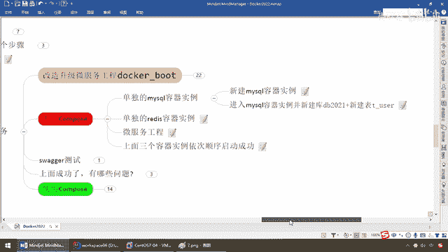

# 尚硅谷Docker实战教程（docker教程天花板） P82 - 82_不用compose编排服务上集 - 尚硅谷 - BV1gr4y1U7CY

好，同学们，我们继续，通过上一步，我们完成改造了我们的微服工程，Docker Boot，并且已经在我们Docker File的编盘下面，形成了我们新的镜像，OK，那么待会我们就要来运行这个镜像作为实例。

它的业务我们在前面已经说过，很简单，那么就是我们最经典的日常操作，微服去反问我们的数据员，Radius加MyCircle，前面是Radius，后面是MyCircle，那么对于我们的写操作。

点一下这个Radius的地址，往数据库里面新增三条记录，那么首先先会往MyCircle里面插三条，然后回写回我们的Radius，第二个，查询一条记录，按照我们的ID，先去Radius里面去查，查得到。

直接返回，查不到，再去找我们的MyCircle，这个也是我们非常经典的一个，在电商系统或者现在的主流微服里面，MyCircle和Radius整合以后结合微服务，能够完成一个基础功能，好。

那么这块我们已经搞定，在这儿也已经形成了静像，那么接下来我们来看一下，before， after，那么，杨哥我不服气，我就是不用Docker Compose，能不能行？可以，那么如果你投帖。

咱们先来走一圈来看看，那么在这边就是，不使用Compose，效果如何？，有哪些问题出现？，再次强调，你可以不写，或者说你可以不用，听懂这个意思吧，好比说你说我现在编代码，我牛逼，我不想用ID二编。

哥们我代码风骚，技术厉害，直接用记事本编，可不可以？完全可以，但是别忘了，公寓善其事，必先利其器，好，那么兄弟们，来吧，我现在呢，不用Docker Compose，我们要完成的懂不懂。

是不是就变成这样了，那么这个呢是我们的，蓝色框框，Docker容器，那么现在我们呢，直接在里面跑，第一个，是不是就是我们的，Redis，对吧，全部给他上容器，那么第二个是不是就是我们的。

MyCircle，兄弟们，这个也没有任何问题吧，还是刚才所说的，全部上容器，那么，得到这一步以后，1。6的这个，进期啊，那么我们也给他运行起来以后，按照我们的编写，是不是也是给他全部上容器，这一波。

没问题吧，那么好了，所以说呢，现在呢，我们要干的活呢是这样的，第一个，我们微服要用，是不是依赖于，首先要先启动我们的MyCircle，容器和Redis容器，否则你这个微服一跑起来去。

连我们的MyCircle和Redis，那肯定是爆，是吗，服务没打开或者是连接出错，对吧，所以说。

那么现在我们呢，先新建MyCircle。