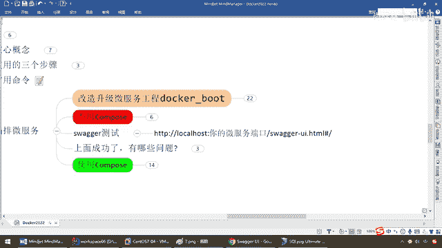

# 尚硅谷Docker实战教程（docker教程天花板） P83 - 83_不用compose编排服务下集 - 尚硅谷 - BV1gr4y1U7CY

接下来我们新建一个mysq的容器实例，好，我们大家看一下，都是我们前面学过的命令，我相信到这这些命令不用阳哥再多废话了吧，我们来，弟兄们，现在呢，我们看啊，docker， ps。

现在后台的话没有跑着任何一个容器实例，过来，我们的mysq，先上手，ok，docker， ps，那么结合我们这，3306，3306，对吧，然后呢，mysq，5。7，ok，登录的密码是12345。

那么这些呢，就不再说了，那么现在docker， ps直接起了一个mysq，5。7，这么一个服务，好，那么老规矩，exec，-it，那么就是mysq，5。7，然后呢，进去，mysq，登录，ok。

那么登录进来了以后，我们现在是不是要像在我们windows环境一样，新建一个数据库，叫db202g，然后新建一张数据库的表，t user，等待着我们容器版的，改造过，升级过的这个微服务来进行数据的插入。

相当于说，我现在mysq是不是准备启动，件库件表，然后我们待会形成的微服务容器实例，是不是也要往这来进行插入数据啊，好，那么来这，整明白了以后，那么现在，create，database。

db202g这一波，ok吧，那么userdb2021，ok吧，那么完了以后，那么弟兄们，拷贝这段脚本就行了，那么这个呢，大家呢，在我的脑兔里面，笔记里面，都有，那么相当于说，进入mysq，容器实例。

新建数据库db2021，使用，并新建表t user，那么来，弟兄们，直接过来，搞定，一回车，那么下面select，新from t user，那么大家请看，现在是不是，插入，数据还没有呢，一查询了以后。

现在呢，表结构是ok的，好了，那么这个呢，是我们的，第一个，那么接下来，我们第一步完成以后，第二个，咱们是不是要单独的redis的容器，来给它启动了，对吧，那么也就是对应着，我们这张图。

在doka容器上面也要启动一个redis的容器实例，好，那么搁到这，也就不再讲解了，这些命令，我认为弟兄们呢，应该学到这，什么有任何问题了，ok，我们的名字呢，叫redis608。

那么请大家看dokar ps，说过了，强调过多次dokar run了以后，马上，肌肉继续dokar ps，一定要斟酌的看清楚，我们的服务有没有起到，那么好，dokar exec，-it。

那么现在就是redis608，bash，redis-client，-p63，那么现在呢，我们是一个，单机版，对吧，6379，ok，那么kiss新，那么弟兄们，大家请看，现在是不是也没有任何记录啊，对吧。

那么mycircle，是空的，redis我们这呢，也是空的，那么在，中端，那么这一块呢，我们这个呢，就是我们的，一个redis这一波，ok吧，那么在这一块，为了辨别，那么这一块，我们的中端。

就是我们的mycircle，ok吧，好了，那么接下来呢，我们是不是要尝试一下我们的微服务了呀，哦，那么回到我们的笔记，那么微服务工程，那么同理，那么弟兄们，搁到这里以后，那是不是我们的dokar。

imagis，然后，来，兄弟们，那么现在我们是不是，要把这个竞技案启动起来，做一个微服务的，容器实力，然后呢，给大家跑起来呀，那么后台运行，干屁，6001，6001，那么来了，你是哪一个，我呢。

就是这一个，那么一起回车，如果不出意外，弟兄们，请看dokar ps，我们大家请看，是不是我们的，阳哥的这个微服务，然后呢，我们的redis608，然后我们的mycircle，575。7。

这个三个容器实力，全部跑在这个蓝色框框的dokar，金鱼背上面，那么下面你可以得到第一个结论，如果我们现在是三个，我们，现在是不是就要运行，几次啊，三次啊，我们的dokar run这个命令啊。

这么说能跟上，那么好，假设正二八经的，生产，你进大产以后，说难听点，都不用说大产，就说中产，30个微服务，很正常，那么请问，你愿意是一键生产，30个微服务，还是运行30次，dokar run，好。

我们先放一下布表，那么下面，上面呢，三个容器实力，是不是一次就顺序，启动成高，那么结合我们的笔记，那么大家请看，你脉记等等等等，这些呢，就统统，OK了，这么说，兄弟们，没问题吧，好了，那么接下来啊。

完成这个，以后，我们呢，开工，是不是要进行我们的swag相关的测试了，这一波，OK吧，那么换句话说啊，我们就要去，在外面来试一下，那么，搁到这儿，那么弟兄们，192。168。111。169，冒号。

6001，那么swag，来看一眼，那么弟兄们，可以看到，这个时候是不是就是我们的用户，user接口，我们之前配的那些swag，配的这些东西，清清楚楚，那么来，二话不说，先user数据库，新增三条记录。

那么来，点一下，测试，现在是全部跑在容器上，一切上，容器，发了个post请求，结果是多少，200，那么口说无凭，回到我们的，MySQL，那么弟兄们，查询一下，大家请看是不是123，三条记录，通通都有了。

OK，那么大家请看，在我们的redis是不是user123，三条记录，通通都有了呀，这么说，能跟上，OK，那么接下来我们的，这个完成以后，这是什么，写操作，那么读操作呢，我们三条记录。

我们现在就查一下1号记录，点一下，兄弟们请看，是不是1号记录，ZZ881，那么密码是这个，全部查询出来，那么跟我们刚才所设想的是不是完全OK呀，好，那么所以说，现在我们，根本就没有上Compose。

那么，完成了我们的三个容器实例，均跑在，Docker上，然后他们之间相互的调用，构成了我们一个整体的微服务，比如说就是我们的user用户模块，好了，那么现在就是什么，根本就没有引入Compose。

那么大家，思考一下，我们讨论一下，你们觉得，上面虽然说，数据上是成功了，随着我们系统的加强，业务变得复杂，微服务越来越多的时候，你们认为会有哪些问题，这就引申出了我们为什么要上Compose。

我先暂停下录屏。

