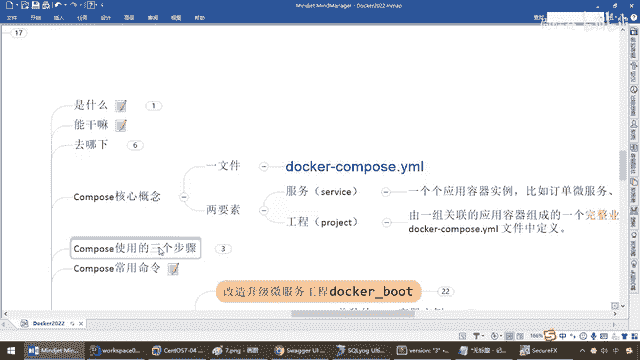

# 尚硅谷Docker实战教程（docker教程天花板） P85 - 85_使用compose编排服务中集 - 尚硅谷 - BV1gr4y1U7CY

下面我们就来看一下，详细的解读一下这个多开Compose这个亚姆文件，好，那么同学们我们把它拷贝出来，逐行解析啊，第一个版本前面说过了，Compose现在用3以后的版本，OK，那么下面的这呢固定写死。

你看复苏，service，意思代表有几个服务容器实例，说难听点就是Compose文件里面这个黑框框几个软，那么来先来看第一个，我们定义的这个服务名，随便你定义啊，只要不冲突就行了，那么假设叫微服务。

那么大家请看，image，叫这个，哎，那么现在啊，我们这个，Docker，image，那么现在，杨哥当时自己编排的这个。

那是不是就叫这个名字。

OK，那么回到我们这，是不是就净下名字，就叫这个，库名加，Tag版本号，那么下面叫Kantana内幕，叫这个，然后这一圈下来，那么来兄弟们，我们呢，来做一个，解读，把这段别的先不看啊。

他的意思是这样的一个情况，相当于这小段就是，Docker run干D，那么干P，6001冒号6001这一波能跟上，那么大家请看啊，然后呢这是端口，对吧，那么这是净下，这是我们的，内幕。

好我们先把它全部写完，弟兄们呢就会有清楚，那么来这干V，那么这个呢前面讲过，是不是叫，容器数据券，那么这个干V，那么意思就是宿主机上的，这个路径，和我容器内部的这个路径，做好的映射，来，这有个什么动盪。

Networks，at 硅谷，Net，再看下面，Redis，也有个Network，at 硅谷，Net，我就是没讲，同学们，我们什么，什么时候什么地方讲过这个动动叫Network，是不是前面说过。

并强调过一张非常重要的动动，是不是叫Docker网络呀，意思就是说，我们现在，希望于我们这三个容器，都跑在同一个网段，跑在同一个网络模式下面，那么现在，我们按照我们的要求，那么，可以把它理解为，在这有。

干干Network，那么现在，我们这个Network就是，at，硅谷，下滑线，叫什么Net，这波能跟上，那阳哥这是哪来的，那么我们说过，任何一个变量余法上，是不是要先定计后使用，那么我们在最下面。

大家请看，这是不是在，Docker YAM这个文件，里面，Docker Compose。YAM这个文件，里面有一个Networks。

at 硅谷。

那么这一行的命令，相当于，弟兄们是不是我们的，Docker，Network，Creator，那么，硅谷，下滑线，Net，这么说，听懂了吗，OK，那么当然啊，我们这后面会说，由于我们这执行的时候。

那么当然我们现在，Docker，执行之前，LS，几个，是不是只有原来我们讲过的，什么Bridge，Post，None这三个，常见默认的，对吧，那么我们待会一运行这个。

Docker Compose YAM文件以后，它在这，相当于就会执行，刚才我们那个命令，完成我们一个，新的网段的一个建设，这么说，能跟上，好，那么接下来，我们继续，完成这个以后，我们呢，可以得到了。

我们的命令，相关的，变形化的这个要求，好，那么，Docker，容器数据券，网络也有了，那么这Depends On，这个倒不是写进去的，它是告诉你，我这个微服务，就要依赖于，Redis和MySQL先起到。

对吧，因为我这个微服务，是不是我们加把大码写的，那么后面这两个，是什么概念呢，杠杠，内幕，这个容器名字，我们这 container内幕，是不是叫，MS01，然后，真真真正，我们在运行的。

是不是就是我们的镜像，就是我们这个，懂不懂，兄弟们，来理解，所以说，说一千到一万以后，那么弟兄们，现在呢，才会明白，原来，我们用Docker，Compose，这样一个压目文件，最终，其实说穿了。

我们写的这一大段，就是写了个Docker Run，这个命令，OK，那么这结合我们讲的，黑框框里面就是，每一个具体要求的Docker Run，我全部按照。

你的编排顺序。

你的业务要求，给你加载起来，OK，好，那么这个呢，是我们的第一个，那么第二个，像Redis，那么只要有前面这一个，是不是也就明白了，那么相当于，Redis 608，对吧，端口映射，6379，6379。

是一个数据一个，那么网络，我也希望你是，At硅谷，Net，对吧，然后命令，我们就用Redis Server，启动了我们的，ETC Redis，Redis Conf，那么这个，请大家看好，我们的。

Service对外暴露的名称，服务名叫Redis，注意，我这可没有加，container内幕，我故意的，上面加了，下面没加，那么我给大家看一下，加和不加，到最后的服务名，有什么变化，来，第三一个。

我们的MyCircle，那么在这块的时候，5。7的镜像，对吧，环境，我们，root密码是12345，我们这新建了一个，用户名，密码，0123db 2027，对吧，端口是，3306，对外暴露。

三个容器券地址，然后，也是跟你在同一个网段，你看，Network，At硅谷，Net，你看这三个，是不是在同一网段，按照服务名，是不是就可以拼通了，那么来，command我们的保证，外部无法反问的问题。

这个加上就行了，最后，弄了这么一个，OK。

那么所以说，兄弟们，这个呢，就是我们的一个，Docker，compose点，Yaml文件，好了，那么，有这么一个文件的，一个内容以后，那么在这块，我们直接，写上去，VIM，Docker，compose。

这一波，OK，那么来，加载进去，我们的全部，指读内容，和相关的文件，那么，WP，保存，退出，好注意，现在，在单前路径下面，是不是就多了这么一个，Docker，compose，Yaml，这么一个文件。

这一波，完成，兄弟们没问题吧，注意，Docker，compose，那么它中间，有一个小短线，来连接，很多同学有时候呢，就是学那个，比如说，Docker，Network，这个命令的时候，它这没有短线。

有些同学就，不OK，好了，那么接下来，我们要二次修改，我们的Docker，boot这个V服务了，那么干什么，写Yaml，注意，通过服务名反问，与IP无关，那么根据我们的前面，我们的，Docker。

compose，Yaml，它对外暴露的服务，这个就叫redis，这个就叫什么，Mycircle，所以说，我这修改的话，要把以前，固定Sys的IP，换成我们的服务，Mycircle，要把我们。

固定Sys的IP，换成我们的服务，Redis，那么前面，一说，大家应该秒懂，那么这两个哪来的，就是在我们，Docker Compose。

Yaml里面。

这个叫redis，这个叫Mycircle，OK，那么好，回到我们这，我们把，这一行呢，拷贝，然后呢，这一行呢，注视掉，那么就把我们的IP地址，换成我们的，Mycircle，OK，服务名称，那么这一行。

也一样，我们坚持注视掉，那么，就把它，换成我们的，Redis，相当于步到，容器里面以后，同一个网段下面，我们就去找，叫Redis，容器实力的服务名，OK，那么就像这，我们现在是不是，就跟IP无关了。

好了，那么在这块，完成以后，那么弟兄们，和前面，的操作步骤一样，是不是又是，Maven的package，上传到，零点服务器下面，然后呢，编写Docker File，当然Docker File。

我们没动过，直接再执行这个命令，就OK了，回到我们这，我们呢，可以先把，Clean一下，当然你不Clean也行，我个人习惯，是先删干净了，咱们再说，好了，我们在这块，完成，就改了两个服务名。

MyCircle，和我们的Redis，其他的，也没动过，和我们的笔记，几乎是什么，一模一样，好，那么兄弟们，我们接下来呢，idea，package，执行，那么好，执行的话呢，我们。

回到我们刚才的这个FTP，这个工具，构建成功，回到我们刚才FTP这个工具，那么把上一个版本的，先给它删掉，就是IP固定，写死这个，OK吧，那么现在，我们呢，再把新生成的这个，直接呢，拖拽过来。

然后呢让它传输，那么没有任何问题的话呢，我们在这，那么，单前MyDocker，这个路径下面，我们就会有，最新版本的，这个，改完，服务名，写好的，最新的，微服务工程。

再加上我们的Docker Compose，再加上我们的Docker File，好，有这个以后，别忘了，这个Docker File，我们没动过，也还是叫，还是熟悉的配方案，还是熟悉的味道，名字都没用。

那么所以说，Docker File这一波，不用变更，那么基本上，还是执行我们这一条命令，那么当然你可以申请你们的版本，你不想用1。6的话呢，也可以，那么来，我们呢，直接，干脆，一不做，二不修。

我们之前是不是有这么一个Docker，Images 1。6，对吧，那么现在呢，我们Docker RMI-F，我先把这个，先给你删除一下，我们再重新生成，我怕他到时候覆盖的话，那么现在你看，后台的话呢。

是不是，还在启动着，OK，那么现在就是什么，我们的干脆我先删除，Docker PS，那么，在这块Docker RM-F，先把这三个容器，全部先停掉，我们，第一个，那么，第二个，好，第三个，妥了。

那么如果说不出意外，那么，现在，Docker PS，我们的后台的容器实力，全部删光光，那么现在呢，删完这个以后，我们现在直接再删除，我们就刚才那个镜下，就是上一版生成的动作，OK，那么把这个删掉了。

那么好，那么现在，那么大家请看Docker，Images下面，已经没有，ZZYY开头的动作，好，那么在这，我们新版的这个，再有结合我们Docker file，我们再重新编译成一个，新版本的动作，好。

那么，隔到这这些命令呢，我们就不再敲了，Docker Build，Gantt，然后呢，镜下名字，镜下的名字，生成的，好，那么在这块，就是，编排了以后，是带着新版本的，所谓的新版本的话。

这儿我们就要来试试，我们调服务，可不可以成功了，OK，好，那么来，同学们，Tag的这块搞定，那么现在，我们呢，Docker，Images，1。6版本，那么兄弟们，有没有，又是，刚刚生成的了，那么现在。

我们的微服务，已经变掉了，好了，那么微服务变化，完成以后，我们接下来下一步，我们就要执行，Docker Compose，UP和UP，Gantt，那么这儿，我们先复习一下，前面我们是不是说过。

一个Compose常用命令。

那么，那么，那么，那么，那么，那么，那么，那么，那么，那么，那么，那么，那么，那么，那么，那么，那么，那么，那么，那么。

那么。