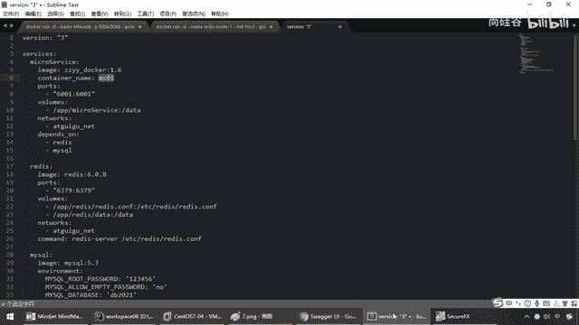
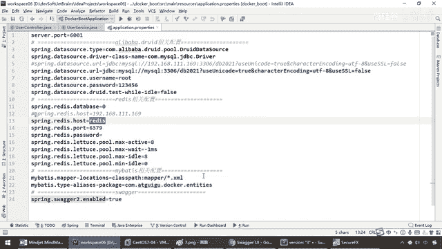

# 尚硅谷Docker实战教程（docker教程天花板） P86 - 86_使用compose编排服务下集 - 尚硅谷 - BV1gr4y1U7CY

我们看一下这些常用命令，打开，大家可以看出，前面也说过啊，在这块呢，这些命令的话呢，也就是什么，，常用的针对于Docker Compose的YAM这些文件的一些操作，那么注意，，执行命令的时候。

一定要在它对应的这个YAM文件的路径下面再去执行啊，，否则它有可能会找不到，最好是放在一块，那么来，我们常用的UP类似于RUN，，这个UP类似于RUN干爹，前台启动还是后台启动，那么这个蛋删除啊，。

重新刷新一下这个文件，那么最终我们这儿呢，需要了解一下这个命令，，那么同学们，在单前的MyDocker下面，我们有一个Docker Compose的YAM，，那么刚才我们编写了这么多，这个余法有这么多。

大家看一下，那么写的对不对呢，，那么所以说我们首先直接Docker Compose Config-Q，如果说没有任何消息输出，，说明你的编排的编写格式，余法这些都是OK的，OK，好，。

那么所以说这些命令呢，同学们可以下去试一下，我们呢节约时间就不再废话，好，，那么接下来呢，我们完成这个以后，执行我们的Docker Compose UP或UP干爹，，那么现在，我们呢直接用后台运行。

好的，那么同学们，Docker PS，，大家请看我现在后台的容器是不是一个都没有启动，，换以前我要启动哪一个，是不是要启动，先是Redis MyCircle为服务，运行三步run，。

那么这个时候的话呢就非常非常的什么，麻烦，那么现在我们直接过来，Docker Compose UP干爹，，那么大家请看，但完了，那么这个是不是就达到了我们的一键部署，听到，，所以说以前你要执行什么。

一堆Docker run，那么他们的加载顺序，加载的内容等等，，我们现在没那么多废话了，我们学会这个以后，一个文件照着模板改吧改吧，，按照官网改吧改吧就完了，变得非常的方便和简单，好，那么同学们，。

完成这个以后，我们接下来我们就验证，第一个，同学们还记不记得我们前面强调过Docker的网络，，我们说过这三个微服务为了保证在一块，服务名拼湯需要在同一网段，。

那么这个时候我们是不是见过一个叫Network，AdGrego Net，那么现在请大家看一下，，先别着急，Docker Network LS，大家请看，我们的名字是不是叫AdGrego下滑线Net。

AdGrego下滑线Net，没问题吧，，但是主件由于我们是在MyDocker这个路径下面的，那么按照我们Docker Compose的编排规矩，，它会给你所在路径的下面的加一个前缀，这么说能跟上，好。

那么同学们请看，，如果你没有指定容器名字一样的道理，我们在这啊，没有指定容器名字就是没有指这个container name的，，大家看Radius和MyCircle，它这干嘛。

是不是也叫MyDocker下滑线前缀，然后MyCircle下滑线一切，，然后这MyDocker下滑线前缀，Radius下滑线一切，相当于说会在我们的这个显示的过程当中，，它会加上前后缀，OK。

但这个不影响我们使用，好吗，那么再来，我们对于我们的这个微服务，，请看我们这是不是加了个名字，container name叫MS01，那么大家请看，人家是不是叫MS01了。

。

所以说这和大家说一下这个前缀和后缀这个动不动，那么好，网络，我们刚才已经看了建设成功，对吧，，那么他们三个呢，就在同一网段下面，也就是我们的这个，那么接下来Docker，PS，。

大家看是不是我们的微服务零件，我们的MyCircle，我们的Radius全部成功启动啊，，那么接下来呢，我们依旧和刚才一样，那么是不是也就进入到我们的容器来看看它能不能来完成我们的工作，。

那么这Docker如果是一样的命令，对吧，那么是不是，，啊，没有，啊，它现在那个容器已经变化了，对吧，不再是那个Docker，PS，那么来吧，exec-it，。

那么现在我们先进入我们这个是MyCircle，那么我们的MyCircle直接过来，，那么bash，那么直接过来的话呢，是不是MyCircle-u，那么zz-y-y-p，，然后我们呢，过来看，show。

database，来兄弟们，由于我们之前见过，什么叫，见过这个DB零件，，存在的容器数据卷，它一恢复以后给它写进来，好，那么现在use the DB2027，，OK，收，tapos，兄弟们。

现在是不是没有这张表，所以说我们呢，再重新建一下这张表，，好了，回到这儿，来，粘贴，现在表，有了吧，那么来了，Docker，PS，那么和刚才一样，，我们现在呢。

直接我们的ratis的服务已经变成了这么一个，这是由Docker Composer生成的，，OK，那么ratis-client，直接也过来，那么kis-xin，那么大家请看，是不是也是空的，。

那么现在我们这个呢，select-xin，from-t，下划性，user，大家请看，都是空的吧，，那么好了，又回到了我们刚才那个，那么现在我们是不是要来测试一下了，好，，打开我们的swag。

那么现在大家请看，这个时候还是我们169，6001这个为服务，，找到我们的user，和前面的测试一样，我们现在呢，是用Docker Composer生成的，，那么来试试，能不能和刚才一样，具体执行成功。

来发送post请求，调用169，6001这个为服务，，大家请看，200，那么我们先来验证最真实的，弟兄们，有没有，123，是不是又插入了，，来看看，有没有，get，那么来吧，get，user，这个1。

大家请看，是不是又插入了我们的一条记录啊，，那么这个呢，是写操作，那么我们的读操作呢，对于我们的Docker Composer融系编排出现的，，那么这个时候，和刚才一样，假设我们查询一下2号记录。

一直行，那么大家请看，，2号尾号是776，那么大家请看，我们在这块一模一样，2号尾号是不是766，，那么弟兄们，766，OK，刚才口误，那么所以说，现在我们是不是也就测试通过，，那么你看，弟兄们。

我们现在用Docker Composer来进行服务编排，是不是又完成了我们最舒服，，最爽的什么，一键部署啊，直接编排好以后，后台启动，弹弹弹，就OK了，，绿色代表成功，OK，所以说兄弟们。

这个时候就完成了，我们就不再需要什么，没没没没，，运行多个Docker Run，100，100，100，第二个，不用写死IP地址，我们直接调服务，，你下面爱怎么换怎么换，反正我只找MySQL。

我只找Rabbit，Rabbit MK，Elexk Search，，一回事儿，所以说在这个我们的Docker Composer，请同学们务必掌握，好，那么最后，，常用命令，刚才呢，也已经给大家呢，说过。

那么现在呢，我们来说一下我们的关停，，那么根据刚才所说的，那么是不是也就是Docker Composer，Store破就完了，，那么假设啊，我们现在Docker，PS4，我要同时停这一系列下面。

在同一网段的，对吧，，6001，3306，6379，我们要全部给它停下来，那么你是不是要执行三个融件ID，，那么现在我们呢，Docker Composer直接，Store破，一回车，那么兄弟们。

不出意外，，大家请看，是不是慢慢的全部都给你挨个挨个的停完了，那么是不是就是一键不说，一键起停啊，，这个就是我们Docker与微服务整合以后，进行相关的容器编排，那么当然，兄弟们，，我这个是三个。

十个没问题，那么更多的，就引入了我们的雷锋扬老师的K8A4，，听懂，那么对于中小型公司十几二十个，对吧，三五十个，哎呀，你用Docker Composer编排起来，，也可以，但是也费劲了，但是更多的话。

那么我们就要上K8A4，，这些来龙去脉，就要给同学们说清楚，道明白，好，那么同学们，这个就是我们Docker Composer容器编排。

。

