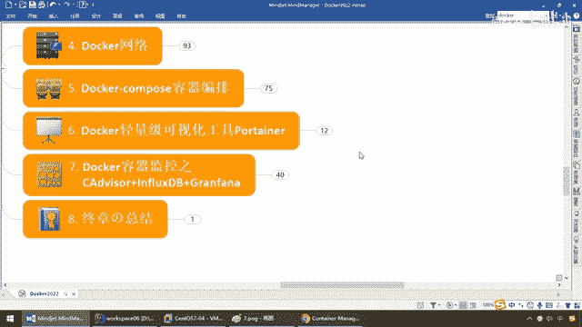
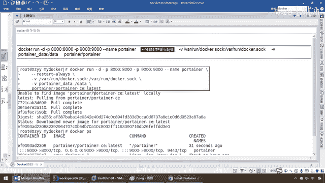
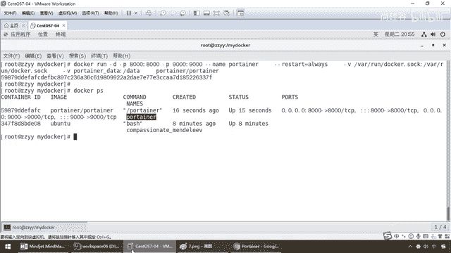
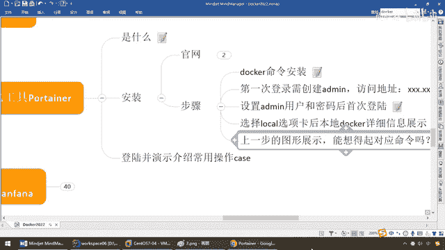

# 尚硅谷Docker实战教程（docker教程天花板） P87 - 87_Portainer简介和安装 - 尚硅谷 - BV1gr4y1U7CY

各位同学，大家好，接下来我们给大家介绍一下第六章，Docker，轻量级的可视化工具，Portainer，那么首先，什么几，轻量级，第二个可视化，那么说白了就是一个图形化的工具，这一章呢，相对而言呢。

简单，那么现在，我们要做的事情，和处理的，我们为什么，要学习这一章呢，是伴随着我们的业务。

我们的系统，深入了以后，我们需要有两个需求，你逃不掉，那么大家请看啊，根据我们上一讲，我们呢，已经完成了，我们通过，Docker Compose，运行，多个容器化实例，好，慢慢的。

我们的一个一个的微服务，都迁移到了容器上，那么这个金鱼背上，容器是不是越来越多，集装箱是不是越来越多了，那么接下来，我们的所有系统，不管你是否跑在Docker上，一定系统越来越多，越来越大以后，有两个。

需求，你必须要解决，1，监控，2，统计，好，现在谁能告诉我，我们这个Docker，上面有几个容器，我们整个Docker有几个镜像，跑着的是几个，容器实例，暂停的是，几个容器实例，我们的网络情况。

是怎么样，我们的Compose，编排效果有几组，等等，等等，哪个容器紧张了，哪个容器空闲了，我们是不是，都需要有一个统计和监控，这两个角色来进行编排，好，那么这个时候，同学们请看，Docker PS。

比如说现在，我们后台就运行着一个，那么好，Docker images，那么搁到这儿，我们到现在有多少个镜像了，那么这些我们都可以用命令，来获得，那么所有的，系统到最后都会偏向于图形化，那么一样。

这些命令结果集，我们能不能通过一种图形化工具，来给大家进行展现，方便于我们的什么，监控和统计，这个就是，我们的Portana Docker的，可视化工具，好，那么同学们，首先它是什么，轻量级的应用。

提供了图形化界面，方便的管理，Docker的环境，包括单机和集群，那么当然，如果真是，集群了，那么建议大家K8s，好，那么下面，一句话，就是Docker的可视化工具，我们那些基础命令，操作的东西。

可以通过，Portana来进行图形化，界面的展示，非常的方便，好，那么同学们，来，老规矩，是什么，能干什么，去哪下，安装步骤，走起，那么来，弟兄们，我们这儿，可以看到，它的官网呢，就是这，那么我呢。

提前打开，来，大家看啊，国外的网站都慢一些，那么又得到了一个官网，OK吧，那么，它呢，干的那是特性啊，它的解决方案啊，大家请看，在这一块，OK，那么不废话，点一下安装，那么来到了我们这。

安装Portana，Docker，on，什么，Linux，好，那么这，都给大家呢，进行了整理和说明，来，Docker安装命令，一条就行了，它呢，也是一个，什么，容器械，直接跑到Docker上。

监控Docker，那么来吧，弟兄们，就干这么一件事，注意，和以前稍微不一样，Docker run，干地，后台，小皮蟹，八千，小皮蟹，九千，呦，随着我们问题的深入，我们现在越来越明白了。

Docker的话呢，除了可以挂多个V，容器数据券，也可以搞，多个P端口的映射，OK，好，那么内幕呢，就叫这个，那么这提前说一嘴，这个叫restart， always，什么意思呢，就比如说，我们这个监控。

工具，如果我们整个Docker，重启了以后，它呢，也会跟着，重启，就是保证我随时在，线，可以持续监控，就这个意思，好，那么后面呢，这个是我们下载，的一个东东，OK，Portana，的C键。

Latest的这个最新版。

那么，一运行即可，好，那么命令，给大家说一下，讲到这儿了，这些东东呢，同学们，应该是什么，非常的清楚和清晰了，我们呢，执行一下，好，那么各位同学，我们呢，由于我，阳哥呢，是提前下好了啊，如果你首次的话。

肯定会有那个下载的那个过程，我这儿呢，就不废话了，因为，我为了避免这个等待和节约，时间，我们就提前下好，好，那么在这块，我们的Portana，直接安装成功，那么大家请看，我们在后台，现在是不是运行着。

两个容器实力，一个是我，之前的一个Ubuntu，一个就是我们的这个，容器ID，叫它，9000到9000，这么一个，映射，我们的Portana，好，到这么一步，就安装完成了，So easy吧，那么接下来。

你们同学们，我们呢，就来看看，登录和反问，由于，之前，阳哥呢，已经用过它，进行过这个工具上的使用，可能稍微介面上和大家，首次安装稍微不一样，但是呢，每一步操作，我都给大家进行了，抓图和笔记。

那么第一次登录，需要你创建，Admin，反问，地址，就是你主机IP地址加，9000端口号，那么得到，刚才的第一个结论，所谓的，这个9000号，就是对外暴露的，外部服务的端口号，那么来，同学们。

一登录了以后，就会出现这么一个，介面，那么默认的用户名就Admin，这块呢，你也不用去管它，那么直接用它默认的，密码，8位就行了，如果密码短了，它会告诉你，不合适，那么8位以后，然后创建这个Admin。

这个用户，加上我们，要求的密码即可，那么好，这是我们的第一步，那么第二步，设置用户Admin以后，我们首次登录，那么来，同学们，登录进来以后，我们呢，主要是监控，本地的Docker引擎。

那么选择我们的Local，它这说的，也很明确，管理本地的Docker，环境，对吧，然后呢，第三步，选择Local以后，那么本地Docker，一登录进去，大家请看，就会看到这么一个界面。

Dashboard，那么这个就是我们的，图形化展现的，命令入口，那么是，仪表盘的意思，那么大家请看，它这儿，就从这个硬件上，告诉你，然后，多少盒的，多少内存，Stack， Container。

Value， Inmai，Network，一看这个名词，大家应该知道，对吧，那么就是，多少个容器，多少个，进线，多少个容器卷，多少个网络，那么问题这个Stack，你该不会认为是Java讯息里面的站吧。

好，那么同学们，笔记完成以后，我们大家来，实套一下，很简单，192。168。111。167，好，那么就是我们的，169吧，我们现在的IP，对吧，那么是，9000，这么一个，来，同学们，根据刚才所说。

我的命，由于杨格之前是用过它监控了，我已经早就做好用户名和密码，所以说稍微和大家不一样，那么来，登录进来以后，这个就是我们的，主界面，然后请，选择什么，Local，一点开，那么同学们请看。

这儿是有个东西叫Dashboard，那这种图形化的界面，我都不用说，弟兄们都可以用VOE自己开发，那么左边我们可以看到了，是吗，Dashboard仪表盘就是一个系统，总盖图，一进来的，登录首页面。

那么它就告诉你，从开工讲到现在，我们有多少个容器了，多少个容器券了，等等等等，关键，这个是什么呢，说镜像，15个，好说，那么大家请看，这些是不是就是我们的，R牌，什么这个，Hello World。

加瓦巴等等等等，一说，都晓得吧，那么，都不用我废话吧，这个是，删掉容器，对吧，这个是，导入导出，这个是构建一个新的容器，我个人觉得这种界面不用我多废话了吧，好，那么关键是，再回到我们Dashboard。

这儿Stack，是什么意思呢，这个就是我们的，有几组编排的容器，就是我们的Compose，那么大家请看，我们这儿是不是在，My Docker下面，这个目录下面，见过一个Compose。

这个Compose里面有几个，容器实例，是不是有三个，哪三个，弟兄们，是不是刚才我们强调过的，Redis， MyCircle，和Wave林间，就是我们上一讲，所做过的东西，OK，所以说同学们。

在这一块以后，那么我们就得到了，我们的Docker。

Portainer的容器化管理工具，一般，这个Home，是首页主页，一般是点这个本机的仪表盘，那么有多少，那么看看左边菜单也都明白了，应用的添加，模板，然后呢，Compose的，这个多少编排的多少组。

容器，镜像，网络，容器券，事件和主机，主机就是在机器的什么物理情况，总的CPU是8核，内存是多少，那么事件，就是告诉你，什么时候，容器建了，你建了一些什么东西，做了一些，什么操作。

是对于Portainer，日制操作的一个说明，好，那么，同学们，在这块，以后，我们呢，回到我们的，笔记，大家想一下，我们上一步，就是这个啊，一进来以后就能看到这些，东西，比如说你现在有21个容器。

65个容器券，13个镜像，以后，都给你盘点出来了，那么，你还能不能想得起，我们这个Portainer一进来以后，它对应着的底层调的命令是哪一个，看总体情况的，那么，弟兄们，Loy。

是不是就是我们的Docker System，DF，说穿了，容器化的东西很简单，也就是你，前面选完命令以后，无非，就是把以前的命令，以图形化的形式，给你表达，那么安装，也，简单。

运行一个Portainer，容器实验就完了，好，那么同学们，这个并不难，那么请大家呢，务必在本期装一下。

那么接下来。

我们呢，演示一下它的常用操作。