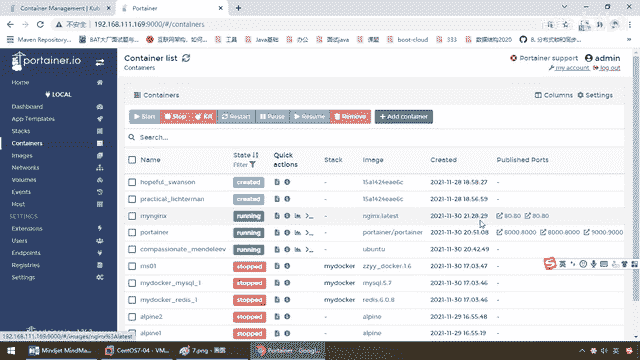

# 尚硅谷Docker实战教程（docker教程天花板） P88 - 88_Portainer常规操作 - 尚硅谷 - BV1gr4y1U7CY

各位同学，大家好，我们继续，通过上一讲，我们已经完成了Portana的简单介绍，它是什么，能干什么，以及对应的安装，并且在我们后台已经成功启动了一个Portana的容器。

可以通过它来对我们的Docker容器进行监控和统计，好，那么话不多讲，下面我们就登录并演示介绍常用的操作，来看看这个图形化界面一般怎么玩，当然图形化的东西，对吧，大家呢，多点两次也就熟了，不难，来。

你自己的Admin登录，来，选择Local，本机的Docker容器，那么来吧，首先映入眼前的是不是就是个Dashboard的仪表盘，这个总体概览，盘点盘点你的家底。

你这个Docker上面有几个Compose，镜像有多少，容器有多少，OK，那么好，左边竖形菜单也一样，那么比如说Docker主要干活的就是容器实力，那么不烦，我们来看看有哪一些。

这些是不是相当于我们曾经运行过的容器实力，比方说现在它的状态是Stop的，比如说像这个，它现在是个U-Ban图的，那么现在是Stop，那么勾选，对吧，我们直接Start，那么如果一切顺利。

我们弟兄们是不是就启动了，这是我们曾经运行过的一个U-Ban图实力，Docker PS，你看，刚才呢，是只有一个Portainer，现在的话回答我是不是又起了一个U-Ban图的实力，那么来吧，继续看看。

通过Portainer的操作，我们几乎不用再去回到我们的命令函界面，它这儿都能干，那么大家请看，现在运行了我们这个U-Ban图的实力，我们可以看一下这是什么Logs，这是什么，我们的Inspect。

查看它容器内部的具体技术细节，然后这个是我们的什么，统计状态，这个呢，我们的命令函，那么来吧，我们来看看它这块容器的日支，好，过，那么再来看看，这个呢是我们容器的Inspect，内部的一些细节。

我们前面讲过，它就是一个结算串的格式，给你说了各种参数，细节是否挂载呀等等等等，那么这个呢，都好说，那么来，看看这个容器它的监控情况，占了内存多少，占了CPU多少，网络使用多少，等等等等。

这个呢都会有个图形化的一个界面，非常方便你的监控，那么最后我们来看一下，我假设想进入这个容器来进行操作，那么Connect，这个是不是相当于执行Docker XEC，那么假设，LS，那么大家请看。

我们是不是就可以看到我们这个Ubuntu容器里面，它有哪些东西，点一下这个，相当于是不是我们Docker XEC这个命令就进去了，我相信这个呢，也so easy，很简单，那么接下来，这些更不用我讲了吧。

OK，好，那么这块我们就快快地过，因为就这么一个界面勾选了以后，上面有一排按钮，一看你也就懂了，好，那么接下来我们来看另外一个，我这儿呢是不是还留有一个小尾巴，我们在这个零击片的时候讲常规安装。

这些我们都详细用命令进行操作，那么现在我们用图形化安装，命令你都学会了图形化的东西，秒懂，那么现在呢，我们要安装一个Nginx，我们用Portainer来给大家进行演示，那么来，同学们，不是镜像。

就是容器，那么当然你可以分成两部，先在镜像这儿干嘛，是不是拉下来这个镜像，然后再在容器那运行，那么这儿我们的二一天作五，两部并一部，那么这儿，同学们请看，我们添加我们的一个容器实列，那么你这个容器实列。

那么相当于这个就是杠杠内幕，叫什么名字，OK，我们叫Mine Nginx，OK，好，我们的下载的仓库呢，Bulkhub，那么你的镜像是谁啊，Nginx，这一波，没问题吧，好了。

那么接下来由于我们的Nginx，它要反问，我们要进行什么，相当于我们的端口映射，你看，发布一个新的端口，那么这个时候Nginx，80端口主机，容器端口，80，那么相当于这个命令，是不是就是我们的。

杠小屁80冒号80，OK，好，这一切搞定以后，我们就是什么，发布部署容器，那么当然，这个是Nginx为例，如果到后面什么Radius啊，Elexk色尺啊，Rabbit MQ，卡夫卡等等，你要挂容器卷。

你要挂网络环境等等等等，这些呢，你都在这可以加啊，这样呢，看一下应该就会了，我呢，也就不再展开，好，我们发布并部署这个容器，好，那么同学们请看，那么他现在做的是不是要去拉。

这个Nginx最新版的这个镜像，完了以后，通过这个隐脉解，再按照我们的配置，生成完我们的一个Nginx的容器实力，好，那么在这儿，我们稍微等他一会，那么至于说其他的啊Network。

那么是不是我们Docker Network那个命令，那么这个呢，Gamv，容器卷，事件，主机情况等等等等，当然还有一些什么，可以做这个用户设置啊，这些情况那么，按照你的情况，着请考虑，好。

那么在这儿我们呢，可以看到我们的容器是不是创建成功，稍微有点慢，那么同学们请看我这儿是不是在，我Docker Portainer界面上面的话，就看到了我们的容器实力，My Nginx，怎么样，简不简单。

这个是不是要比用命令安装Nginx，要方便很多，那么来吧，这些的话呢，是不是都是我们的8080。

OK，那么按照我们的说法，那么现在我们的Linux服务器，192。168。1111。169吧，然后呢。

80端口对吧，一回车，大家请看，Welcome to Nginx，那么这个时候我们是不是通过，我们的Portainer，就完成了我们Nginx的安装，那么当然如果你不想用这个界面验证。

直接用命令也完全可以，进去以后，CURL127。0。0。1，然后80端口，那么兄弟们请看，这是不是有个东西，叫Welcome to Nginx，跟我们界面是不是一模一样。

If you see this page，这些东西，你看，If you see this page，那么所以说，通过这儿，我们就完成了我们用Portainer，来进行我们日常的容器，和竞相的管理。

发布和操作，OK，这些呢都很简单，我们呢就不再展开，OK，好，我们接下来介绍我们，重量级的容器监控。