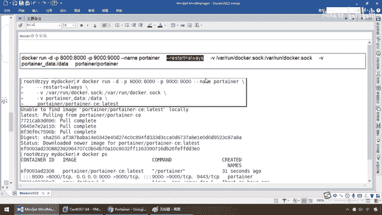

# 尚硅谷Docker实战教程（docker教程天花板） P89 - 89_Portainer补充说明 - 尚硅谷 - BV1gr4y1U7CY

各位同学，大家好，我们继续，那么接下来我们对Protainer这个可视化工具再做一个补充的说明，刚才课间有同学提问，就是说对于这一个图形化界面，也好理解，结合前面的命令，现在只不过是用图形化操作。

基本上同学们都没问题，那么对于我们启动的安装命令，有同学希望我再说一下这个，那么在这给大家做一下更细腻度的讲解，好，就一句话，它代表如果我Docker重启了。

那么我部署在该Docker上面的这个容器实力，也会跟着Docker再重新启动，那么保证我这个容器实力跟着Docker如影随形，步步紧逼，永远是在线状态，这个容器永远是running启动状态。

那么只有这样是不是我们这个Protainer，才能对我们的Docker进行时时刻刻的监控啊，好，那么同学们，我们这呢，来看一下啊，给大家演示啊，Docker PS，那么现在大家可以看。

我后台呢有两个容器实力，一个就是我们Protainer短口号9000这个，另外一个是我们之前的U班图的一个叫U1对吧，那么现在我们晓得的System RestartDocker，那么什么概念。

相当于金鱼是不是在海里面翻了个背，翻了个山，那么背上的集装箱是不是有些就丢了，那么现在如果是你背上，加了这么一个等等，那么代表你容器Docker引擎，苏醒的时候重启了以后，我还能够继续活回来，好。

那么同学们请看，Restart我们Docker，那么此时我在Docker PS，弟兄们可以看到效果，U1重启了以后，那么自然让这个容器实力沉海里面去了，没了。

但是如果加了RestartAlways这个参数，这个时候我们的Protainer，你重启以后，我照样后台马上就执行Docker Run，再执行一次，这条命令相当于说我依旧在线，OK，好。

那么同学们讲到这。

应该清楚这个Restart了，好，那么同学们，这个就是我们Protainer的全部内容。