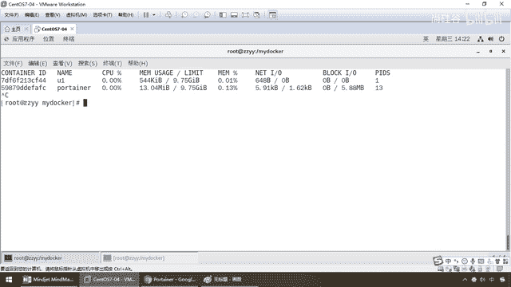
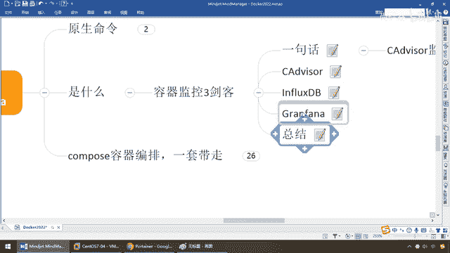

# 尚硅谷Docker实战教程（docker教程天花板） P90 - 90_CIG容器重量级监控系统介绍 - 尚硅谷 - BV1gr4y1U7CY

各位同学，大家好，我们继续，那么接下来我们给大家介绍一下，Docker容器监控的CA Deviser Inflex DB和Grapha，来构建我们的重量级的Docker容器监控引擎，好，那么同学们。

它是什么，能干一些什么，这是干什么的，你不说监控或者图形化工具有Portrainer了吗，这是啥，轻量级的，那这是啥，重量级的，OK，那么好，兄弟们，说人话，我们大家在做电商项目。

跟着丰阳老师和钟阳老师做的时候，我们一定讲过一个知识点，就比方说我们的电商系统里面的分布实质系统，用了一个东西叫E-LK，兄弟们，有印象吧。

Electricsearch加LogsDash加Keyboard，这个我就不废话了，兄弟们，应该是OK的，那么在这边也一样，也会有我们类似的，针对于Docker容器。

以及Docker容器上的每一个跑的实例来进行监控，那么它的功能是远远要比Portrainer这个简单版的强大的，OK，那么它呢，也就是我们的CADeviser，InfluxDB和Grapha。

那么简称CIG，OK，好，好，那么来看看，它能完成的功能和效果是什么，首先，我们来看看原生命令，第一个，我们现在比如说Docker RestartUZ，OK，成功启动Docker PS。

那么大家请看我后台是不是有一个Portrainer，再加一个U1U班图的两个容器实例，那么现在对于它们两个容器实例，占了多少内存，占了多少CPU，网络IO是多少，那么对于我们容器，我们前调过了。

维护我加瓦代码写完了，通过Dockerfile打成个镜像，一切在容器上面跑起来了，那么相当于我们全部把我们的应用，一个有机的整体发布在Docker上面，那么有了这些应用以后是不是逃离不了两个东西。

一个叫监控，一个叫统计，那么针对于我们的这些Docker上面的容器，目前它们的统计状态我们需要有一个，那么大家请看，container ID，容器ID，名字啊，CPU用了多少，内存用了多少。

那么现在我们最高上限，比如说阳哥是10个G，那么现在它们分别用了多少，内存啊，网络IO啊，主色IO啊等等等等，那么对于这样的，随着你的系统越来越盘大，你上面Docker上面的容器实力可能是达到成百个。

OK，那么这个时候如果你只有专门一个并联行界面，来进行监测和预警的话，这个呢就有点什么力不从心。

所以说呢我们来看一眼，我们用Docker Stacer操作的结果啊，比如说我们之前的MyCircuit 5。7，Redis 608一样的啊，就是看看整个Docker的情况，那么来进行我们用了多少CPU。

用了多少内存，好，那么它带走的问题是，Docker Stacer的命令，可以很方便看到单前宿主机上所有容器的，占用的这些东西，懂不懂，一般什么，小公司够了，听到，我没说它不好。

但是Docker Stacer的统计结果，只能是单前宿主机的全部容器，数据资料是什么，实时的，没有地方去存储，比方说现在我某个容器档了，我想看看它昨天的数据，没有，那么因为没有地方存储嘛，它只有实时的。

我Docker重启了，之前的也没了，没有什么健康指标，过线预警等等功能，它只能是什么，实时数据的展现啊，是可以的，因为它是最原始最原生的命令，可以用，不是代表它不可以用，但是呢，更复杂的功能它搞不定。

所以说呢，要像我们的一样，做一套自己的什么，Docker容器内部的，预警监控分析系统，那么来，弟兄们，我们呢就会明白，容器监控的三件客，那么就是我们的CIG，一句话，我们呢，是三个软件构成了一个。

监控存储图形化展现的系统，分别叫CA Deviser，InflexDB和Graph，那么他们的作用，来，它这个Deviser，这个呢是个猫头鹰的意思，那么干嘛呢，收集监控。

猫头鹰晚上逮耗子是不是特别厉害吧，整出来的东西，那么我们为了，长期看，游远观察，我们需要存储到一个数据库里面，这个叫InflexDB，当然也可以存到别的数据库，但是只是说这个三件套是最合适的。

那么有收集，有存储，通过我们的分析，然后呢，送到Graph来进行数据的展现，OK，所以说整套就这么一个流程，那么它能解决的问题，和我们的目的，主要就是为了更复杂的，大型Docker容器的，监控，当然啊。

比这个更狠的，那么当然就是上午的K8A4，好，那是后话，那么来分别来介绍一下这三个软件，Cadevisor，那么首先啊，它呢，基本上呢，可以内存，CPU，网络，IO，同时监控，OK，那么但是呢。

我们为什么会引入到后面那些Flags和Graph呢，因为Cadevisor呢，它默认存储几分兆，两分钟的数据，而且只是针对是吗，单物理机，这个有点不好，它收集信息倒是，挺牛逼，那么所以说呢，它呢。

就需要把你收集的东西全部存进到一个数据库里面，然后呢，把这些监控数据往这些数据库里面的存起来，当然你可以存在Rotis，卡夫卡以来测试等等，但是呢，我们这用FlagsDB，因为它官方推荐的就这个。

所以说呢，它呢，主要就是什么，将监控收集到的数据存在起来，可以往后面的数据库去推送，它来负责，收集和分析，那么FlagsDB，那么来，它呢是一个开源的分布式，持续指标和数据库，不用依赖外部。

那么前面我们说过了，Cadevisor只能存储两分钟的数据，那么现在，为了持久化的存储和统一的收集展现，我们当然需要一个数据库，所以说我们这就选FlagsDB，好，那么它来进行什么，数据的存储。

那么来了，收集，存储，整理完了以后，是不是要对外暴露，一个图形化的展现，那么Graph，就是一个什么，开源的数据监控分析，是吗，可视化平台，有点像我们的Portainer，好，那么说到底，一句话总结。

他们三个，三件客，就是Cadevisor，收集，分析处理我们所有运行者容器的实时数据，相当于说对我们的容器进行实时监控，监控完了以后，配置了我们的数据源，Inflags，就把我的这些动作。

相当于刚才大家看到的这些信息，存到我们的FlagsDB上面，形成什么，我们的Graph，图形化展现，曲线图啊 爆表啊，大概是个什么样，该不该报警，你后面写程序配合，即可，所以说他们就是什么。

我们的容器监控，三件客，Cadevisor，InflagsDB，Graph。

各自分别是，收集，存储，展现。