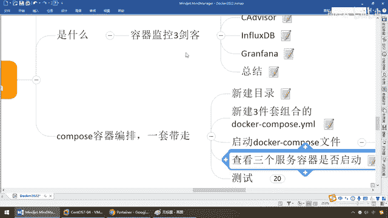

# 尚硅谷Docker实战教程（docker教程天花板） P91 - 91_CIG结合compose一键搭建监控平台 - 尚硅谷 - BV1gr4y1U7CY

同学们大家好，我们继续，那么前面介绍了容器三件客，他们分别是什么，能干些什么，那么接下来我们呢，Docker上面，现学现卖，之前刚讲过这个Docker Compose的容器编排，那么这个时候大家请看。

我们也把这三个服务，写在一个Compose文件里面，一键不朽，就搭建出了我们的监控平台，当然，如果你比较笨的，你要Docker Run，CA Devices，Docker Run，Influx，DB。

Docker Run，Grapha，没有任何问题，但是呢，我们学了，我们就尽量用一下，所以我们现在，Compose容器编排一套带走，来兄弟们，新建一个目录，我们在MyDocker下面，新建CIG。

那么就是CA Devices，Influx，DB，和Grapha，OK，他呢，这么看，那么大家请看，单前路径是这个，那么现在我们，Make DIR，CIG，那么CD，CIG，OK。

那么下面是不是什么都没有啊，那么好了，这波完成以后，我们呢，新建三件套的组合，Docker Compose。YAM文件，那么自然而然，里面的内容，我们也需要做一番耐心的讲解，这个还是挺啰嗦，好。

Docker Compose YAM，不过呢，同学们已经有了前面的这个基础，基础的话，那你也晓得，无非就是这个什么Docker Compose，把三个容器实例，写在同一个文件里面，点一下一键生成，好。

我们来看一下，我们需要面对的，容器知识和操作，那么来，同学们，我们粘贴，脱了，那么现在呢，直接先保存，好了，那么老规矩，我们是不是说过Docker Compose，CNFIG-Q，先来检查我们的语法。

如果没有任何东西输出，就说明我们这个文件编辑成功，OK，那么好，同学们，我们呢，简单的来看一下啊，第一个，我们说过了，我们的Docker Compose文件，3。0以上的版本，那么Valumz。

就实现了一个，我们的一个Grapha数据的挂载，好，容器券，那么下面请大家看，Service多个容器实例服务，就是RUN的那个清单，第一个，FluxDB，一脉机是这个，那么大家请看。

Re-start always，不用我多介绍了吧，那么我们的环境，预先会在InfluxDB上面建一个CA Devices，这么一个什么，创建，预先创建一个数据库，好，因为InfluxDB。

有点类似我们装了MyCircle，我们是不是要CREATE DATABASE，比如说DB202Z，然后再使用它，我们一样啊，那么它对外，暴露的WARP端口是8083，OK，那么内部的是8086。

那么到后面啊，我们在做测试的时候，我们在这儿，会用FluxDB来看看我们的，图形化数据库界面长什么样，好，那么这个时候Valumz，InfluxDB，在单前路径的Data，下面Influx的DB。

又跟容器里面的Data，来做了一个容器数据卷的相关关联，OK，那么我相信有前面的基础，这个你也就明白，千言万语，千言万语会总成一句话，就是把我们Docker Run命令，发不到这儿，一键不术生成。

那么接下来，CA Devices，那么也一样啊，它是谷歌的产品，那么CA Devices，负责数据的连接，那么这儿，我们呢，用了个Link，然后呢，它呢可以Link到，前面的InfluxDB。

这个容器数据库里面，好，那么下面我们说过，它是负责收集的，收集的数据，放到哪个数据库，InfluxDB，好，那么接下来呢，我们再来看，其他的一些命令，也都是什么，Restart，然后在这儿。

Command的话，就直接告诉它，你存储驱动的引擎是InfluxDB，那么这些有点像我们的MySQL，选什么，驱动啊，数据库等等，好，那么这儿我暴露的端口是8080，那么这是几个，四个容器数据卷，好。

那么Grapha是负责图形化展面展现的，我们User104固定写死就行了，那么来，以MyGrapha，然后重启，那么代表大家请看Restart，这三个是不是都有，那么相当于说它就时时刻刻。

只要你Docker启动了，我也跟着你执行，OK，时时刻刻，如影随形的监控着我们的Docker，然后完了以后，针对于我们的Grapha是做图形化展现，那么你要展现的数据从哪来，从InfluxDB过来。

那么它的端口是3000，那么后面，针对于环境，你所见的管理员，我的命，对吧，然后呢，暴露的端口，好，就这么一个，那么接下来，我们写好这么一个文件模板以后，这个你不用去手写，你看得懂就行了。

按照杨哥给你的脑涂和套装，我也是从官网上扒下来的，这个没有必要重，这个已经是偏运为了，好吧，不是说我们加上程旋主抓的内容，那么来下面呢，弟兄们请看，讲解完这个文件，在单前路径下面，那么呢，我们呢。

也有这么Docker Compose的亚默，内容，给大家刚才做了个介绍，那么在这，我们也做了居发检查，没问题，那么如果说这行命令，后面写个干爹，那么就是什么，后台启动，那么这不烦的，我呢，就前台启动。

给大家呢，看一下这个效果，OK，那么来，Docker Compose Up，那么大家请看，那么这个时候来，这个时候是不是相当于说三个套装软件，都已经挨杆挨杆的，逐渐启动了呀，但是注意。

因为杨哥之前讲过背过课，我的下载就比较快，你看现在是不是CIG，Influx这么一个，就是之前我们讲过的前坠，后坠，还有印象吧，那么蛋蛋蛋三个，代表，启动，成功，下载，完成，那么大家如果你，各位同学。

首次启动啊，因为杨哥是做过很多遍了，所以说我本地已经有这个镜像，我也不想耽误时间，尽量提前给他下载好，那么所以说呢，就没有那个等待时间，但是你来做的时候，第一次啊，他会去创建网络。

你看CIG Default什么什么之类的，对吧，然后呢，FluxDB先拉这个，然后呢，再拉CA Devices，然后呢，再拉，我们的下一个Graphon，完了以后，这三个都OK了，蛋蛋蛋，哎。

和我们这个呢，也差不多，好，那么现在呢，我们来查看三个服务器，是否启动，那最经典的是不是Docker，PS，对吧，那么来吧，弟兄们，回到这里，干这个呢，我们就另起一个窗口吧，好吧，那个呢，就不动，来。

同学们，那么这个是，我们的Portainer，9000这个，这个是UJ，U版图的这个动作，那么来，弟兄们，可以看到，现在是不是我们的，CA Devices，负责收集的，InfluxDB，负责存储的。

Graphon，负责展现的，三个Docker容器实力，均跑步成，启动成功啊，OK，好，那么弟兄们，这个就是我们，通过Compose，进行，容器服务的编盘，然后呢，搭建出了，一键生成。

监控三件客。

