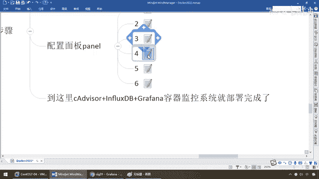

# 尚硅谷Docker实战教程（docker教程天花板） P93 - 93_CIG添加panel - 尚硅谷 - BV1gr4y1U7CY

各位同学，大家好，我们继续，通过上一步的讲解和验证，我们都分别成功登录了CIG三大监控融线，图形化界面登录成功，说明什么，OK，那么接下来我们来进行更细部的配置，那么我们这个Grapha哥们儿我呢。

是负责图形化展现的，那么我的数据原来在哪儿，你是不是得给我配一个，所以说呢，我们这儿按照我们的步骤，第一个，要为Grapha，你看现在我们是不是在这儿，要配置数据原，我要展现的数据来自哪儿，下面呢。

在这儿，配置数据原，添加数据原，那么我们数据库大家可以看，它支持很多种数据库，Grapha还是一个非常强大的图形化展现工具，包含单不限于在这个案例中使用，那么这儿由于我们前面的约定。

我们是不是选择InflaxDB，OK，那么在这儿，你的名字就叫InflaxDB，那么当然它是一种数据库，MyCircle也是一种数据库，那么我们的Circle就是Circle920的一些标准。

那么当然对于InflaxDB，它有InflaxQL这么一种查询语句，OK，那么好，那么在这儿我们将来写，按照我们的服务名来进行配置，那么弟兄们，我们这儿就不能写Localhost，按照我们的配置细节来。

我们这儿设置Flex，这儿要写FlexDB8086，这一波能跟上，好的，那么过来这儿，OK，好，这是我们的什么，一定要舔掉的，不要写死，前面也说过，尽量用服务名去调用8086，好。

那么在这儿FlexDB搞定，那么搞定完成这个以后，那么下面我们就要是一些配置细节，那么来，你FlexDB的话呢，你呢，需要的用户名和连的数据库是哪一个，那么我们往下翻，那么你的Datebase是哪一个。

还记不记得，我们前面是不是说过，你FlexDB我们自己提前预先建立一个叫CA Deviser，这一波能跟上，那么所以说我们要写上CA Deviser，那么用户名默认是root，密码也是root，OK。

那么好，保存并测试，把了绿勾勾，代表数据员is working正确连通，那么你FlexDB上面确实有个数据库叫CA Deviser，那么graphic连过去了，它里面有什么数据。

我就可以给你实时推送和展现，好，那么弟兄们，搁到这儿了以后我们的第二步，大家请看，只要能看到这个绿勾勾，代表我们的服务保存并测试通过，OK，好，那么回到我们的配置面板下面，来了。

那么这个配置面板是什么意思呢，来我们这儿就要创建一个新的观察页面，叫dashboard，那么相当于我们这儿dashboard，好，添加新的一行，添加一个面板，然后呢等等等等，我们这儿要选择添加一个面板。

好，这是第二步，那么第三步就要选择我们的图形化展现，你想有什么样，它有很多种啊，添加这个面板，这是第一步，第二个我们刚才选了，一开始没有吗，我们还没有，我们要选一个面板，你要选的是曲线图啊，柱状图啊。

折线图啊等等，这是第二步，那么第三步在这儿，search，然后呢我们选这个图形化的这么一个展现啊，随便你啊，你都可以选各种啊，柱状图啊或者什么都一样，OK，我们这儿呢就拿最经典最常用，最通用的这个呢。

来给大家进行一下说明，好，那么选了这个，相当于说它就有一种图，柱状加折线，共同来给你展现一种图形化，那么你这个，比如说我们的CIG，零件这个title，你要说，那么就是什么呢，CIG，study。

随便了啊，那么在这块你要想些什么，那么它更多的几乎都给你配置好，那么来，如果说OK了，那么CIG01这个也成功了，那么兄弟们点一下save，那么在这，那么我们直接就叫CIG01吧，那么这儿呢。

文件夹普通的是否创建都不用保存，那么来兄弟们，请看我现在是不是就是CIG01就给大家弄出来了，这一波，这一波能跟上，OK，好了，那但是现在你可能说那里有这个面板了，好像我没看到数据啊，别着急。

继续添加。

那么下一个， quê。