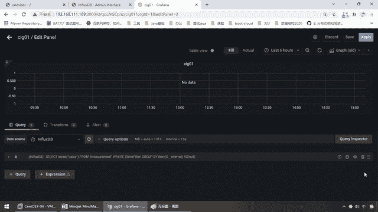
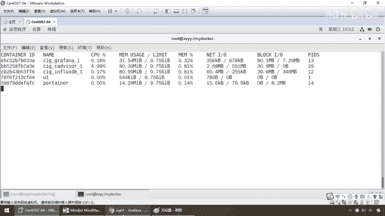
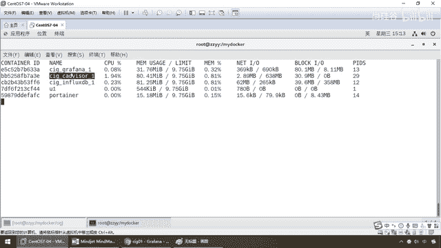
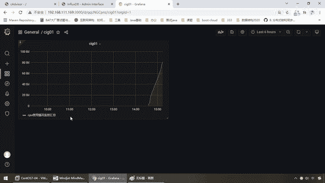
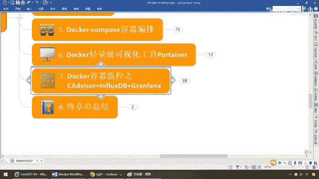

# 尚硅谷Docker实战教程（docker教程天花板） P94 - 94_CIG配置监控业务规则 - 尚硅谷 - BV1gr4y1U7CY

来同学们，我们点赞以后发现，按照我们的笔记和刚才一样这是不是no data，那么接下来我们就要给它填充数据，怎么操作呢，五六两步是关键，好，我们直接动手上，搁到这了以后，no data，选择它，编辑。

图形化的东西也非常简单，同学们可以自己点一下，几乎就能够明白一个所以然，包括要换一个模板都可以，那么把这个往上收缩一下，重要的是来给大家讲解下面这块查询，好，现在选择数据源InflaxDB，好说。

这个已经确认了，那么接下来，你要监控要多个维度可以ABC，这么说，能跟上每一个维度写一个，比如说这个是CPU，这个是内存，这个是IOS，由得你，那么现在，我们呢，先。

写一个最简单的。

比如说我们这儿啊，就监控我们的CPU吧，那么回到我们的系统。

A，那么这是InflaxDB的数据源，那么现在呢，Furong，你要从哪儿啊，我们现在呢，要选你，你大家看一下啊，他这有很多维度，当然我再把他收缩一下，给同学们看的全一点，那么CPU。

每个CPU用了多少，比如多核的吧，系统集用了多少，总共用了多少，用户用了多少，那么这个是文件的，这个是负载均衡的，这是内存的，等等等等，那么现在我们就选CPU，假设就，总的，OK，隆隆。

到底现在CPU的耗损是多少，那么Y啊，添加一个，你按照什么呀，我按照容器的名字，我们强调过了，基本上，他呢就是对我们这个来进行监控，听懂了吗，好，那么搁到这儿了以后，我们这个容器名字选哪个呢。

那么同学们，DockerStates，那么大家请看，这个是不是ContainerID，这个是不是叫Container的容器，我们就选他，这个是图形的，这个是数据库的，我们强调过。

这哥们他是不是真真真真收集数据的。

好，那么来吧，搁到这儿了以后，我们就是CID，对吧，我们选择，Invizor，OK，那么这个呢是我们的，CPU使用情况，好，那么下面呢还Select GroupPy，这些什么时区啊监控啊什么都不用写。

那么这儿有个别名，那么就是CPU，使用情况监控，回去走，OK，那么搁到这儿，完了以后，那么同学们可以明显看到，我们的数据是不是开始出来了，那么保存，那么添加一个什么说明，我也懒得写了，一点，OK。

那么回退到我们这儿，一刷新，那么弟兄们可以看出，刚才是NoData，现在跟我们前面里面的一样，这个数据是不是出来了，那么下面是我们的别名，CPU使用情况，监控。

会走。

所以说你后面你要监控哪一个，都可以把他的名字写进去，对每一个容器，CPU内存，以及Io来进行监控，就按照他，所提供的参数，选择即可，好，那么同学们，这个到这儿，我们就把我们的CID。

CA DevicesInfluxDB Grafas，容器监控系统，部署完成，那么这儿，就会变成我们一直在说说的，一切在云端，服务就是容器，那么这个时候，我们把我们代码写完了，打包成镜像跑起来了。

然后的话，也需要有监控，统计系统，那么这儿，已经是什么，在日常工作当中，必备，的标准流程，那么所以说，要么你整一个，轻量级的，要么你整一个重量级的，OK，所以说这个容器监控。

和统计。

请同学们，务必用在生产上。