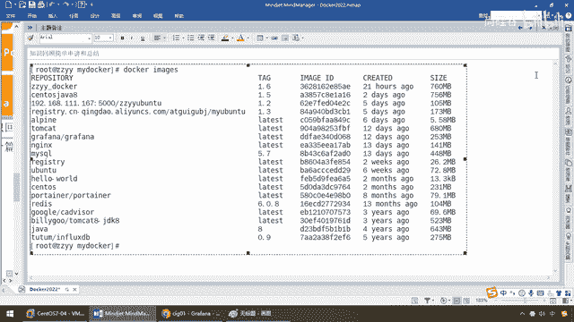
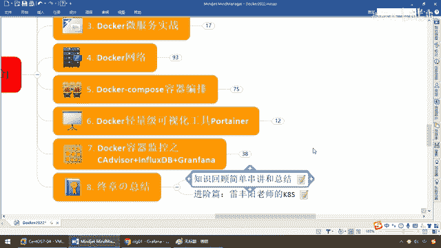
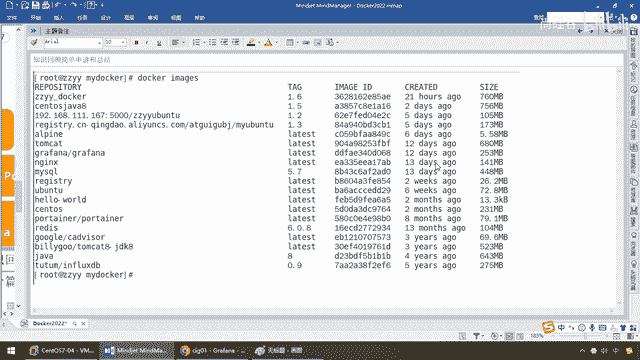
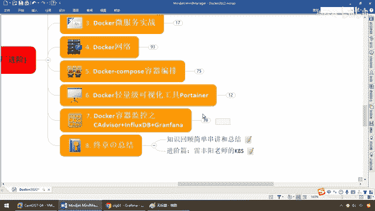
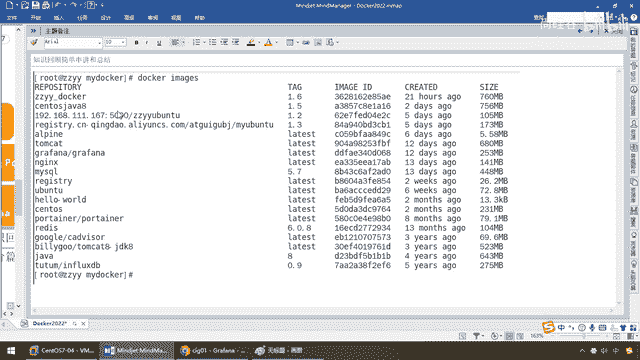
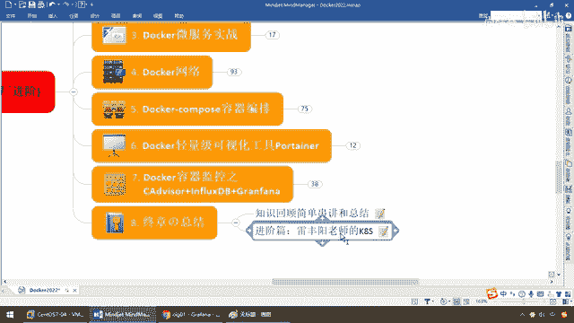

# 尚硅谷Docker实战教程（docker教程天花板） P95 - 95_终章の总结 - 尚硅谷 - BV1gr4y1U7CY

各位同学大家好，接下来呢终于来到了我们的最后一站，那么感谢各位同学各位粉丝，能够跟着阳哥走到这一步，那么我们，按照以前的流程和老规矩，需要对我们本战内容进行一下知识的简单串讲，总结和回顾，好。

那么再次感谢能够听到这，从头跟到我的粉丝和同学们，那么下面我们来看看啊，如果说，你现在本地，所拥有的镜像跟我差不多，不排除你善利一些，那么但是，是呢，你现在应该看到，从Hello World。

我们开始学起，到现在是不是有这么多镜像了，哎，感谢你，一步一步的跟下来，那么如果你现在看到，每一个镜像，怎么来的，大概涉及到的知识点是哪一些，那么恭喜你，你应该是这个Docker，应该是从入门到上手了。

应该是成为一个熟练的，DV OPS开发工程师，运威，开发工程师，双间在任两间能挑，好，那么呢，也请各位同学呢，最后多啰嗦两句吧，就天洋歌。

那么多东西呢。

三五天的学习，请同学们一定全部动手，做一遍，对吧，笔记脑头发给大瞎了，同学们不能来啊，我要的是你们动手。

能够融会贯通，然后呢，把精力呢，放在这些学习上面，每一张到底讲了什么，它是怎么来的，然后呢，不要再去关心那些什么，陈旭儿35岁被优化，脑袋上的没头发都是光头，陈旭儿找不到女朋友，等等等等那些无聊的话题。

希望各位粉丝，各位同学，耐得住单调，耐得住寂寞，耐得住重复，将我们的学习进行到底，少研究别人，多提升自己，不是成功来的慢，是你努力的不够狠，你必须给阳哥熬过去。

OK。

好，那么同学们，我们简单的过一下，我们到底每一张，分别给大家讲了什么样的内容，那么来，前面都是一些Docker的理论知识，安装，常用命令，那么Docker三件套，镜像，容器，仓库，你应该晓得。

那么这一张，我们说了，每一个镜像，它怎么来的，有些功能不够用的话，我们是不是加入自己的功能，用Docker commit命令，完成了我们的什么，新镜像的构建啊，哎，然后呢，接下来呢，我们有了这个镜像。

需要跟别人交货，你不能孤帆自赏吧，对吧，所以说呢，可以发不到自己，个人名下的，阿里云远程库，当然我们那个是个人版，如果你们公司有钱，买个企业版，那么当然，如果说，你们觉得不安全，那么公司自己派一个。

是不是可以派一个，Docker的私服库，对吧，就像我们的GitLab一样，好，然后呢，我们在基础片，再给大家介绍了，Docker容器数据卷，和我们的常规安装，尤其这个安装啊，绝对不是什么。

Docker Run，Gundi后台几个服务，就行了，很多小细节，MySQL的中文乱码，Radius的，选择启动哪个配置文件，等等等等，好，那么这些是我们的基础片，然后到后面，我们的高阶片。

主要给大家介绍了，我们的一级系统，对于分布式缓存，上一条，你们的那些数据，该如何存储，那么百分之百有Radius，一台不够，肯定是分布式加集群，所以说我们在Docker上面，给大家演示了。

三组三重的搭建安装，以及扩容四组四重，然后又变成缩容，再从四组四重缩回三组三重，给大家做了详细的配置和演示，那么结合我们的实战部分，现在Spring Boot，Spring Cloud百分百是标配。

微服务编码完成，那么你形成微服务的，架包以后，打好包，那么结合我们的Docker File，要将它编辑为新的镜像文件，然后一切在云端服务进容器，部署到我们的Docker引擎上面，最终我们也明白了。

Docker它要通信，尤其是什么，底层IP地址和服务容器的，映射关系是会变的，不能写死IP，所以说我们研究了一下我们的网络，了解了我们的桥接网络，Breakage，Poster，NAN。

自定义网络和容器网络，五大方式都给大家全面覆盖，那么主要是要给大家了解，在我们Docker容器之间，容器和容器之间的通信的话，最好是按服务名去调用，完了以后，我们研究了我们的容器的编排。

介绍了Docker Compose。YAM，这么一个配置文件，结合我们的Docker File编排，我们的微服务，再把所有容器，通过我们的Compose文件，一键生成，一键发布。

那么完成我们的多容器实例的编排工作，那么最后，反系统上线都需要有监控和统计，那么这个就涉及到我们的图形化，那么我们介绍了轻量级的Portana，介绍了重量级的CIG。

那么看同学们日常工作。

需要哪一个用哪一个，OK，那么所以说这些是怎么来的，我相信大家对所有的指使。

就应该有一个分门别类，就应该以情而出，好，那么在这儿，我们Docker相关的指使接近为生，那么还有一些，由于新技术的叠加和新技术的层出不穷，比如说我们对容器编排，我们讲了Docker Compose。

这个确实是在用，但是对于Docker集群的管理，还有一个叫Docker Swarm，那么这个东西由于K8S已经出来了。

逐渐将它取代。

所以说在这儿我们就没有介绍，那么后续请同学们可以去登录B站，搜索我的好兄弟好同事，雷神雷凤阳老师的云云生，专门给大家介绍了更高阶篇的K8S，相关的学习和资料，OK，好，那么请同学们继续坚持下去。

默默实施的努力，成为极少数优秀的加把开发工程师，好，那么最后两个在这儿，祝大家学习顺利，生活顺遂，人人有公开，各个拿高薪，再见了，各位同学。

我们下期再见。

谢谢大家。